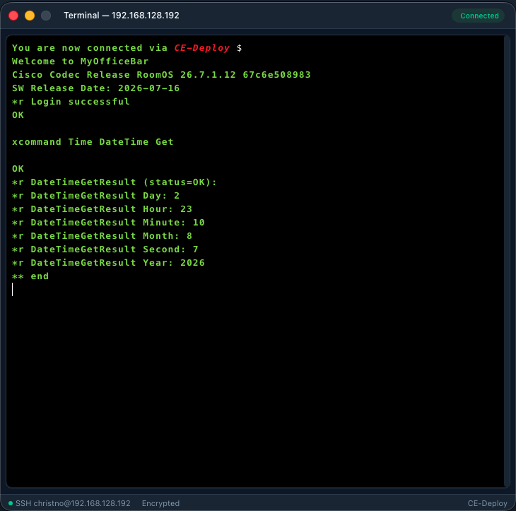

{{ config.cProps.acronyms }}
# On-Prem Toolkit: Backups, Logs & SSH-TTY

!!! abstract

    Three of CE-Deploy's handiest on-premises tools live side by side in the left sidebar:
    downloading a full device backup, pulling diagnostic logs for a TAC case, and opening a live
    SSH terminal for ad-hoc troubleshooting. In this lab you'll run all three against your pod
    device through the On-Premise organization you set up earlier.

    !!! warning

        This lab will only work if the endpoint and your PC/Mac running CE-Deploy are on the same
        network.

-   <i class="fa-solid fa-location-dot"></i> **Where**

    ---

    ==Backups==, ==Logs==, and ==Tools== → SSH-TTY, all in the left sidebar (On-Premise org active)

-   <i class="fa-solid fa-clock"></i> **Time**

    ---

    About 10 minutes

-   <i class="fa-solid fa-bullseye"></i> **Goal**

    ---

    Download a backup, pull device logs, and open a live SSH terminal

??? lesson "{{config.cProps.dep.sectionIds.cD}}.6 Lab Part 1: Backups"

    <highlight_1>{{config.cProps.dep.sectionIds.cD}}.6.1</highlight_1> Open CE-Deploy. Use the organization switcher at the top of the
    window (or the ==Organizations== screen in the left sidebar) to activate your ==On-Premise==
    organization from "Connect CE-Deploy to Your Organization." Once it's active, new items appear
    near the bottom of the left sidebar — select ==Backups==.

    <highlight_1>{{config.cProps.dep.sectionIds.cD}}.6.2</highlight_1> On the ==Device Backups== page, confirm your device credentials are
    populated and the ==Download endpoint backups== toggle is on.

    <highlight_1>{{config.cProps.dep.sectionIds.cD}}.6.3</highlight_1> Click ==Next: Select Devices== at the bottom of the page. Click
    through the Deployment Options modal with ==Next: Schedule==, then leave ==Run Now== selected in
    the Deployment Scheduler modal and click ==Continue==. The message console shows the file
    location of the downloaded backup.

    <highlight_1>{{config.cProps.dep.sectionIds.cD}}.6.4</highlight_1> To open that file location, use your computer's menu bar (not
    the in-app sidebar) — the top-level ==Tools== menu, then ==Open Data Folders== > ==Backup
    Files==.

    !!! important "Two different things are both called \"Tools\""

        CE-Deploy has a ==Tools== item in the left sidebar (QR Code, Export, Base64, Tests, SSH-TTY
        — you'll use that one in Part 3 below) **and** a separate ==Tools== menu in your computer's
        own menu bar (top of the screen on macOS, top of the window on Windows) with app-level
        utilities like Open Data Folders. Step {{config.cProps.dep.sectionIds.cD}}.6.4 is the
        second one.

    !!! Success

        Feel free to unzip the backup and poke around. Settings, macros, backgrounds, and
        extensions are all in there.

    ??? challenge "Restore from Backup (Cloud organization)"

        CE-Deploy 16 adds a proper **Backup/Restore** feature — but note it's a Cloud organization
        feature, not on-premise, so it lives in a different place than what you just used. Activate
        your Cloud organization again, select ==Backup/Restore== in the left sidebar, click
        ==Choose Backup File==, select the backup you just downloaded, and restore it back to your
        device via the cloud xAPI. Heads up, this may trigger a reboot. Switch back to your
        On-Premise organization when you're done, since the next two parts need it.

??? lesson "{{config.cProps.dep.sectionIds.cD}}.6 Lab Part 2: Logs"

    !!! Tip

        Ever been asked to pull logs from an endpoint for TAC? CE-Deploy downloads the full log
        bundle in one step. If you need logs from more than one endpoint, the CSV option lets you
        enter a list of IP addresses to pull from multiple endpoints at once.

    <highlight_1>{{config.cProps.dep.sectionIds.cD}}.6.5</highlight_1> With your On-Premise organization still active, select ==Logs== in
    the left sidebar (just above Backups, in the on-premise-only section near the bottom) and turn
    on ==Download endpoint logs==.

    <highlight_1>{{config.cProps.dep.sectionIds.cD}}.6.6</highlight_1> Click ==Next: Select Devices==, then ==Next: Schedule==, then leave
    ==Run Now== selected and click ==Continue==. The console shows the downloaded log bundle's file
    location, named `log_bundle-SEP<mac>-<timestamp>.tar.gz`.

    <highlight_1>{{config.cProps.dep.sectionIds.cD}}.6.7</highlight_1> To find that file again later, use your computer's menu bar
    ==Tools== > ==Open Data Folders== > ==Downloads & CSV Files== (the same menu bar Tools from Part
    1, different submenu item since logs and backups are stored separately).

    !!! Success

        Well done. Not the most frequently used feature, but essential to know when a TAC case comes
        up.

??? lesson "{{config.cProps.dep.sectionIds.cD}}.6 Lab Part 3: SSH-TTY"

    <highlight_1>{{config.cProps.dep.sectionIds.cD}}.6.8</highlight_1> In the left sidebar, select ==Tools== (the in-app sidebar item
    this time, not the menu bar), then click the ==SSH-TTY== tab near the top of the page — it only
    appears when an On-Premise organization is active. Your pod device should already appear in the
    device dropdown, auto-populated from your active On-Premise organization, with credentials
    auto-filled.

    <highlight_1>{{config.cProps.dep.sectionIds.cD}}.6.9</highlight_1> Pick a terminal theme from the color swatches — Matrix, Classic,
    Light, or Ocean — then click ==Connect==.

    <figure markdown="span">
      { width="500" }
      <figcaption>Matrix theme, connected — CE-Deploy prints its own welcome banner before you get a prompt</figcaption>
    </figure>

    <highlight_1>{{config.cProps.dep.sectionIds.cD}}.6.10</highlight_1> Once connected, try a few commands:

    | `Command`                    |
    |------------------------------|
    | `xCommand ?`                 |
    | `xCommand Time DateTime Get` |
    | `xConfiguration ?`           |
    | `xConfiguration NetworkServices Websocket` |

    !!! Success

        Once you've tried a few commands, type ==Bye== and the terminal window closes on its own.
        That wraps up the on-prem toolkit. Use the organization switcher at the top of the window to
        activate your Cloud organization again for the final lesson.
