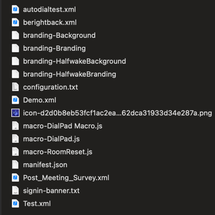

# Perform a device backup and download logs using CE-Deploy

!!! abstract

    In our final deployment lab, we will perform a backup of your endpoint using CE-Deploy and download the logs. 
    This backup will include all settings, macros, backgrounds, and extensions. 
    Having a backup of all your endpoints can be invaluable when you need to replace or restore a device.

??? lesson "4.14 Lessons Part 1"
    
    4.14.1 Open CE-Deploy and ensure you are in local mode and then select ==Backups== from the deployment panel
    
    !!! warning
    
        This lab will only work if the endpoint and your PC/MAC running CE-Deploy are on the same 
        network.
    
    4.14.2 Enter your local admin user credentials and select single device and enter the IP address
    of your endpoint.
    
    <figure markdown="span">
      { width="300" }
      <figcaption></figcaption>
    </figure>
    
    4.14.3 Ensure the ==Download endpoint backups== checkbox is selected in Backups panel.
    
    4.14.4 Select ==Start Deployment==. The message console will now show the file location of the downloaded
    backup from the endpoint.
    
    <figure markdown="span">
      { width="300" }
      <figcaption>Message Console</figcaption>
    </figure>
    
    4.14.5 To open the file location go to the application Tools->Backup Files. This wiill open the directory
    where all the backup files are stored.
    
    <figure markdown="span">
      { width="300" }
      <figcaption></figcaption>
    </figure>

    ??? Tip
    
        If you want a more configurable option the web admin portal of the device will allow customization
        of the device backup you can download from the device. CE-Deploy will only download an entire backup ignoring any options from the 
        web admin portal.

    !!! Success
        
        What you will find is a full back up of the device in a zip file. Feel free to unzip
        the file and explore what was backed up on your endpoint.
        <figure markdown="span">
          { width="300" }
          <figcaption>Backup File Unzipped</figcaption>
        </figure>
    
    !!! challenge "Restore(optional) from Backup"
    
        You have a backup but now what! Can you workout how to restore your endpoint using CE-Deploy?
        Hints: Deployment feature "EndpointRestore" may help. Ensure CE-Deploy is allowed inbound 
        connections on ports 9001(http) or 8000(https) on your MAC or PC firewall.

??? lesson "4.14 Lessons Part 2"

    !!! Tip

        Ever been asked to download the logs from a endpoint for TAC. Well now you can download all the logs
        in one simple step. If you are required to download logs from more than one endpoint try the CSV option 
        where you can enter a list of IP addresses to download logs from multiple endpoints.
    
    4.14.7 Open CE-Deploy and ensure you are in local mode and then select ==Logs== from the deployment panel
    
    !!! warning
    
        This lab will only work if the endpoint and your PC/MAC running CE-Deploy are on the same 
        network.
    
    4.14.8 Select ==Download endpoint logs==

    <figure markdown="span">
        { width="300" }
    </figure>

    4.14.9 Select ==Start Deployment==. The message console will now show the file location of the downloaded
    logs from the endpoint.
    
    4.14.10 To open the file location go to the application Tools->Downloaded and CSV Files Files. This wiill open the directory
    where all the log files are stored. Log file naming convention will follow log_bundle-SEP<mac>-<timestamp>.tar.gz.

    <figure markdown="span">
        { width="300" }
    </figure>

    !!! Success

        Well done. You have explored the main features of CE-Deploy and a few lesser known ones. Feel free
        to explore and see what else it can do. CE-Deploy is built on public API's freely available to everyone
        to develop your own solutions and scripts.