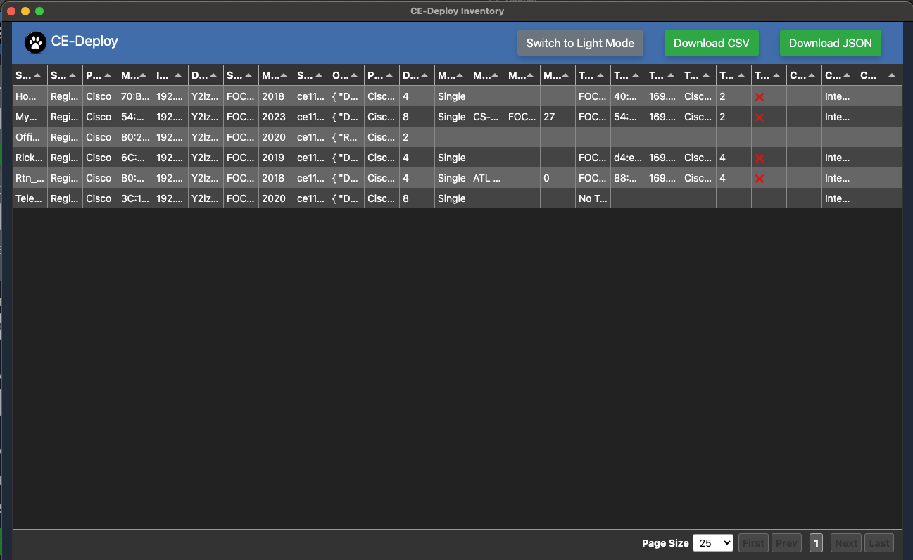
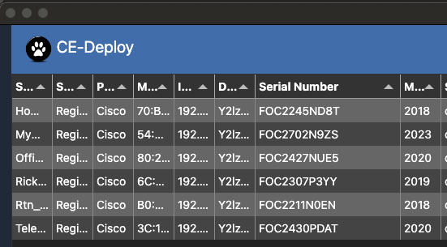
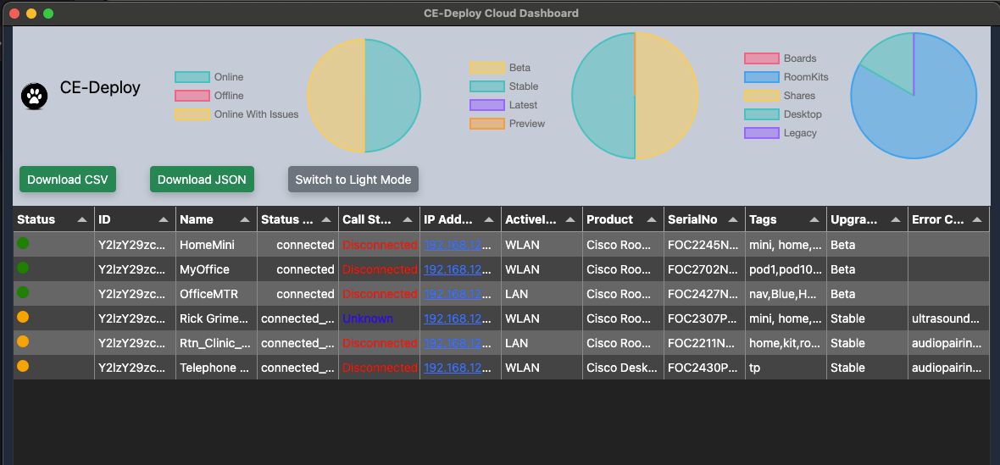

{{ config.cProps.acronyms }}
# Perform a device backup and download logs using CE-Deploy

!!! abstract

    In this lab we will we are going to open one of the most popular dashboards in CE-Deploy and check out our inventory.
    In the previous lab we saw the Macro Factory for viewing and controlling the macros on our endpoints. In this lab we are 
    going to look at our inventory and gather our serial numbers to help with our lifecycle management.

??? lesson "{{config.cProps.dep.sectionIds.cD}}.10 Lab"

    <highlight_1>{{config.cProps.dep.sectionIds.cD}}.10.1</highlight_1> Open CE-Deploy in cloud mode and load the 
    environment your created in a previous lab.
    
    ??? cedeploy "Loading Environments"
    
        To load an environment, use the dropdown in the Environment loading section and select your
        new Environment and select ==Load Environment==.

    <highlight_1>{{config.cProps.dep.sectionIds.cD}}.10.2</highlight_1> Select the ==Dashboards== tab and the from the 
    ==Deployment Options== drop down select ==Org Id==. The Org Id will auto populate.

    Next, select ==Inventory== from the Dashboards panel.

    <figure markdown="span">
      { width="300" }
      <figcaption></figcaption>
    </figure>

    <highlight_1>{{config.cProps.dep.sectionIds.cD}}.10.3</highlight_1> A new window will open with a view into every endpoint
    in your Control Hub Org. 

    <figure markdown="span">
      { width="300" }
      <figcaption></figcaption>
    </figure>

    <highlight_1>{{config.cProps.dep.sectionIds.cD}}.10.4</highlight_1> Explore the types of data it makes accessible.
    Some examples are Serial Numbers, Year of Manufactor and if a touch panel is present its compatibility to MTR.

    <figure markdown="span">
      { width="300" }
      <figcaption></figcaption>
    </figure>

    <highlight_1>{{config.cProps.dep.sectionIds.cD}}.10.5</highlight_1> Close the Inventory window.

    <highlight_1>{{config.cProps.dep.sectionIds.cD}}.10.6</highlight_1> Click the Dashboard button button in the 
    Dashboards pane. Ensure that Org Id is still the selected Deployment Option. If you click away frolm the Dashboards pane
    this will revert back to the default blank choice.

    <figure markdown="span">
      { width="300" }
      <figcaption></figcaption>
    </figure>

    <highlight_1>{{config.cProps.dep.sectionIds.cD}}.10.7</highlight_1> Notice the data available. Some examples are 
    active call status even in MTR mode, upgrade channel and any current errors.

    <figure markdown="span">
      { width="300" }
      <figcaption></figcaption>
    </figure>

    <highlight_1>{{config.cProps.dep.sectionIds.cD}}.10.8</highlight_1> Close the Dashboard window.

    !!! Success

        Well done. You have explored the main features of CE-Deploy and a few lesser known ones. Feel free
        to explore and see what else it can do. CE-Deploy is built on public API's freely available to everyone
        to develop your own solutions and scripts.
