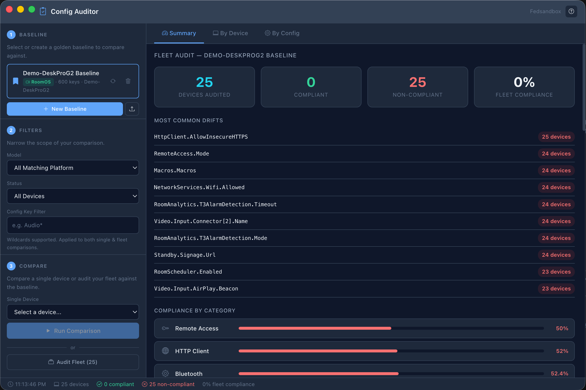

{{ config.cProps.acronyms }}
# Fleet Intelligence: Inventory & Config Auditor

!!! abstract

    You've spent this module configuring one device by hand and by the fleet-load. Time to check
    the fleet's health. Inventory gives you a quick data pull across every device in the org.
    **Config Auditor** goes further: capture a device's configuration as a golden baseline, then
    audit the rest of the fleet against it. We'll use the very macro and configuration you deployed
    earlier in this module as the baseline, so the results actually mean something.

-   <i class="fa-solid fa-location-dot"></i> **Where**

    ---

    ==Apps== → Fleet Management → Inventory & Config Auditor

-   <i class="fa-solid fa-clock"></i> **Time**

    ---

    About 8 minutes

-   <i class="fa-solid fa-bullseye"></i> **Goal**

    ---

    Pull fleet inventory data and audit the whole lab fleet against your own device

??? lesson "{{config.cProps.dep.sectionIds.cD}}.7 Lab"

    <highlight_1>{{config.cProps.dep.sectionIds.cD}}.7.1</highlight_1> Open CE-Deploy. Use the organization switcher at the top of the
    window (or the ==Organizations== screen in the left sidebar) to activate your ==Cloud==
    organization from "Connect CE-Deploy to Your Organization," the first CE-Deploy lesson of this
    module.

    <highlight_1>{{config.cProps.dep.sectionIds.cD}}.7.2</highlight_1> In the left sidebar, select ==Apps==. This opens a dashboard of
    feature cards grouped into categories. Under the ==Fleet Management== category, click the
    ==Inventory== card.

    <highlight_1>{{config.cProps.dep.sectionIds.cD}}.7.3</highlight_1> Explore the device data available — serial numbers, model, software
    version, and registration status for every device in the lab organization. Export to CSV or JSON
    if you'd like to keep a copy.

    <highlight_1>{{config.cProps.dep.sectionIds.cD}}.7.4</highlight_1> Close the Inventory window. Back on the ==Apps== dashboard, still
    under ==Fleet Management==, click the ==Config Auditor== card (green clipboard icon).

    <highlight_1>{{config.cProps.dep.sectionIds.cD}}.7.5</highlight_1> Config Auditor opens in its own window. Click ==New Baseline==. Set
    the Source Device to your pod device — the one you've been configuring all module — and leave
    the Baseline Name as-is. Optionally set a Config Key Filter of `Audio*` to keep the capture
    small and fast. Click ==Capture==.

    <highlight_1>{{config.cProps.dep.sectionIds.cD}}.7.6</highlight_1> With your new baseline selected, choose your device from the
    ==Single Device== dropdown and click ==Run Comparison==. Since you just captured this baseline
    from this same device, you should see 100% compliance — a good sanity check that the feature
    works as expected.

    <highlight_1>{{config.cProps.dep.sectionIds.cD}}.7.7</highlight_1> Now click ==Audit Fleet (N)== (the number matches how many devices
    fit your current filters) to compare every other pod's device against your baseline. Watch the
    progress bar as it queries the fleet in parallel, then review the three result tabs: ==Summary==
    (fleet-wide compliance stats, a Most Common Drifts list, and Compliance by Category bars),
    ==By Device== (per-device compliance with expandable diffs), and ==By Config== (which devices
    drift on each individual setting).

    <figure markdown="span">
      { width="650" }
      <figcaption>The Summary tab after an Audit Fleet run — your own numbers will differ, since this example baseline came from a different device model than the fleet it's auditing</figcaption>
    </figure>

    !!! Success

        You've just audited the entire lab fleet's Audio configuration against your own device in
        seconds. Scale that up to a real deployment of thousands of endpoints and you're catching
        configuration drift long before it becomes a support ticket.

    ??? cedeploy "Worth exploring after class: Environmental Intelligence"

        CE-Deploy 16's flagship new feature is **Environmental Intelligence** (Apps > Fleet
        Management > Environmental Intelligence): real-time temperature, humidity, noise, and
        occupancy monitoring with anomaly detection across your fleet. It's genuinely powerful, but
        its health scores need several days of baseline data to mean anything, so in a single lab
        session you'll mostly see rooms sitting in a "Forming…" state. Take a look at the Health
        Cards and Grid views to get a feel for the UI, then revisit it with a real fleet once it's
        had time to learn your rooms' baselines.

    ??? challenge "Save This as a Template"

        You've now run several multi-step deployments in this module. Next time you open Deployment
        Options for one of them, look for ==Save as Template== — it captures the deployment type,
        form data, and target so you can re-run it with one click from the Apps dashboard next time,
        no re-entry required.
