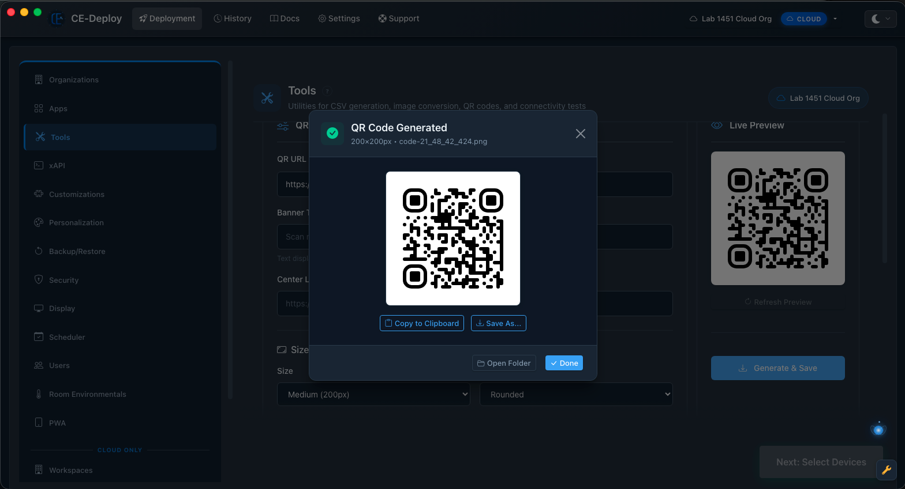
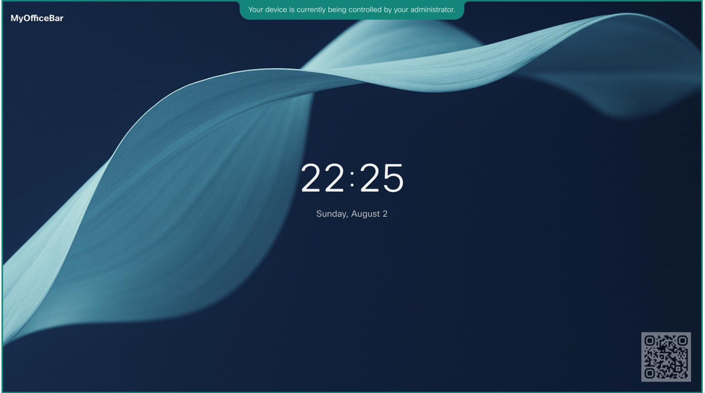

{{ config.cProps.acronyms }}
# Personalization: Device Appearance

!!! abstract

    Branding and Wallpaper used to be two separate screens. Not anymore. CE-Deploy 16 folds them
    into one **Device Appearance** card: a 3×2 grid covering Wallpaper, Halfwake Background, Logo
    (Awake), Logo (Halfwake), Scheduler Background, and Scheduler Logo, all deployed in one pass.
    Desk-series devices (Desk, Desk Mini, Desk Pro) also get three Virtual Background slots. In
    this lab we'll build a QR code and deploy it as a logo to your device, same idea as before, new
    unified interface.

<div class="grid cards" markdown>

-   <i class="fa-solid fa-location-dot"></i> **Where**

    ---

    ==Tools== → QR Code, then ==Personalization==, both in the left sidebar

-   <i class="fa-solid fa-clock"></i> **Time**

    ---

    About 10 minutes

-   <i class="fa-solid fa-bullseye"></i> **Goal**

    ---

    Build a QR code and deploy it as a logo to your device

</div>

??? lesson "{{config.cProps.dep.sectionIds.cD}}.3 Lab"

    <highlight_1>{{config.cProps.dep.sectionIds.cD}}.3.1</highlight_1> Open CE-Deploy. Check the organization switcher at the top of the
    window and confirm your Cloud organization (added in "Connect CE-Deploy to Your Organization")
    is active — activate it from there, or from the ==Organizations== screen in the left sidebar,
    if it isn't.

    !!! Tip

        Your pod tag was already created in the Control Hub "Tag Your Pod Device" lesson at the
        start of this module — no need to create another one here.

    <highlight_1>{{config.cProps.dep.sectionIds.cD}}.3.2</highlight_1> It's time to create a unique QR code using CE-Deploy. In the left
    sidebar select ==Tools==, then click the ==QR Code== tab near the top of the page.

    <highlight_1>{{config.cProps.dep.sectionIds.cD}}.3.3</highlight_1> In the QR URL field enter

    ```text
    https://www.webexone.com/
    ```

    Adjust size or color to your liking — you'll see it update live in the Live Preview pane on the
    right — then click ==Generate & Save==.

    <figure markdown="span">
      { width="650" }
      <figcaption>A "QR Code Generated" modal confirms the file and its name — click Open Folder to jump straight to it</figcaption>
    </figure>

    A ==QR Code Generated== confirmation modal appears showing your code and its filename. Click
    ==Open Folder== to jump straight to where it saved (or ==Save As...== if you'd rather choose a
    different location), then click ==Done== to close the modal.

    <highlight_1>{{config.cProps.dep.sectionIds.cD}}.3.4</highlight_1> In the left sidebar select ==Personalization==. You'll see the
    unified Device Appearance card with a 3×2 grid of upload slots.

    <highlight_1>{{config.cProps.dep.sectionIds.cD}}.3.5</highlight_1> Click into the ==Logo (Awake)== slot and browse to your QR code
    image. Repeat for the ==Logo (Halfwake)== slot using the same image.

    !!! cedeploy "Bonus round: Virtual Backgrounds"

        === "Desk Pro pods"

            The Device Appearance card also has three Virtual Background slots. Try uploading an
            image to one of them, then check ==Enable Camera BG== and set the Background Mode to
            ==Image== — this gives your camera feed a custom background instead of just the screen
            wallpaper.

        === "Room Bar pods"

            Room Bar doesn't have a camera background feature, so the Virtual Background slots
            won't do anything on your pod device. Skip this step and move on to targeting your
            deployment below.

    <highlight_1>{{config.cProps.dep.sectionIds.cD}}.3.6</highlight_1> Scroll down and click ==Next: Select Devices== at the bottom of the
    Personalization page. In the Deployment Options modal that opens, select ==Tags== as the target
    and enter your pod tag.

    <highlight_1>{{config.cProps.dep.sectionIds.cD}}.3.7</highlight_1> In that same modal, check ==Video Devices Only==, then click
    ==Next: Schedule== at the bottom of the modal.

    <highlight_1>{{config.cProps.dep.sectionIds.cD}}.3.8</highlight_1> In the Deployment Scheduler modal, leave ==Run Now== selected and
    click ==Continue==. The deployment console appears — depending on file size this may take a
    moment.

    !!! Success

        Congrats, you just deployed your QR file as a logo using the new unified Device Appearance
        card. You should now see it on your endpoint's home screen :tada: Deploying by tag like this
        scales the same way to hundreds of devices — pair it with the Per-Device Branding (CSV)
        option on the same card and you can push a different logo to every single one.

        <figure markdown="span">
          { width="500" }
          <figcaption>The QR code, deployed and live in the corner of the device's home screen</figcaption>
        </figure>

    ??? challenge "Per-Device Branding via CSV"

        The Device Appearance card has a ==Per-Device Branding (CSV)== checkbox. Enabling it reveals
        a CSV format guide right in the UI. Can you work out the column layout needed to deploy a
        different logo to two different devices in one deployment?
