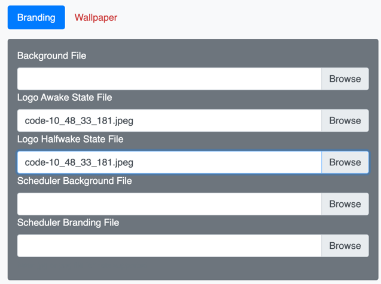

{{ config.cProps.devNotice }}
# Deploy Branding via CE-Deploy

!!! abstract

    Similar to deploying xAPI commands, using CE-Deploy for branding offers unique advantages over 
    using Control Hub. While Control Hub allows for organization-wide branding, CE-Deploy provides 
    greater granularity, enabling deployment down to a single endpoint via a CSV file. This is 
    particularly useful if you have unique QR codes for each endpoint, as you can deliver the images 
    through CE-Deploy using a CSV file, rather than manually deploying them to each endpoint. In 
    this lab, we will deploy a branding image along with a QR code as a logo, helping your users 
    easily access a website of your choosing.

    The widespread adoption of QR codes has introduced unique advantages to branding. While
    it's commonly perceived that branding primarily involves displaying a company's logo on various
    devices, the integration of QR codes can significantly enhance this strategy. By combining branding
    with QR codes, companies can establish a dynamic communication channel with users directly through
    the devices they hold. In this exercise, we will create a QR code that will serve as a branding logo.
    This QR code will provide users with access to information they can conveniently take with them when
    they leave the room.

??? lesson "{{config.cProps.dep.sectionIds.cD}}.4 Lab"

    <highlight_1>{{config.cProps.dep.sectionIds.cD}}.4.1</highlight_1> Open CE-Deploy and load the environment your created in a previous lab.
    
    ??? cedeploy "Loading Environments"
    
        To load an environment, use the dropdown in the Environment loading section and select your
        new Environment and select ==Load Environment==.
    
    <highlight_1>{{config.cProps.dep.sectionIds.cD}}.4.2</highlight_1> In this lab we will be load a background and logo on to our lab device but to help us do that first 
    we must create a tag for your pod's device in Control Hub. Log into the lab control hub instance and find your device. 
    Remember this Control Hub instance is for the entire lab so choosing your pod's device is important as we only want 
    to make changes to just your device.
    
    [Control Hub admin login](https://admin.webex.com/)
    
    <highlight_1>{{config.cProps.dep.sectionIds.cD}}.4.3</highlight_1> Add a tag using your pod ID similar to ==podXXX== format.
    
    <figure markdown="span">
      { width="300" }
      <figcaption></figcaption>
    </figure>
    
    After typing in the tag press enter. The tag will be saved once you press enter.
    
    Now we have a tag added in Control Hub it will be easier to filter to just your device in CE-Deploy as we explore more options.
    
    <highlight_1>{{config.cProps.dep.sectionIds.cD}}.4.4</highlight_1> It is now time to create a unique QR code using CE-Deploy. Open CE-Deploy from the deployment options select 
    ==Tools->QRCode==.
    
    <figure markdown="span">
      { width="300" }
      <figcaption></figcaption>
    </figure>
    
    <highlight_1>{{config.cProps.dep.sectionIds.cD}}.4.5</highlight_1> In the QR URL text box enter
    
    ```text
    https://www.webexone.com/
    ```
    Feel free to adjust the QR Code color palette to your liking or add a center image.
    
    Other options that are available include adding Banner Text or using the QR Code on a background image but 
    today we are using the QR code as a logo.
    
    ??? vidcast "CE-Deploy QR Code"
    
        <div style="padding-bottom:56.25%; position:relative; display:block; width: 100%">
        <iframe src="https://app.vidcast.io/share/embed/02286d09-5585-4a24-9f93-dadd3d0e3e13" width="100%" height="100%" title="CE-Deploy QR Code Feature" frameborder="0" loading="lazy" allowfullscreen style="position:absolute; top:0; left: 0;border: solid; border-radius:12px;"></iframe>
        </div>
    
    <highlight_1>{{config.cProps.dep.sectionIds.cD}}.4.6</highlight_1> Once you have picked your options select ==Process QRCode==.
    
    <figure markdown="span">
      { width="300" }
      <figcaption></figcaption>
    </figure>
    
    Everytime you select ==Process QRCode== a new QR Code file is generated with a timestamp embedded in the name.
    For example code-09_47_51_582.jpeg. Feel free to generate as many codes as you like, you will need to pick one for the next step.
    
    <highlight_1>{{config.cProps.dep.sectionIds.cD}}.4.7</highlight_1> Once you see the preview of your QR Code select the ==Open QR File== button. 
    Take note of the location of the QR Code or copy and paste the QR code file 
    somewhere you can easily find for the next step.
    
    <highlight_1>{{config.cProps.dep.sectionIds.cD}}.4.8</highlight_1> Next we are going to use the ==Personalization->Branding== deployment option.
    
    <figure markdown="span">
      { width="300" }
      <figcaption></figcaption>
    </figure>
    
    Click Browse on the ==Logo Awake State File==. Find your QR Logo and select it using the file picker.
    Next click Browse on the ==Logo HalfWake State File==. Find your QR logo and select it using the file picker.
    Once both file are selected it should look like the screenshot below.
    
    <figure markdown="span">
      { width="300" }
      <figcaption></figcaption>
    </figure>
    
    <highlight_1>{{config.cProps.dep.sectionIds.cD}}.4.9</highlight_1> In the ==Deployment Options== section dropdown select ==Tags== and enter your pod tag in the text box
    
    <figure markdown="span">
      { width="300" }
      <figcaption></figcaption>
    </figure>
    
    <highlight_1>{{config.cProps.dep.sectionIds.cD}}.4.10</highlight_1> Ensure the ==Video Devices Only== checkbox is checked.
    
    <highlight_1>{{config.cProps.dep.sectionIds.cD}}.4.12</highlight_1> Press button Start Deployment.
    
    <highlight_1>{{config.cProps.dep.sectionIds.cD}}.4.13</highlight_1> Ensure the ==Scheduler== has the ==Run Deployment Now== check box selected and click ==Next==.
    
    <highlight_1>{{config.cProps.dep.sectionIds.cD}}.4.14</highlight_1> The Message Console will now appear, you can follow along the deployment process.
    
    <figure markdown="span">
      { width="300" }
      <figcaption></figcaption>
    </figure>

    !!! Success
    
        Congrats you just deployed your QR file as a logo using branding to your endpoint. You should now see
        the QR on the screen of your endpoint home screen. This was a pretty simple example, but as you can imagine 
        if you have 100's or 1000's of endpoints to deploy new branding assets to this could save 
        hours of work. By using tags to deploy your branding you can now see how effect filtering is. 
        You could deploy unique branding assets to different devices based on the tags you create.