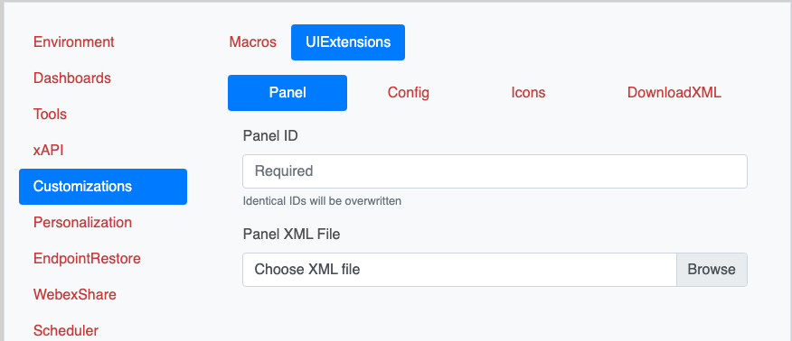

{{ config.labVariables.devNotice }}
# 4.11 Deploy Extensions via CE-Deploy

!!! abstract

    Extensions enable companies to enhance and personalize the user experience. These extensions 
    can be deployed through Control Hub or CE-deploy. In this lab, we will deploy an extension to 
    accompany our macro from the last lab.

??? lesson "4.11 Lessons"

    4.11.1 Open CE-Deploy and load your environment you created in the previous lab if it's not already loaded
    
    ??? Tip "Loading Environments"
    
        To load an environment, use the dropdown in the Environment loading section and select your
        new Environment and select ==Load Environment==.
    
    Then select ==Design->Macro Editor== from the main menu
    
    <figure markdown="span">
      { width="300" }
      <figcaption></figcaption>
    </figure>
    
    4.11.2 The Macro Editor can also be used to create our XML file. Copy the text below and paste it into 
    the Macro Editor and save the file as ==LaunchHalfwake.xml==. Be sure to change the default extension from 
    .js to .xml
    
    ```xml title="LaunchHalfwake.xml" linenums="1"
    <Extensions>
      <Version>1.8</Version>
      <Panel>
        <Order>1</Order>
        <PanelId>halfwake</PanelId>
        <Origin>local</Origin>
        <Type>Home</Type>
        <Icon>Power</Icon>
        <Color>#07C1E4</Color>
        <Name>HalfWake</Name>
        <ActivityType>Custom</ActivityType>
      </Panel>
    </Extensions>
    ```
    It should look something like this:
    
    <figure markdown="span">
      { width="300" }
      <figcaption></figcaption>
    </figure>
    
    4.11.3 Now we have our xml file lets role it out to our endpoint. For a single panel in the deployment panel select 
    ==Customizations->UIExtensions->Panel==. This allows ot deploy or update a single panel.
    
    <figure markdown="span">
      { width="300" }
      <figcaption></figcaption>
    </figure>
    
    !!! Tip
        
        When deploying a single panel using the same panel ID will create a new panel the first time, but subsequent 
        uses of the same ID will overwrite existing panels. 
        
        To update more than 1 panel use the Customizations->UIExtensions->Config deployment panel feature.
        This allows the upload of xml files that contain multiple panels.
    
    4.11.4 In the panel ID text box enter ==halfwake== as the panel ID. Using the Browse file picker select your 
    xml file you created in the last step.
    
    <figure markdown="span">
      { width="300" }
      <figcaption></figcaption>
    </figure>
    
    4.11.5 Under deployment Options use the dropdown to select Tags and enter your pod tag for your device.
    
    <figure markdown="span">
      { width="300" }
      <figcaption></figcaption>
    </figure>
    
    4.11.6 Ensure the ==Video Devices Only== checkbox is checked.
    
    !!! warning
    
        An error may occur if this check box is not selected. Just make sure that it is checked
        if you receive an error while deploying.
    
    4.11.7 Press button Start Deployment.
    
    4.11.8 Ensure the ==Scheduler== has the ==Run Deployment Now== check box selected and click ==Next==.
    
    4.11.9 The Message Console will now appear, you can follow along the deployment process.

    !!! Success
    
        Its test time. The halfwake button should now appear on your home screen of your device. 
        Pressing the button should place your endpoint into the halfwake state.