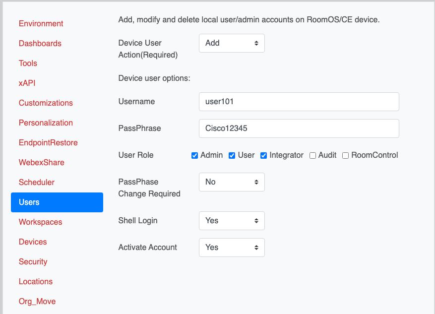
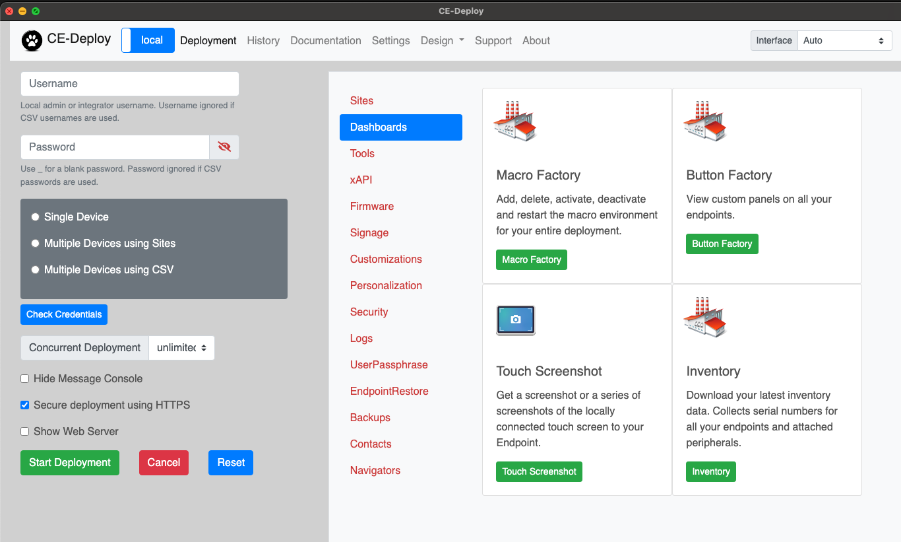

{{ config.cProps.devNotice }}
# Deploy a local user admin using CE-Deploy

!!! abstract

    A local user admin account allows direct access to the device without needing to go through 
    its web portal via Control Hub or the cloud xAPI. Some tasks and configuration options are not available 
    via the cloud, so having a local admin account provides a way to set configurations 
    and manage personal mode devices. Typically, setting up a new cloud device removes local 
    admin accounts, making the device's web portal accessible only through Control Hub. In this lab,
    you will add a new local admin account to the device via the cloud xAPI using CE-Deploy. 

??? lesson "4.12 Lessons"
    
    4.12.1 Open CE-Deploy and load your environment you created in the previous lab
    
    ??? Tip "Loading Environments"
    
        To load an environment, use the dropdown in the Environment loading section and select your
        new Environment and select ==Load Environment==.
    
    Then select ==Users== from the deployment panel
    
    <figure markdown="span">
      { width="300" }
      <figcaption></figcaption>
    </figure>
    
    !!! Tip "Device Users"
        
        Device users allows us to add, delete and modify device users via the cloud xAPI in CE-Deploy. If you doing
        integrations with 3rd party's, setting configurations or doing device backups having a local admin 
        account on the device may be critical for day to day operations. CE-Deploy can access a device by the
        IP address to take advantage of the local admin account. 
    
    4.12.2 Set the following setting.
    
    
    | `Setting`            | <!-- -->                |
    |----------------------|-------------------------|
    | `Device User Action` | Add                     |
    | `Username`           | userxxx(yourPodNumber)  |
    | `Passphrase`         | Cisco12345              |
    | `User Role`          | Admin, User, Integrator |
    | `PassPhase Change`   | No                      |
    | `Shell Login`        | Yes                     |
    | `Activate Account`   | Yes                     |
    
    
    <figure markdown="span">
      { width="300" }
      <figcaption></figcaption>
    </figure>
    
    4.12.3 Under deployment Options use the dropdown to select Tags and enter your pod tag for your device.
    
    <figure markdown="span">
      { width="300" }
      <figcaption></figcaption>
    </figure>
    
    4.12.4 Ensure the ==Video Devices Only== checkbox is checked.
    
    4.12.5 Press button ==Start Deployment==.
    
    4.12.6 Ensure the ==Scheduler== has the ==Run Deployment Now== check box selected and click ==Next==.
    
    4.12.7 The Message Console will now appear, you can follow along the deployment process.
    
    !!! challenge "Network IP Address Challenge"
        
        In the next portion of the lab you will need the IP address of your pods endpoint. Using the 
        command below in CE-Deploy can you retrieve your IP?

        ```text
            xStatus Network[1] IPv4 Address
        ```
    
    4.12.8 To test the local admin account we are going to switch CE-Deploy into local mode from cloud
    and run an xAPI command directly to the device.
    
    Select the cloud/local toggle in the main navigation bar.
    
    <figure markdown="span">
      { width="150" }
      <figcaption></figcaption>
    </figure>
    
    Ensure that it is set to local and the interface updates:
    
    <figure markdown="span">
      { width="300" }
      <figcaption></figcaption>
    </figure>
    
    Now we can use the IP address of the device to send commands.
    
    4.12.9 Using the IP address from the IP challenge  and your new local admin username and password
    enter the details as shown along with the command:
    
    ```text
    xCommand time datetime get
    ```
    
    <figure markdown="span">
      { width="300" }
      <figcaption></figcaption>
    </figure>
    
    4.12.10 Click on ==Start Deployment==
    
    4.12.11 Ensure the ==Scheduler== has the ==Run Deployment Now== check box selected and click ==Next==.
    
    4.12.13 The Message Console will now appear, you can follow along the deployment process.
    
    <figure markdown="span">
      { width="300" }
      <figcaption></figcaption>
    </figure>

    !!! Success
    
        All done. Congrats, you have now seen the most commonly used functions in CE-Deploy, but there 
        is still plenty to explore. Stay on the local tab as we dive in deep to some lesser known features.