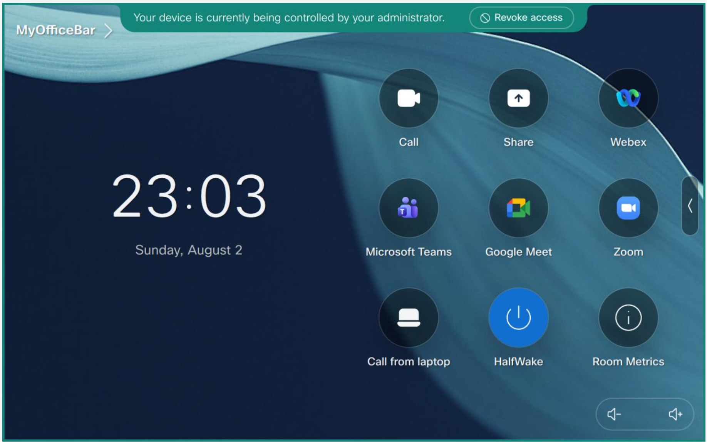

{{ config.cProps.acronyms }}
# Customizations: Macros (xAPI Forge) & UI Extensions

!!! abstract

    Macros and UI Extensions almost always travel together: a macro needs a button to trigger it,
    and a button needs a macro listening for the click. The old Macro Editor Pro is retired in
    CE-Deploy 16, replaced by **xAPI Forge**, a full Monaco-based IDE with xAPI IntelliSense, an AI
    assistant, and a live device connection for streaming macro engine logs. In this lab you'll
    write a macro in xAPI Forge, publish it straight into CE-Deploy, deploy it and its matching
    panel to your device with your pod tag, then confirm it's actually running.

<div class="grid cards" markdown>

-   <i class="fa-solid fa-location-dot"></i> **Where**

    ---

    ==Apps== → Design & Development → xAPI Forge, then ==Customizations==

-   <i class="fa-solid fa-clock"></i> **Time**

    ---

    About 12 minutes

-   <i class="fa-solid fa-bullseye"></i> **Goal**

    ---

    Write a macro, publish it, and deploy it plus its matching panel to your device

</div>

??? lesson "{{config.cProps.dep.sectionIds.cD}}.4 Lab"

    <highlight_1>{{config.cProps.dep.sectionIds.cD}}.4.1</highlight_1> Open CE-Deploy. Check the organization switcher at the top of the
    window and confirm your Cloud organization (added in "Connect CE-Deploy to Your Organization")
    is active. In the left sidebar select ==Apps==, then under the ==Design & Development== category
    click the ==xAPI Forge== card. It opens in its own window.

    !!! cedeploy "Not under a Design menu anymore"

        If you've used an older CE-Deploy version, you may remember a "Design" item in the main
        menu bar. That's gone in this version — all the design tools, including xAPI Forge, moved
        into the Apps dashboard.

    <highlight_1>{{config.cProps.dep.sectionIds.cD}}.4.2</highlight_1> Type the following into a new file and save it as ==LaunchHalfwake.js==:

    ```Javascript title="LaunchHalfwake.js" linenums="1"
    import xapi from 'xapi';

    xapi.Event.UserInterface.Extensions.Panel.Clicked.on((e) => {
      if (e.PanelId === 'halfwake') {
        xapi.Command.Standby.Halfwake();
      }
    });
    ```

    ??? challenge "Optional: Try the AI Assistant"

        This challenge is optional and is **not required to complete the lab**. xAPI Forge defaults
        to Claude for its AI Assistant, which requires a valid Anthropic API key with available API
        credits. The lab does not provide this key.

        If you already have a suitable key and want to try the feature, open the AI Assistant
        settings, select ==Claude==, enter your Anthropic API key, and test the connection. Then
        click ==AI== in the toolbar and ask it to "Create a macro that puts the device into halfwake
        when a panel called halfwake is clicked." Compare its result with the required snippet
        above, then use ==Explain== to see how the assistant describes the code.

        If you do not have a valid Claude API key, skip this challenge and type the supplied macro
        exactly as shown. You will not lose any required lab functionality.

    <highlight_1>{{config.cProps.dep.sectionIds.cD}}.4.3</highlight_1> **Optional development test:** click ==Connect== in the Device
    panel, select your pod device from the cloud device picker, and click ==Connect==. Once
    connected, click ==Deploy== to push the macro directly and watch the engine logs stream in at
    the bottom of the window. This tests one device while you are developing; it does not replace
    the required Publish and tag-targeted deployment workflow in the next steps. If you skip this
    optional test, continue directly to step {{config.cProps.dep.sectionIds.cD}}.4.4.

    <highlight_1>{{config.cProps.dep.sectionIds.cD}}.4.4</highlight_1> When you're happy with the macro, click ==Publish== to send it to
    the main CE-Deploy window for bulk deployment.

    <highlight_1>{{config.cProps.dep.sectionIds.cD}}.4.5</highlight_1> Close xAPI Forge and go back to the main CE-Deploy window. In the
    left sidebar select ==Customizations==, then the ==Macros== tab near the top of the page. Your
    published macro should already be selected. Name it ==LaunchHalfwake== and ensure the
    ==Activate on deployment== checkbox is selected.

    <highlight_1>{{config.cProps.dep.sectionIds.cD}}.4.6</highlight_1> Click ==Next: Select Devices== at the bottom of the page. In the
    Deployment Options modal, select ==Tags== as the target and enter your pod tag, then check
    ==Video Devices Only==. Click ==Next: Schedule==, leave ==Run Now== selected in the Deployment
    Scheduler modal, and click ==Continue==.

    <highlight_1>{{config.cProps.dep.sectionIds.cD}}.4.7</highlight_1> You've deployed and activated a macro, but unlike the device's own
    web admin portal, the API doesn't restart the macro engine for you automatically. In the left
    sidebar select ==xAPI== and, in the Command Builder's command card, enter:

    ```text
    xCommand Macros Runtime Restart
    ```

    Click ==Next: Select Devices==, target it at your pod tag with ==Video Devices Only== checked
    (same as before), then ==Next: Schedule== and ==Continue==.

    <highlight_1>{{config.cProps.dep.sectionIds.cD}}.4.8</highlight_1> Now let's give the macro a button to trigger it. Back in xAPI Forge,
    create a new file with this content and save it as ==LaunchHalfwake.xml== (change the default
    extension from `.js` to `.xml`):

    ```xml title="LaunchHalfwake.xml" linenums="1"
    <Extensions>
      <Version>1.8</Version>
      <Panel>
        <Order>1</Order>
        <PanelId>halfwake</PanelId>
        <Origin>local</Origin>
        <Type>Home</Type>
        <Icon>Power</Icon>
        <Color>#07C1E4</Color>
        <Name>HalfWake</Name>
        <ActivityType>Custom</ActivityType>
      </Panel>
    </Extensions>
    ```

    <highlight_1>{{config.cProps.dep.sectionIds.cD}}.4.9</highlight_1> Back in the main CE-Deploy window, in the left sidebar select
    ==Customizations==, then click the ==UI Extensions== tab near the top of the page. Within it,
    stay on the nested ==Panel== tab (as opposed to ==Config==, which replaces every panel on the
    device at once). Enter ==halfwake== as the Panel ID and browse to your XML file.

    !!! Tip

        Deploying a single panel with the same Panel ID creates it the first time and overwrites it
        on every later deploy. If you ever need to push more than one panel at once, use the nested
        ==Config== tab instead, which accepts an XML file containing several `<Panel>` blocks.

    <highlight_1>{{config.cProps.dep.sectionIds.cD}}.4.10</highlight_1> Click ==Next: Select Devices== at the bottom of the page. In the
    Deployment Options modal, select ==Tags== as the target, enter your pod tag, and check
    ==Video Devices Only==.

    !!! warning

        An error may occur if this checkbox is not selected. Make sure it's checked if you receive an
        error while deploying.

    <highlight_1>{{config.cProps.dep.sectionIds.cD}}.4.11</highlight_1> Click ==Next: Schedule==, leave ==Run Now== selected in the
    Deployment Scheduler modal, and click ==Continue==. The message console shows the deployment in
    progress.

    !!! Success

        The halfwake button should now appear on your device's home screen. Press it and the
        device drops into halfwake :smiley: Look at you go: a working macro and its matching UI
        extension, written, tested, and deployed entirely from CE-Deploy.

        <figure markdown="span">
          { width="600" }
          <figcaption>The HalfWake button, live on the touch panel — same icon, color, and name from the XML you wrote</figcaption>
        </figure>

    ??? challenge "Catch Your Own Drift"

        Later in this module you'll use Config Auditor to audit a fleet's configuration against a
        baseline. Its sibling feature, Macro Drift Detection, does the same thing for macros: it can
        tell you if a device's macro has drifted from what you just deployed. Worth a look after
        this lab if you have time.
