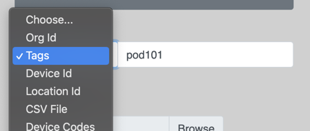

{{ config.cProps.devNotice }}
{{ config.cProps.acronyms }}
# Deploy Macros via CE-Deploy

!!! abstract

    Macros enhance your customization capabilities, allowing you to tailor your experience exactly 
    as you want it. However, deploying these macros can be challenging, especially when dealing 
    with multiple endpoints. While Control Hub supports single-endpoint deployment, this approach 
    becomes cumbersome and time-consuming for larger deployments. With CE-Deploy, you can roll out 
    a macro in minutes to hundreds or even thousands of endpoints. The CE-Deploy Macro Factory also 
    enables you to monitor your deployment for consistency and performance without needing to log 
    into the endpoint admin portal or control hub. Additionally, you can write your macro code 
    directly in CE-Deploy and deploy it in just a few easy steps. In this lab, we will write a new 
    macro, save it, and deploy it to your endpoints. We will then use the Macro Factory  to monitor 
    the rollout of everyone's macros.

??? vidcast "CE-Deploy Macro deployment and the Macro Factory"

    <div style="padding-bottom:56.25%; position:relative; display:block; width: 100%">
	    <iframe src="https://app.vidcast.io/share/embed/5a2a7a03-441a-48d4-afa9-4dccc47c48c3" width="100%" height="100%" title="CE-Deploy Macro Deployment and the Macro Factory" frameborder="0" loading="lazy" allowfullscreen style="position:absolute; top:0; left: 0;border: solid; border-radius:12px;"></iframe>
    </div>

??? lesson "{{config.cProps.dep.sectionIds.cD}}.5 Lab"

    <highlight_1>{{config.cProps.dep.sectionIds.cD}}.5.1</highlight_1> Open CE-Deploy and load your environment you created in the previous lab
    
    ??? cedeploy "Loading Environments"
    
        To load an environment, use the dropdown in the Environment loading section and select your
        new Environment and select ==Load Environment==.
    
    Then select ==Design->CE Macro Editor Pro== from the main menu
    
    <figure markdown="span">
      { width="300" }
      <figcaption></figcaption>
    </figure>
    
    <highlight_1>{{config.cProps.dep.sectionIds.cD}}.5.2</highlight_1> Copy the following code and paste it into the editor page and save the file as ==LaunchHalfwake.js==
    
    ```Javascript title="LaunchHalfwake.js" linenums="1"
    import xapi from 'xapi';
    
    xapi.Event.UserInterface.Extensions.Panel.Clicked.on((e) => {
      if (e.PanelId === 'halfwake') {
        xapi.Command.Standby.Halfwake();
      }
    });
    ```
    Once completed it should look like the screenshot below.
    
    <figure markdown="span">
      { width="300" }
      <figcaption></figcaption>
    </figure>
    
    <highlight_1>{{config.cProps.dep.sectionIds.cD}}.5.3</highlight_1> Click ==Save As==.
    
    <highlight_1>{{config.cProps.dep.sectionIds.cD}}.5.4</highlight_1> Name your file and select a directory ==LaunchHalfwake.js== and click ==Save==
    
    <highlight_1>{{config.cProps.dep.sectionIds.cD}}.5.5</highlight_1> Exit the Macro Editor.
    
    <highlight_1>{{config.cProps.dep.sectionIds.cD}}.5.6</highlight_1> Select ==Customizations->Macros== from the deployment features panel.
    
    <highlight_1>{{config.cProps.dep.sectionIds.cD}}.5.7</highlight_1> Using the Macros deployment feature we can easily deploy a macro to hundreds of endpoints in minutes.
    Name your macro LaunchHalfwake and use the Macro Javascript File Browse button to select 
    the js file you create just moments ago.
    
    Ensure the ==Activate on deployment== checkbox is selected.
    
    <highlight_1>{{config.cProps.dep.sectionIds.cD}}.5.8</highlight_1> Under deployment Options use the dropdown to select Tags and enter your pod tag for your device.
    
    <figure markdown="span">
      { width="300" }
      <figcaption></figcaption>
    </figure>
    
    <highlight_1>{{config.cProps.dep.sectionIds.cD}}.5.9</highlight_1> Again ensure the ==Video Devices Only== checkbox is selected.
    
    <highlight_1>{{config.cProps.dep.sectionIds.cD}}.5.10</highlight_1> Press button Start Deployment.
    
    <highlight_1>{{config.cProps.dep.sectionIds.cD}}.5.11</highlight_1> Ensure the ==Scheduler== has the ==Run Deployment Now== check box selected and click ==Next==.
    
    <highlight_1>{{config.cProps.dep.sectionIds.cD}}.5.12</highlight_1> The Message Console will now appear, you can follow along the deployment process.
    
    <figure markdown="span">
      { width="300" }
      <figcaption></figcaption>
    </figure>

    <highlight_1>{{config.cProps.dep.sectionIds.cD}}.5.13</highlight_1> You just deployed a macro to your device and activated it, we still need one more step 
    to ensure that it is in fact running. Unlike the device web admin portal which will restart the macro engine
    automatically everytime a change is made to a macro the APIs are not as polite. So in the next step
    we will use CE-Deploy xCommand to restart the endpoint macro engine.
    
    <highlight_1>{{config.cProps.dep.sectionIds.cD}}.5.14</highlight_1> Open the deployment panel xAPI->Command feature and enter the restart command:
    
    ```text
    xCommand Macros Runtime Restart
    ```
    <figure markdown="span">
      { width="300" }
      <figcaption></figcaption>
    </figure>
    
    <highlight_1>{{config.cProps.dep.sectionIds.cD}}.5.15</highlight_1> Under deployment Options use the dropdown to select Tags and enter your pod tag for your device.
    
    <figure markdown="span">
       { width="300" }
      <figcaption></figcaption>
    </figure>
    
    <highlight_1>{{config.cProps.dep.sectionIds.cD}}.5.16</highlight_1> Ensure the ==Video Devices Only== checkbox is checked.
    
    <highlight_1>{{config.cProps.dep.sectionIds.cD}}.5.17</highlight_1> Press button Start Deployment.
    
    <highlight_1>{{config.cProps.dep.sectionIds.cD}}.5.18</highlight_1> Ensure the ==Scheduler== has the ==Run Deployment Now== check box selected and click ==Next==.
    
    <highlight_1>{{config.cProps.dep.sectionIds.cD}}.5.19</highlight_1> The Message Console will now appear, you can follow along the deployment process.
    
    <highlight_1>{{config.cProps.dep.sectionIds.cD}}.5.20</highlight_1> We have our macro rolled out across all our endpoints but lets checkin on the other pods and see how they 
    doing. We are going to use the Macro Factory to monitor how the other pods are doing. In the deployment panel
    select the Dashboards. Do not select the Macro Factory just yet. First we need to select our deployment option.
    
    <figure markdown="span">
      { width="300" }
      <figcaption></figcaption>
    </figure>
    
    <highlight_1>{{config.cProps.dep.sectionIds.cD}}.5.21</highlight_1> This time around we are going to select the ==Org Id==
    
    <figure markdown="span">
      { width="300" }
      <figcaption></figcaption>
    </figure>
    
    When you select Org Id, the id automatically populates for our lab Control Hub org.
    
    <highlight_1>{{config.cProps.dep.sectionIds.cD}}.5.22</highlight_1> Select the Macro Factory from the Dashboards
    
    <figure markdown="span">
      { width="300" }
      <figcaption></figcaption>
    </figure>
    
    You should now see the Macro Factory appear with all the pod endpoints that have added their macros.
    
    <figure markdown="span">
      { width="300" }
      <figcaption></figcaption>
    </figure>
    
    Take a look around. Keep it open and move the window to the side when done. We are going to 
    use the Macro Factory to clean up later.

    !!! Success

        Now that we have our macro deployed we will turn our attention to deploying the accompanying
        extension to make it work.

    ??? challenge "Macro Factory Add a Macro"
        
        Can you load or remove a different Macro from an earlier lab? Have a go, its easy.

!!! Tip
    
    Things to note for the Macro Factory.

    1. Visual way to monitor macros
    2. Easy to use buttons, no need to remember commands
    3. Great for managment of a few endpoints adding, removing and activating macros
    4. For large bulk rollouts of Macros using the Deployment panel Customizations->Macros is a better option