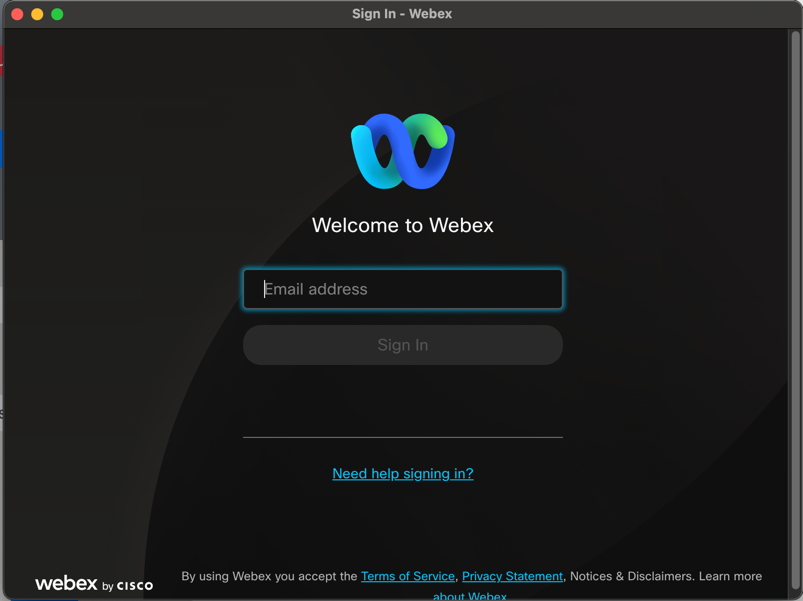
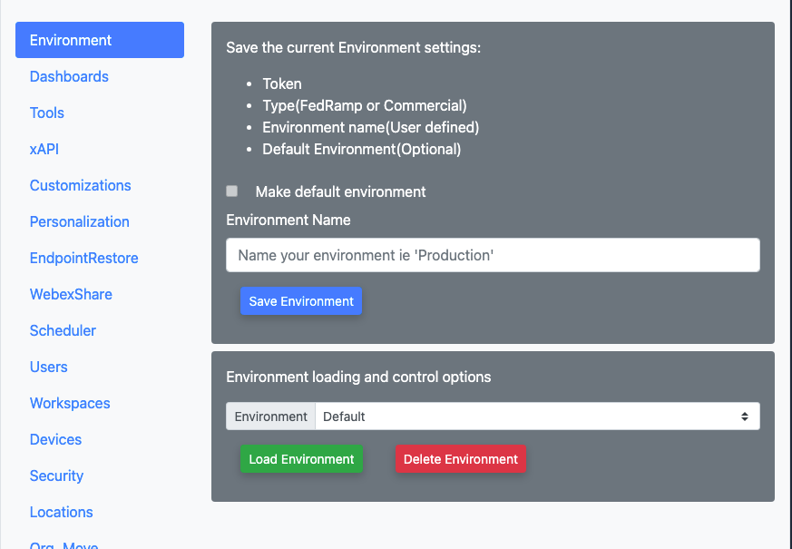
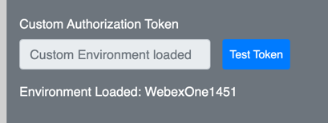
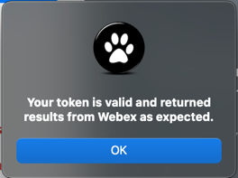

{{ config.cProps.acronyms }}
# Download a Webex token and create an Environment in CE-Deploy

!!! abstract

    Environments enable an admin to download access and refresh tokens into CE-Deploys OS secure store, 
    which are refreshed daily. This feature is particularly useful for admins who need to access 
    multiple Control Hub instances. By utilizing environments, admins can streamline the deployment 
    process. Instead of logging into Webex everytime you need to perform a deployment you can simply select the appropriate 
    environment, load the token from the secure store, and perform the required deployment.

??? vidcast "Creating CE-Deploy Environments"

    

	    <iframe src="https://app.vidcast.io/share/embed/8e846983-6528-46e9-9b95-7d1a3ae2f5b3" width="100%" height="100%" title="CE-Deploy Environments Training" frameborder="0" loading="lazy" allowfullscreen style="position:absolute; top:0; left: 0;border: solid; border-radius:12px;"></iframe>
    

??? lesson "{{config.cProps.dep.sectionIds.cD}}.2 Lab"

    <highlight_1>{{config.cProps.dep.sectionIds.cD}}.2.1</highlight_1> Open CE-deploy and select the Download Webex Token button in the manage token section
    
    <figure markdown="span">
      { width="300" }
      <figcaption></figcaption>
    </figure>
    
    <highlight_1>{{config.cProps.dep.sectionIds.cD}}.2.2</highlight_1> Sign in to Webex and accept the integration permissions when prompted. This will load 
    your token and refresh token into the default environment. This is not a persistent environment 
    so will want to save our tokens into the secure store for repeated use.

    <figure markdown="span">
      { width="300" }
      <figcaption></figcaption>
    </figure>
    
    <highlight_1>{{config.cProps.dep.sectionIds.cD}}.2.3</highlight_1> In the deployment features panel select =="Environment"==.
    
    <figure markdown="span">
      { width="300" }
      <figcaption></figcaption>
    </figure>
    
    <highlight_1>{{config.cProps.dep.sectionIds.cD}}.2.4</highlight_1> In the Environment Name section, enter EnvLab and 
    click Save Environment. The new environment is now saved, but the default will continue to be used unless you load 
    the newly saved environment token. With this setup, you can control which Control Hub instance to deploy to. If you 
    have multiple Control Hub instances, simply switch between different environments as you save them. Token refresh is 
    automatic but can also be done manually after the environment is loaded.
    
    <highlight_1>{{config.cProps.dep.sectionIds.cD}}.2.5</highlight_1> To load our new environment, use the dropdown in the Environment loading section and select your 
    new Environment  and select =="Load Environment"==.

    <figure markdown="span">
      { width="300" }
      <figcaption></figcaption>
    </figure>
    
    <highlight_1>{{config.cProps.dep.sectionIds.cD}}.2.6</highlight_1> You should now see your environment name populate the Environment Loaded text under manage Token.
    
    <figure markdown="span">
      { width="300" }
      <figcaption></figcaption>
    </figure>
    
    <highlight_1>{{config.cProps.dep.sectionIds.cD}}.2.7</highlight_1> To test your token click the =="Test Token"== button. You should see the response below:
    
    <figure markdown="span">
      { width="300" }
      <figcaption></figcaption>
    </figure>

    !!! Success
    
        Congrats, your token is now downloaded, you are ready to roll. You can build as many 
        Environments as you require. Whether you have a test and production Orgs or you are a 
        partner managing multiple customer Orgs this removes the need to always be logging in
        everytime you need to complete a deployment. The refresh token expires after 90 days so by
        keeping the app open you wont need to log in everytime you need to do a deployment.