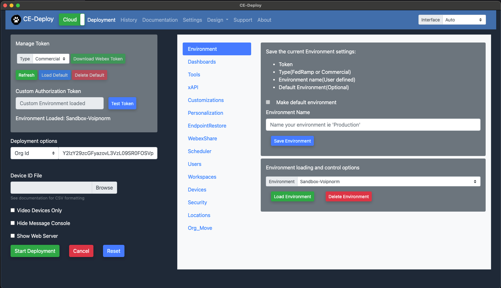
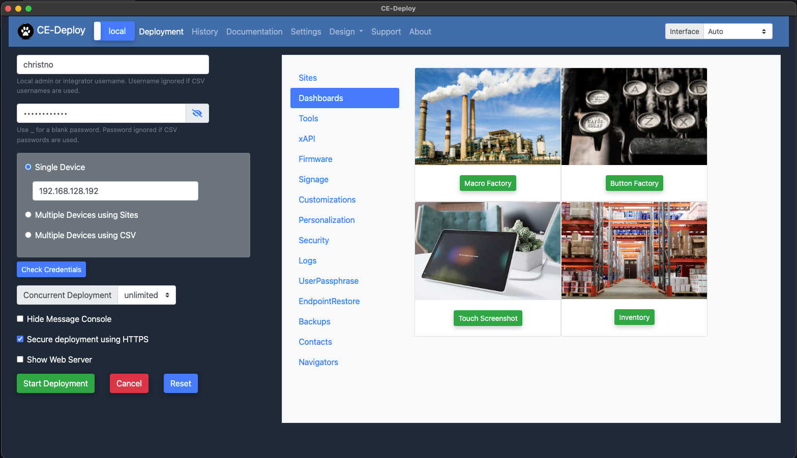
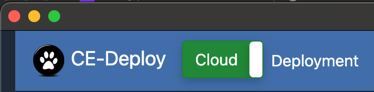
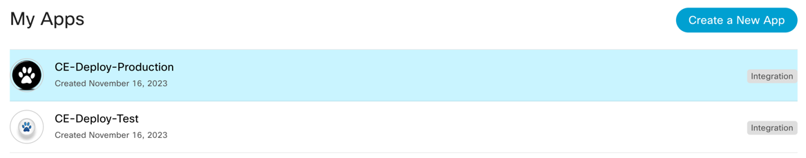
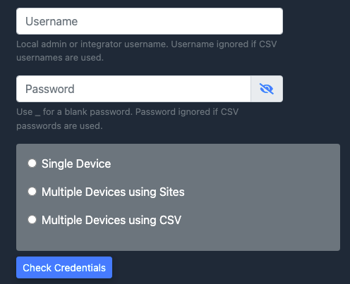

{{ config.cProps.acronyms }}
# Switch Between Deploying via Cloud xAPI and Local xAPI

!!! abstract

    In this brief lab we explore how you can use CE-Deploy to deploy in Cloud or Local mode. We will explore switching 
    CE-Deploy between the Cloud mode used for deploying commands Control Hub cloud xAPI and using the local API interface
    of the device.

??? lesson "{{config.cProps.dep.sectionIds.cD}}.1 Lab"
    
    <highlight_1>{{config.cProps.dep.sectionIds.cD}}.1.1</highlight_1> To kick things off this short lab shows the two 
    primary interfaces of CE-Deploy(CED) which are controlled by a switch to back and forth between Cloud and Local.

    The figure below show CED in cloud mode.

    <figure markdown="span">
      { width="300" }
      <figcaption></figcaption>
    </figure>

    The figure below shows CED in Local Mode.    

    <figure markdown="span">
      { width="300" }
      <figcaption></figcaption>
    </figure>

    To switch between modes click the mode toggle which by default is set to cloud.

    <figure markdown="span">
      { width="300" }
      <figcaption></figcaption>
    </figure>

    <highlight_1>{{config.cProps.dep.sectionIds.cD}}.1.2</highlight_1> In Cloud mode CE-Deploy utilises a classic Webex 
    Control Hub integration.

    <figure markdown="span">
      { width="300" }
      <figcaption></figcaption>
    </figure>

    <highlight_1>{{config.cProps.dep.sectionIds.cD}}.1.3</highlight_1> In local mode we need to two elments to allow us 
    to process commands. Direct accesss to the device IP address and also a local admin account on the device.

    <figure markdown="span">
      { width="300" }
      <figcaption></figcaption>
    </figure>

    We will be addressing the local admin account in a later lab, for now just take note of whats required to complete a 
    deployment accessing the endpoint directly. Note: CE-Deploy takes advantage of Websockets which by default is tied to the
    NetworkServices HTTP Mode setting which must be enabled. 

    !!! Success

        Depending on the configuration you need to roll out, you may use either cloud or local options. While local has 
        some limitations, it may be the only way to change certain settings, since those same settings might be read-only in the cloud.

    ??? challenge "Find My Setting!"
        
        Can you find the setting NetworkServices HTTP Mode and check that it is enabled either in Control Hub or directly
        directly on the endpoint?
    