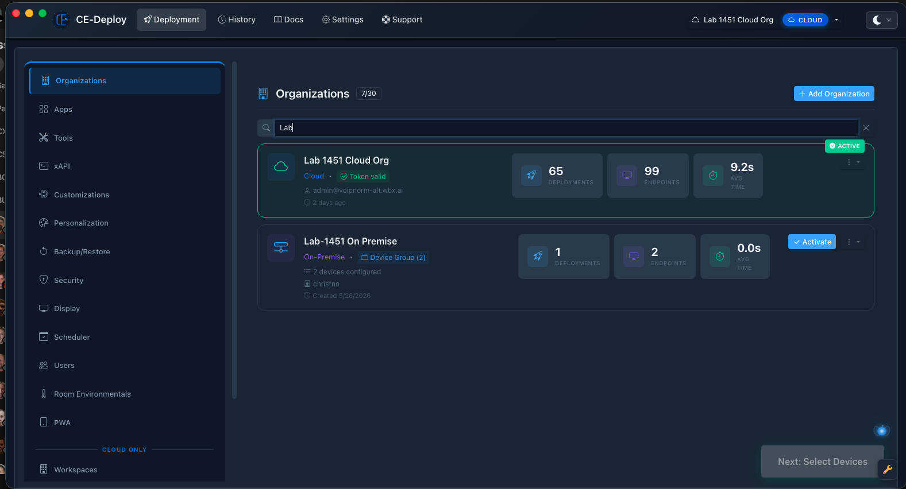

{{ config.cProps.acronyms }}
# Connect CE-Deploy to Your Organization

!!! abstract

    Remember hunting down a developer token and pasting it into CE-Deploy every session? That's
    gone. CE-Deploy 16 introduces **Organizations**: every place you can deploy to, whether it's a
    Webex cloud org or an on-premises device reachable by direct IP, gets added once through the
    same Add Organization screen and activated with a click from then on. In this lab you'll
    connect CE-Deploy to the lab's Webex org over OAuth, add an On-Premise organization for your
    pod's direct device access, and learn to switch between the two. Everything else in this
    module builds on what you set up here, so don't skip it.

-   <i class="fa-solid fa-location-dot"></i> **Where**

    ---

    ==Organizations== in the left sidebar

-   <i class="fa-solid fa-clock"></i> **Time**

    ---

    About 10 minutes

-   <i class="fa-solid fa-bullseye"></i> **Goal**

    ---

    Add a Cloud org and an On-Premise org, and learn to switch between them

??? lesson "{{config.cProps.dep.sectionIds.cD}}.1 Lab"

    <highlight_1>{{config.cProps.dep.sectionIds.cD}}.1.1</highlight_1> Open CE-Deploy and select ==Organizations== in the left sidebar.

    <highlight_1>{{config.cProps.dep.sectionIds.cD}}.1.2</highlight_1> Click ==+ Add Organization==. In the deployment type picker choose
    ==Cloud== (Commercial) — not FedRAMP, that's for US Government clouds — then click ==Authenticate
    with Webex==.

    <highlight_1>{{config.cProps.dep.sectionIds.cD}}.1.3</highlight_1> Complete the OAuth sign-in in your browser using the lab's Control Hub
    admin credentials and accept the integration permissions when prompted. CE-Deploy uses OAuth 2.0
    with PKCE, so this token is issued specifically to your session — nothing is typed or copy-pasted.

    <highlight_1>{{config.cProps.dep.sectionIds.cD}}.1.4</highlight_1> Back in CE-Deploy you should now see an organization card for the lab
    org showing its Display Name, Organization ID, connection Status, and Token Expiry.

    <highlight_1>{{config.cProps.dep.sectionIds.cD}}.1.5</highlight_1> Rename the card to something you'll recognize, for example ==Lab Org
    - pod"yourPodNumber"==. Click the ⋮ (more options) icon in the corner of the card to find
    ==Rename== — it's in that dropdown menu, not a button on the card face. Then click the
    ==Activate== button that sits directly on the card (no menu needed for this one) to make it the
    active organization for deployments. You'll see a highlighted card border and the org name
    appear in the organization switcher at the top of the CE-Deploy window.

    <highlight_1>{{config.cProps.dep.sectionIds.cD}}.1.6</highlight_1> Open that same ⋮ menu on the card and select ==Test Connection== to
    verify CE-Deploy can reach your Webex org. You should see a success response.

    !!! important "No more manual token downloads"

        Tokens are stored securely in your OS credential store and refreshed automatically in the
        background — there's no "download token" button and nothing to save or reload by hand
        anymore. If a token ever does expire you'll see a warning right on the card; click
        ==Refresh== and re-authenticate.

    <highlight_1>{{config.cProps.dep.sectionIds.cD}}.1.7</highlight_1> Now let's add your pod's on-premises access. Click ==+ Add
    Organization== again. This time, in the deployment type picker choose ==On-Premise== (look for
    the "New" badge) instead of Cloud or FedRAMP.

    !!! important "One Add Organization screen for everything"

        On-Premise isn't a separate mode or a different part of the app — it's a third option right
        alongside Cloud and FedRAMP in the same Add Organization screen. Once created, it becomes an
        organization card just like the one you made in step {{config.cProps.dep.sectionIds.cD}}.1.5.

    <highlight_1>{{config.cProps.dep.sectionIds.cD}}.1.8</highlight_1> Give it an ==Organization Name== (for example ==pod"yourPodNumber"
    - onprem==). You can leave Default Username/Password blank for now — you'll create a local
    admin account for this device in a later lesson.

    <highlight_1>{{config.cProps.dep.sectionIds.cD}}.1.9</highlight_1> Under Target Devices choose ==Single Device== (you're only targeting
    your one pod device today) and enter its IP address as the Device IP Address.

    !!! important "NetworkServices HTTP Mode must be enabled"

        On-Premise organizations connect over direct HTTPS to the device. This depends on the
        device's `NetworkServices HTTP Mode` xConfiguration being enabled. It is by default in this
        lab, but keep it in mind if an on-premise connection ever fails on your own devices later.

    ??? challenge "Find My Setting!"

        Can you find the setting NetworkServices HTTP Mode and confirm it is enabled, either in
        Control Hub or directly on the endpoint?

    <highlight_1>{{config.cProps.dep.sectionIds.cD}}.1.10</highlight_1> Save it, then look at the ==Organizations== screen in the left
    sidebar: you now have two cards, a Cloud org and an On-Premise org (with its purple "On-Premise"
    badge), each with the same ==Activate== button plus a ⋮ menu with Test Connection / Rename /
    Remove. Click ==Activate== on either card — or use the organization switcher dropdown at the
    top of the window, which lists both — to flip which one is active. Watch the left sidebar itself
    change as you switch: cloud-only tabs (like Tags) disappear when the On-Premise org is active,
    and on-prem-only tabs (like Logs) appear.

    <figure markdown="span">
      { width="650" }
      <figcaption>Both organizations live on the same screen — Cloud is active here, On-Premise is one click away</figcaption>
    </figure>

    !!! Success

        You've now got a Cloud organization and an On-Premise organization set up on the
        ==Organizations== screen, and you know two ways to flip between them: the ⋮ menu's Activate
        action on each card, or the organization switcher at the top of the window. Every lesson
        from here tells you exactly which organization to activate and how — you won't need to
        remember this step, just remember that "activating an org" always means one of those two
        places.
