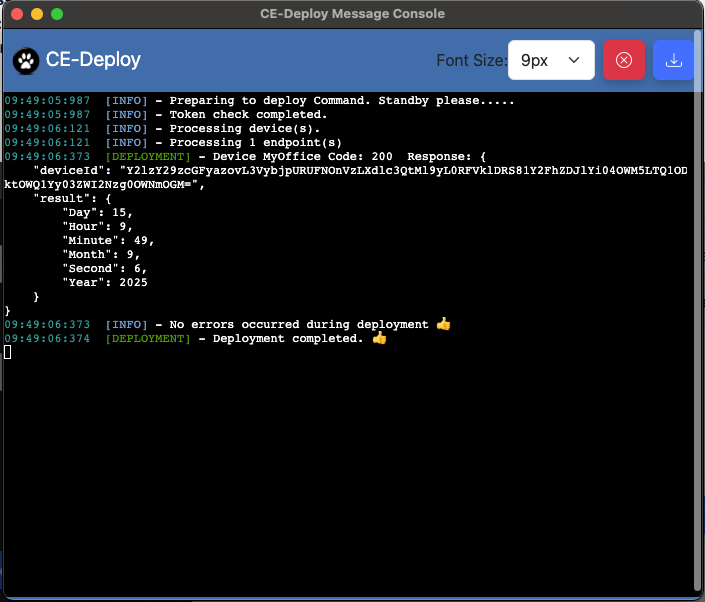
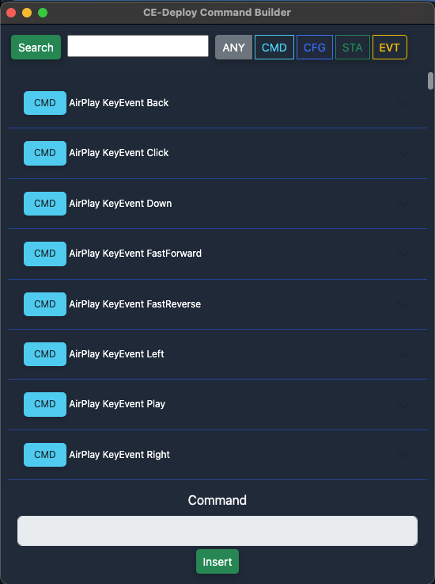
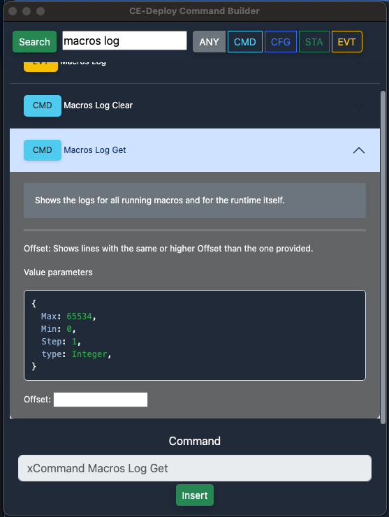
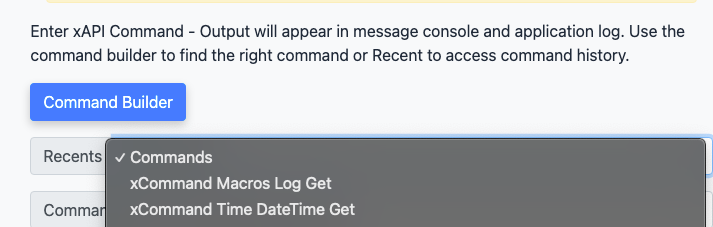

{{ config.cProps.devNotice }}
{{ config.cProps.acronyms }}
# Deploy xAPI commands via CE-Deploy

!!! abstract

    Deploying xAPI commands is a fundamental aspect of administering a Cisco collaboration endpoint 
    deployment. While Control Hub allows us to deploy commands to a single endpoint, scaling this 
    process to a larger deployment through Control Hub or a terminal command prompt can be 
    time-consuming and inefficient. By utilizing CE-Deploy, we can efficiently deploy xAPI commands 
    to multiple endpoints using various criteria such as IP Address, Control Hub Org ID, Control Hub 
    Tags, and more. This lab will demonstrate how to deploy a system time check across multiple devices. 
    Although this is not a configuration change, it will showcase how the CE-Deploy message console 
    provides real-time feedback as the deployment progresses.

??? vidcast "CE-Deploy Running xAPI Commands"

    <div style="padding-bottom:56.25%; position:relative; display:block; width: 100%">
    <iframe src="https://app.vidcast.io/share/embed/e0469f2c-5631-4a7a-a8aa-b15ecd84b4d3" width="100%" height="100%" title="CE-Deploy Running xAPI Commands" frameborder="0" loading="lazy" allowfullscreen style="position:absolute; top:0; left: 0;border: solid; border-radius:12px;"></iframe>
    </div>

??? lesson "{{config.cProps.dep.sectionIds.cD}}.3 Lab"

    <highlight_1>{{config.cProps.dep.sectionIds.cD}}.3.1</highlight_1> Open Ce-deploy and load the environment your 
    created in the last lab if its not already loaded.
    
    ??? cedeploy "Loading Environments"
    
        To load an environment, use the dropdown in the Environment loading section and select your
        new Environment and select ==Load Environment==.
    
    <highlight_1>{{config.cProps.dep.sectionIds.cD}}.3.2</highlight_1> Select xAPI from the deployment section. In the command text box enter:
    
    ```text
    xCommand Time DateTime Get
    ```
    <figure markdown="span">
      { width="300" }
      <figcaption></figcaption>
    </figure>
    
    <highlight_1>{{config.cProps.dep.sectionIds.cD}}.3.3</highlight_1> Under the deployment options drop down select ==Org Id==, this will populate the lab org ID. 
    As this command does not make any system changes it can be safely run against all the devices
    in the lab Control Hub Organization. By doing this we can see how CE-Deploy queues and completes 
    xAPI commands in bulk.
    
    <figure markdown="span">
      { width="300" }
      <figcaption></figcaption>
    </figure>
    
    <highlight_1>{{config.cProps.dep.sectionIds.cD}}.3.4</highlight_1> Select the ==video devices only== filter checkbox. This will limit running the command to only 
    the xAPI capable device in the organization and no other devices in the lab, an example being a phone.
    
    <highlight_1>{{config.cProps.dep.sectionIds.cD}}.3.5</highlight_1> Select =="Start Deployment"==
    
    <highlight_1>{{config.cProps.dep.sectionIds.cD}}.3.6</highlight_1> Ensure ==Run Deployment Now== is selected and select ==Next==.
    
    <highlight_1>{{config.cProps.dep.sectionIds.cD}}.3.7</highlight_1> If any devices are offline you may receive a prompt letting your know that some of the devices are offline. 
    If this is case just select =="Yes"==.
    
    <highlight_1>{{config.cProps.dep.sectionIds.cD}}.3.8</highlight_1> The message console will now let you see the deployment in progress and all output from the devices. 
    In this case what is returned is the system time running on the endpoints.
    
    <figure markdown="span">
      { width="300" }
      <figcaption></figcaption>
    </figure>

    <highlight_1>{{config.cProps.dep.sectionIds.cD}}.3.9</highlight_1> Switch back to CE-Deploy staying in XAPI abd select
    the =="Command Builder"== button. This launches the Command Builder window. This allows us to search for commands based
    on the command syntex.

    <figure markdown="span">
      { width="300" }
      <figcaption></figcaption>
    </figure>

    <highlight_1>{{config.cProps.dep.sectionIds.cD}}.3.10</highlight_1> In the search area type "macros log" and select the
    Macros Log Get command.

    <figure markdown="span">
      { width="300" }
      <figcaption></figcaption>
    </figure>   
    
    Click =="Insert"==. You should now see the command populate the main XAPI Command area. You should also take note that
    the Recents drop down is now populated with the last command you ran. This just makes life a little easier to access
    commands you repeatedly run.

    <figure markdown="span">
      { width="300" }
      <figcaption></figcaption>
    </figure> 
    
    !!! Success
    
        This concludes this section. While this is a simple use case, any xAPI command can be run in this fashion 
        including multiline commands that contain a body section.

    ??? challenge "Running a xStatus Command"

        Now that you know how to run a xCommand, can you work out how to run a xStatus command?
        
        Find a command at [RoomOS](roomos.cisco.com)