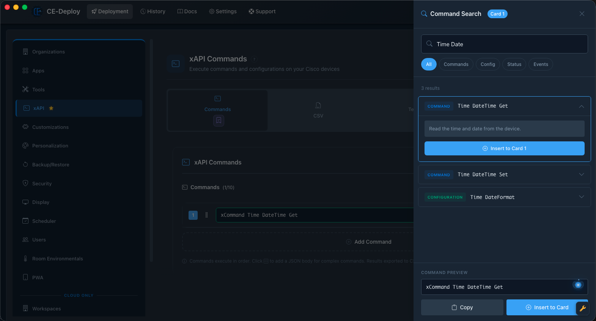

{{ config.cProps.acronyms }}
# Bulk xAPI Commands & Command Search

!!! abstract

    Deploying xAPI commands is a fundamental part of administering a Cisco collaboration endpoint
    deployment. Control Hub got you one command on one device. CE-Deploy runs that same command
    against your entire organization at once, filtered by Org Id, Tags, Device ID, whatever you
    need, with results streaming back live. In this lab you'll run a safe read-only command across
    the whole lab organization using the Command Builder, then use its built-in search to find and
    insert a command you don't already know by heart.

<div class="grid cards" markdown>

-   <i class="fa-solid fa-location-dot"></i> **Where**

    ---

    ==xAPI== in the left sidebar

-   <i class="fa-solid fa-clock"></i> **Time**

    ---

    About 8 minutes

-   <i class="fa-solid fa-bullseye"></i> **Goal**

    ---

    Run one command org-wide, then find and run a second one via Command Search

</div>

??? lesson "{{config.cProps.dep.sectionIds.cD}}.2 Lab"

    <highlight_1>{{config.cProps.dep.sectionIds.cD}}.2.1</highlight_1> Open CE-Deploy. Check the organization switcher at the top of the
    window and confirm your Cloud organization (the one you added in "Connect CE-Deploy to Your
    Organization") is active. If it isn't, click it in the switcher, or go to ==Organizations== in
    the left sidebar and click ==Activate== on that card.

    <highlight_1>{{config.cProps.dep.sectionIds.cD}}.2.2</highlight_1> In the left sidebar, select ==xAPI==. You'll land on the
    **Commands** tab, which contains the **Command Builder** — a list of one or more command cards
    rather than a single text box.

    <highlight_1>{{config.cProps.dep.sectionIds.cD}}.2.3</highlight_1> The Command Builder initially shows ==Commands (0/10)== with no
    command cards open. Click ==Add Command== to create the first command card.

    <highlight_1>{{config.cProps.dep.sectionIds.cD}}.2.4</highlight_1> Click inside the new command card's text field (the placeholder
    reads "xCommand or xConfiguration...") and type:

    ```text
    xCommand Time DateTime Get
    ```

    !!! cedeploy "One card per command"

        Each command card is a full command on its own line — there's no separate xConfiguration
        vs. xCommand picker anymore, you just type the command you want. Click ==Add Command==
        below the card list to add another (up to 10 per deployment), or use the ==Import== button
        to paste several commands at once, one per line.

    <highlight_1>{{config.cProps.dep.sectionIds.cD}}.2.5</highlight_1> Scroll down and click ==Next: Select Devices== at the bottom of the
    page. This opens the **Deployment Options** modal (you'll see "Step 1 of 2" in the subtitle).

    --8<-- "dep_deployment_flow.md"

    <highlight_1>{{config.cProps.dep.sectionIds.cD}}.2.6</highlight_1> In the Deployment Options modal, select ==Org Id== as the target.
    This will populate the lab org ID. As this command does not make any system changes it can be
    safely run against every device in the lab Control Hub Organization — a great way to see how
    CE-Deploy queues and completes xAPI commands in bulk.

    <highlight_1>{{config.cProps.dep.sectionIds.cD}}.2.7</highlight_1> In that same modal, check ==Video Devices Only==. This limits the
    command to xAPI-capable devices in the organization only — for example, it would skip a phone.

    <highlight_1>{{config.cProps.dep.sectionIds.cD}}.2.8</highlight_1> Also in this modal, make sure ==Hide Message Console== is
    **not selected**. The next steps ask you to watch the commands and device responses in that
    console, so it must remain visible. You may optionally check ==Collect Command Outputs== to
    save every device's response into a CSV you can open afterwards — handy when you're running the
    same query against a large fleet and want the results in a spreadsheet as well as the on-screen
    log.

    <highlight_1>{{config.cProps.dep.sectionIds.cD}}.2.9</highlight_1> Click ==Next: Schedule== at the bottom of the Deployment Options
    modal. This opens the **Deployment Scheduler** modal.

    <highlight_1>{{config.cProps.dep.sectionIds.cD}}.2.10</highlight_1> Leave ==Run Now== selected (it's the default) and click
    ==Continue==. If any devices are offline you may be prompted to continue anyway — select
    ==Yes==.

    <highlight_1>{{config.cProps.dep.sectionIds.cD}}.2.11</highlight_1> The deployment console shows the command in progress and the
    system time returned by every device in the organization.

    <highlight_1>{{config.cProps.dep.sectionIds.cD}}.2.12</highlight_1> Now let's find a command you don't already know. Back on the
    ==xAPI== tab, click the magnifying-glass icon on the right side of your command card (its
    tooltip reads "Search commands") to open the **Command Search** panel.

    <highlight_1>{{config.cProps.dep.sectionIds.cD}}.2.13</highlight_1> Type "macros log" and select the Macros Log Get command from the
    results — the panel shows the exact JavaScript/xAPI syntax and actual valuespace values before
    you commit to it. Click ==Insert to Card 1== to drop it into your command card, replacing the time
    command.

    <figure markdown="span">
      { width="650" }
      <figcaption>Command Search always shows which card it's inserting into — here, "Card 1"</figcaption>
    </figure>

    <highlight_1>{{config.cProps.dep.sectionIds.cD}}.2.14</highlight_1> Click ==Next: Select Devices== again. In the Deployment Options
    modal, switch the target from ==Org Id== to ==Tags== and enter your pod tag (the one you
    created in the Control Hub "Tag Your Pod Device" lesson), so this run only touches your device.

    <highlight_1>{{config.cProps.dep.sectionIds.cD}}.2.15</highlight_1> Click ==Next: Schedule==, leave ==Run Now== selected, and click
    ==Continue== to watch the macro engine logs come back in the console.

    !!! Success

        That wraps up this section. Now that you know how to build and run commands at scale, try
        a few more from Command Search on your own. Just stick to your pod's tag when making real
        changes; the Org Id target touches every device in the lab.

    ??? challenge "Running an xStatus Command"

        Now that you know how to run an xCommand, can you work out how to run an xStatus command?
        Use the search icon on a command card and filter by the Status category, or find a command
        at [RoomOS](https://roomos.cisco.com).
