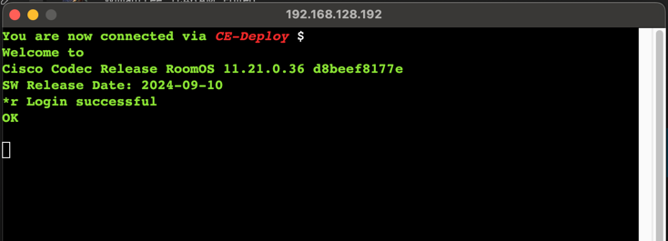

{{ config.cProps.acronyms }}
# Deploy xAPI command via the shell using CE-Deploy

!!! abstract

    The terminal is not only a crucial tool for administering Cisco collaboration endpoints 
    but also an important resource for exploring xAPIs. In this lab, we will use CE-Deploy's 
    terminal emulation feature to run a command. CE-Deploy is the swiss army knife of video endpoint
    deployments so lets keep exploring.

??? lesson "{{config.cProps.dep.sectionIds.cD}}.9 Lab"

    <highlight_1>{{config.cProps.dep.sectionIds.cD}}.9.1</highlight_1> From the ==local interface== in the deployment panel select ==Tools->SSH-TTY==.

    !!! warning

        This lab will only work if the endpoint and your PC/MAC running CE-Deploy are on the same 
        network.
    
    <highlight_1>{{config.cProps.dep.sectionIds.cD}}.9.2</highlight_1> Add your endpoint local admin details, choose a theme and add the IP address 
    from the IP address challenge. 
    
    <figure markdown="span">
      { width="300" }
      <figcaption></figcaption>
    </figure>
    
    <highlight_1>{{config.cProps.dep.sectionIds.cD}}.9.3</highlight_1> Select ==Connect==. The terminal will appear in a new Window and you can start 
    interacting with it.

    Commands to try:

    | `Command`                    |
    |------------------------------|
    | `xCommand ?`                 |
    | `xCommand Time DateTime Get` |
    | `xConfiguration ?`           |
    | `xConfiguration NetworkServices Websocket`|
    
    <figure markdown="span">
      { width="300" }
      <figcaption></figcaption>
    </figure>

    !!! Success
    
        Once you have tried a few commands type in the ==Bye== command and the window 
        will automatically close. Lets switch back to Cloud now ready for our next lab.