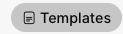
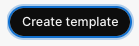
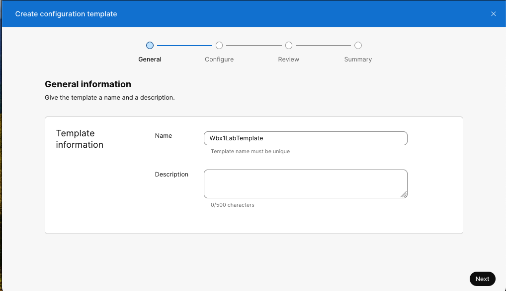
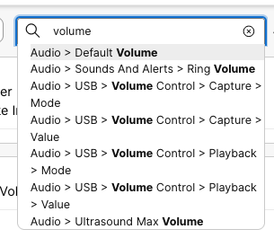
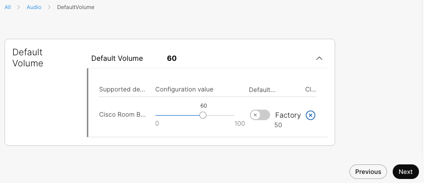
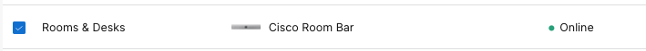
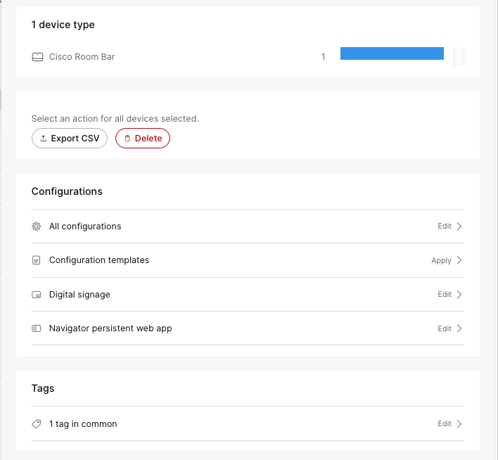
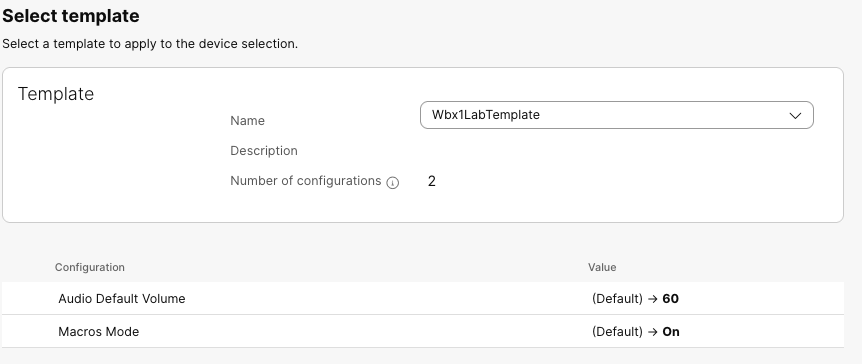
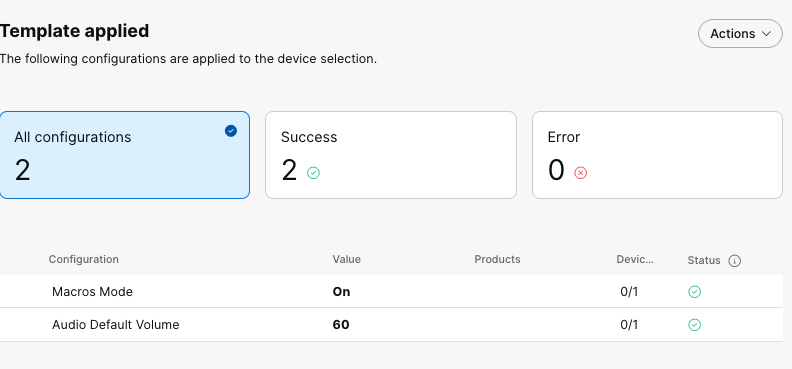

{{ config.labVariables.devNotice }}
# Building and deploying configuration templates via Control Hub

!!! abstract

    One of the easiest and most effective ways to deploy a series of configuration changes to 
    RoomOS devices is through Control Hub default configuration templates. In this lab, we will explore deploying 
    configurations using both device-based and default organization-based templates. In this lab we are 
    going to create a template to set the volume of you device and enable macros for the Macro 
    deployment lab. 

!!! Tip
    
    Default Configuration Templates are hierarchical. Configurations set on location and device levels override 
    organization level device configurations.

    If one of your devices doesn't support a specific value, you can't select that value on the organization or location
    level, even if all other devices support that value. This limitation also applies if one of the devices is running 
    a software version that doesn't support a selected value. This doesn't impact configuring individual or multiple device, or configuration templates.

??? lesson "4.2 Lessons"

    4.2.1 Login to control hub with your lab admin credentials
    
    4.2.2 Select Management>Devices
    
    <figure markdown="span">
      { width="150" }
      <figcaption></figcaption>
    </figure>
    
    4.2.3 Select Templates
    
    <figure markdown="span">
      { width="100" }
      <figcaption></figcaption>
    </figure>
    
    
    
    4.2.4 Select Create template
    
    <figure markdown="span">
      { width="100" }
      <figcaption></figcaption>
    </figure>
    
    4.2.5 Name your template Wbx1LabTemplate<yourPodNumber> and select Next. 
    For example Wbx1LabTemplate101.
    
    <figure markdown="span">
      { width="300" }
    </figure>
    
    4.2.6 In the Search by configuration name type volume
    
    <figure markdown="span">
      { width="300" }
      <figcaption></figcaption>
    </figure>
    
    4.2.7 Select Audio>Default Volume
    
    4.2.8 Change the Default Volume to 60
    
    <figure markdown="span">
      { width="300" }
      <figcaption></figcaption>
    </figure>
    
    4.2.9 Once you have set Audio to 60 select "All" to go back to the configuration search
    
    4.2.10 In the Search by configuration name type Macro
    
    <figure markdown="span">
      { width="300" }
      <figcaption></figcaption>
    </figure>
    
    4.2.11 Change the Mode from Off to On and then select Next
    
    <figure markdown="span">
      { width="300" }
      <figcaption></figcaption>
    </figure>
    
    4.2.12 Review your new template and select Create
    
    4.2.13 Now that we have created a new template lets apply it to our device. Select Go to Devices
    
    <figure markdown="span">
      { width="100" }
      <figcaption></figcaption>
    </figure>
    
    4.2.14 Select your lab device(Room Bar or Desk Pro)
    
    <figure markdown="span">
      { width="400" }
      <figcaption></figcaption>
    </figure>
    
    4.2.15 Select Edit
    
    <figure markdown="span">
      { width="100" }
      <figcaption></figcaption>
    </figure>
    
    4.2.16 Select Configuration templates
    
    <figure markdown="span">
      { width="300" }
      <figcaption></figcaption>
    </figure>
    
    4.2.17 From the template dropdown select the Wbx1LabTemplateXXX and review your settings
    
    <figure markdown="span">
      { width="300" }
      <figcaption></figcaption>
    </figure>
    
    4.2.18 Select Next and then Apply
    
    4.2.19 Review the successful deployment of your configurations and select close
    
    <figure markdown="span">
      { width="300" }
      <figcaption></figcaption>
    </figure>

    !!! Success
    
        Well done. This lab section is now complete.