{{ config.cProps.acronyms }}
# Building and deploying configuration templates via Control Hub

!!! abstract

    One of the easiest and most effective ways to deploy a series of configuration changes to
    RoomOS devices is through Control Hub configuration templates. In this lab we'll build a
    device-level template that sets your volume and turns Macros on. Hang on to that second
    setting; the CE-Deploy macro lesson later in this module needs it. Then we'll zoom out and
    peek at how the same idea scales up to an entire organization.

!!! Tip

    Configuration Templates are hierarchical. Configurations set on location and device levels override
    organization level device configurations.

    ```mermaid
    flowchart TD
        A[Organization Defaults] -->|overridden by| B[Location Defaults]
        B -->|overridden by| C[Device Template]
        C -->|overridden by| D[Manual Device Config]

        style A fill:#0078D4,color:#fff
        style D fill:#10B981,color:#fff
    ```

    The device-level template you're about to build sits near the bottom of that stack — it wins
    over anything set at the organization or location level, which is exactly why it's the fastest
    way to guarantee a setting on one specific device.

    If one of your devices doesn't support a specific value, you can't select that value on the organization or location
    level, even if all other devices support that value. This limitation also applies if one of the devices is running
    a software version that doesn't support a selected value. This doesn't impact configuring individual or multiple devices.

<div class="grid cards" markdown>

-   <i class="fa-solid fa-location-dot"></i> **Where**

    ---

    Management → Devices → Templates, in Control Hub

-   <i class="fa-solid fa-clock"></i> **Time**

    ---

    About 8 minutes

-   <i class="fa-solid fa-bullseye"></i> **Goal**

    ---

    Build a device template that sets Volume and turns Macros on, then apply it to your device

</div>

??? lesson "{{config.cProps.dep.sectionIds.cH}}.2 Lab"

    <highlight_1>{{config.cProps.dep.sectionIds.cH}}.2.1</highlight_1> Return to Control Hub and sign in with your lab admin credentials
    if necessary.

    <highlight_1>{{config.cProps.dep.sectionIds.cH}}.2.2</highlight_1> Select Management>Devices>Templates

    <highlight_1>{{config.cProps.dep.sectionIds.cH}}.2.3</highlight_1> Select Create template

    <highlight_1>{{config.cProps.dep.sectionIds.cH}}.2.4</highlight_1> Name your template ==LabTemplateXX==, replacing `XX` with your
    two-digit pod number, and select Next. For example, pod 1 uses ==LabTemplate01==.

    <figure markdown="span">
      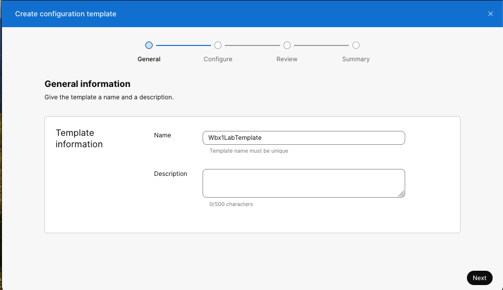{ width="300" }
      <figcaption>Name your own template here — the wizard steps are General, Configure, Review, Summary</figcaption>
    </figure>

    <highlight_1>{{config.cProps.dep.sectionIds.cH}}.2.5</highlight_1> In the Search by configuration name type volume

    <figure markdown="span">
      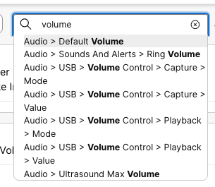{ width="300" }
      <figcaption></figcaption>
    </figure>

    <highlight_1>{{config.cProps.dep.sectionIds.cH}}.2.6</highlight_1> Select Audio>Default Volume and change the Default Volume to 60

    <figure markdown="span">
      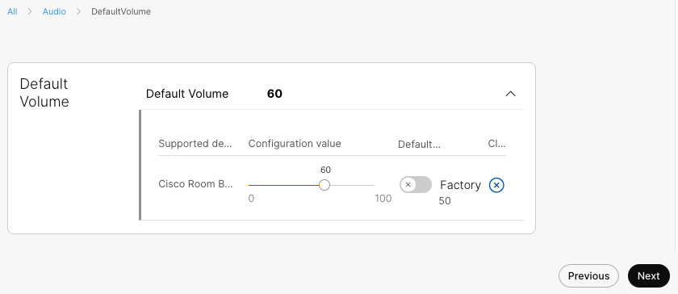{ width="300" }
      <figcaption></figcaption>
    </figure>

    <highlight_1>{{config.cProps.dep.sectionIds.cH}}.2.7</highlight_1> Once you have set Audio to 60 select "All" from the
    setting breadcrumb links to go back to the configuration search

    <figure markdown="span">
      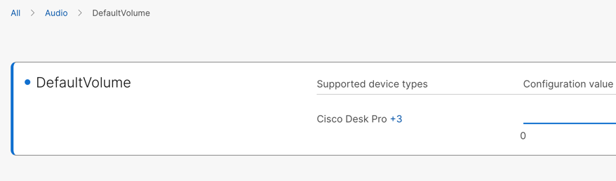{ width="300" }
      <figcaption></figcaption>
    </figure>

    <highlight_1>{{config.cProps.dep.sectionIds.cH}}.2.8</highlight_1> In the Search by configuration name type Macro

    <highlight_1>{{config.cProps.dep.sectionIds.cH}}.2.9</highlight_1> Change the Mode from Off to On and then select Next

    <figure markdown="span">
      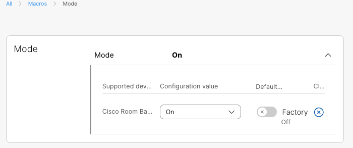{ width="300" }
      <figcaption></figcaption>
    </figure>

    !!! important "Why this matters later"

        Turning Macros On here is a required prerequisite — the CE-Deploy "Macros & UI Extensions"
        lesson later in this module deploys and runs a macro on this same device.

    <highlight_1>{{config.cProps.dep.sectionIds.cH}}.2.10</highlight_1> Review your new template and select Create

    <highlight_1>{{config.cProps.dep.sectionIds.cH}}.2.11</highlight_1> Now that we have created a new template lets apply it to our device. Select Go to Devices

    <highlight_1>{{config.cProps.dep.sectionIds.cH}}.2.12</highlight_1> Select the checkbox beside your lab device — the one you tagged in
    the previous lesson ("Tag Your Pod Device"). If you don't remember which device is yours, use
    the ==Tags== filter and select your pod tag; if your view exposes the ==Find by devices== search
    box, you can instead type ==Tags:== followed by your pod tag. Your device should be the only
    result. Keep its checkbox selected so that the bulk ==Edit== action appears.

    <highlight_1>{{config.cProps.dep.sectionIds.cH}}.2.13</highlight_1> Select ==Edit==

    <highlight_1>{{config.cProps.dep.sectionIds.cH}}.2.14</highlight_1> Select Configuration templates

    <figure markdown="span">
      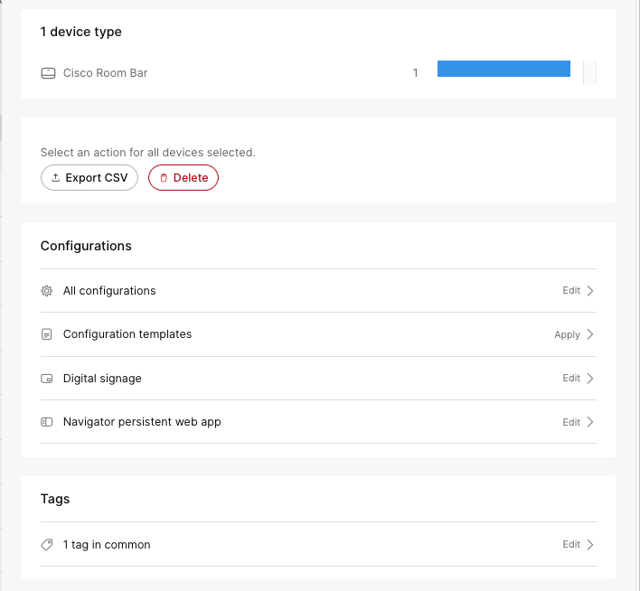{ width="300" }
      <figcaption></figcaption>
    </figure>

    <highlight_1>{{config.cProps.dep.sectionIds.cH}}.2.15</highlight_1> From the template dropdown, select your ==LabTemplateXX== template
    and review its settings.

    <figure markdown="span">
      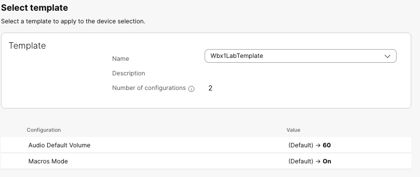{ width="300" }
      <figcaption></figcaption>
    </figure>

    <highlight_1>{{config.cProps.dep.sectionIds.cH}}.2.16</highlight_1> Select Next and then Apply

    <highlight_1>{{config.cProps.dep.sectionIds.cH}}.2.17</highlight_1> Review the successful deployment of your configurations and select close

    <figure markdown="span">
      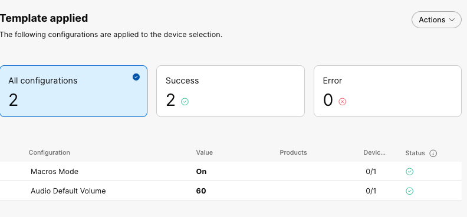{ width="300" }
      <figcaption></figcaption>
    </figure>

    !!! Success

        Well done, your device now has Macros mode on and is ready for later lessons.

    ??? cedeploy "Zooming out: Org-Wide Defaults"

        Device templates like the one you just built are great for a specific device or group of
        devices. Control Hub also lets you set **Configuration Defaults** at the organization or
        location level, so every newly-added device inherits sane baseline settings automatically.
        No template needed.

        Take a quick look: select Management>Devices>Settings>Configuration Defaults.

        <figure markdown="span">
          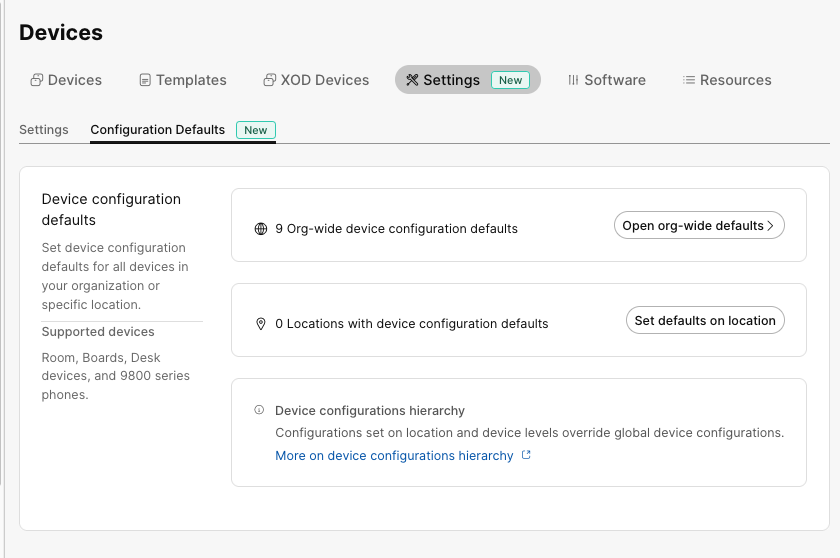{ width="500" }
          <figcaption>Control Hub states the same override hierarchy right on this page</figcaption>
        </figure>

        Then Open org-wide defaults. You'll see settings already provisioned by the lab. Browse Add
        configurations if you like, it's the same picker you just used.

        <figure markdown="span">
          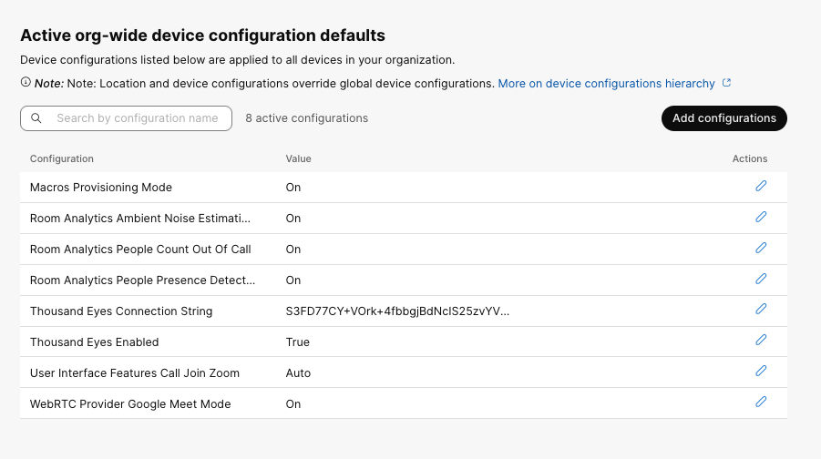{ width="300" }
          <figcaption></figcaption>
        </figure>

        Just **don't apply anything here** — this lab environment has multiple pods sharing one
        organization, and an org-wide change would affect everyone else's devices too.

        <figure markdown="span">
          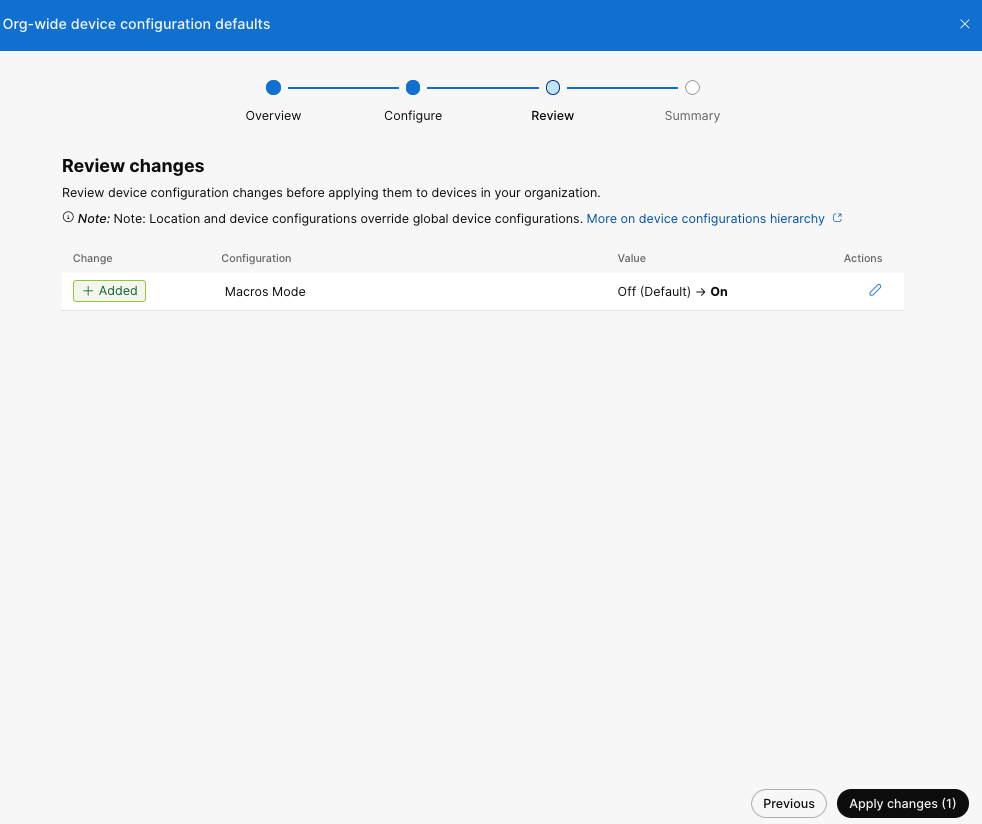{ width="300" }
          <figcaption>Review, then Cancel — don't apply an org-wide change in this lab</figcaption>
        </figure>

        Keep this pattern in mind: device-level template (what you just did) vs. org-wide defaults
        (what you just previewed). You'll see it again in CE-Deploy as a bulk deployment to a
        tag/filter you choose, versus a Deployment Template you save once and reuse everywhere.
