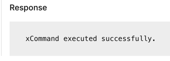

# Deploy Extensions via Control Hub

!!! abstract

    Adding custom buttons can be achieved in several ways, including via the API, embedded in a macro
    , the web admin portal on the device, Control Hub, or CE-Deploy. Regardless of the method you 
    choose, all approaches yield the same outcome. In our labs, we will try using Control Hub and 
    then CE-Deploy.

??? lesson "4.5 Lessons"

    4.5.1 In the clear search box for Run xCommands type UserInterface > Extensions >Panel and select 
    the Save option
    
    <figure markdown="span">
      { width="325" }
      <figcaption></figcaption>
    </figure>
    
    4.5.2 This will open the Save Arguments dialog
    
    <figure markdown="span">
      { width="300" }
      <figcaption></figcaption>
    </figure>
    
    4.5.3 Use Post_Meeting_Survey as the PanelId. Open Post_Meeting_Survey.xml or copy the xml below in a 
    text editor then copy and paste the Post_Meeting_Survey.xml text into the Body section.
    
    ```xml title="Post_Meeting_Survey_Macro.xml" linenums="1"
    <Extensions>
        <Version>1.11</Version>
        <Panel>
            <Order>14</Order>
            <PanelId>Post_Meeting_Survey</PanelId>
            <Location>Hidden</Location>
            <Icon>Lightbulb</Icon>
            <Name>Post Meeting Survey</Name>
            <ActivityType>Custom</ActivityType>
            <Page>
                <Name>Post Meeting Survey</Name>
                <Row>
                    <Name>Overall Rating</Name>
                    <Widget>
                        <WidgetId>post_overall_text</WidgetId>
                        <Name>- - - - -</Name>
                        <Type>Text</Type>
                        <Options>size=2;fontSize=normal;align=center</Options>
                    </Widget>
                    <Widget>
                        <WidgetId>post_overall_change</WidgetId>
                        <Name>Change</Name>
                        <Type>Button</Type>
                        <Options>size=2</Options>
                    </Widget>
                </Row>
                <Row>
                    <Name>Audio Quality</Name>
                    <Widget>
                        <WidgetId>post_Audio</WidgetId>
                        <Type>GroupButton</Type>
                        <Options>size=4</Options>
                        <ValueSpace>
                            <Value>
                                <Key>4</Key>
                                <Name>Superb 🎉</Name>
                            </Value>
                            <Value>
                                <Key>3</Key>
                                <Name>Good 😊</Name>
                            </Value>
                            <Value>
                                <Key>2</Key>
                                <Name>Ok 👍</Name>
                            </Value>
                            <Value>
                                <Key>1</Key>
                                <Name>Poor 🫤</Name>
                            </Value>
                        </ValueSpace>
                    </Widget>
                </Row>
                <Row>
                    <Name>Video Quality</Name>
                    <Widget>
                        <WidgetId>post_Video</WidgetId>
                        <Type>GroupButton</Type>
                        <Options>size=4</Options>
                        <ValueSpace>
                            <Value>
                                <Key>4</Key>
                                <Name>Superb 🎉</Name>
                            </Value>
                            <Value>
                                <Key>3</Key>
                                <Name>Good 😊</Name>
                            </Value>
                            <Value>
                                <Key>2</Key>
                                <Name>Ok 👍</Name>
                            </Value>
                            <Value>
                                <Key>1</Key>
                                <Name>Poor 🫤</Name>
                            </Value>
                        </ValueSpace>
                    </Widget>
                </Row>
                <Row>
                    <Name>Room Cleanliness</Name>
                    <Widget>
                        <WidgetId>post_Room</WidgetId>
                        <Type>GroupButton</Type>
                        <Options>size=4</Options>
                        <ValueSpace>
                            <Value>
                                <Key>4</Key>
                                <Name>Superb 🎉</Name>
                            </Value>
                            <Value>
                                <Key>3</Key>
                                <Name>Good 😊</Name>
                            </Value>
                            <Value>
                                <Key>2</Key>
                                <Name>Ok 👍</Name>
                            </Value>
                            <Value>
                                <Key>1</Key>
                                <Name>Poor 🫤</Name>
                            </Value>
                        </ValueSpace>
                    </Widget>
                </Row>
                <Row>
                    <Name/>
                    <Widget>
                        <WidgetId>post_Email_text</WidgetId>
                        <Name>[Enter Email] -- &gt;</Name>
                        <Type>Text</Type>
                        <Options>size=3;fontSize=normal;align=center</Options>
                    </Widget>
                    <Widget>
                        <WidgetId>post_Email_enter</WidgetId>
                        <Name>Enter</Name>
                        <Type>Button</Type>
                        <Options>size=1</Options>
                    </Widget>
                </Row>
                <Row>
                    <Name/>
                    <Widget>
                        <WidgetId>post_Submit</WidgetId>
                        <Name>Submit</Name>
                        <Type>Button</Type>
                        <Options>size=4</Options>
                    </Widget>
                </Row>
                <Options/>
            </Page>
        </Panel>
    </Extensions>
    ```
    
    <figure markdown="span">
      { width="300" }
      <figcaption>Saving the Panel extension</figcaption>
    </figure>
    
    4.5.4 Scroll done to the bottom of the Arguments section and Select Execute
    
    <figure markdown="span">
      { width="300" }
      <figcaption></figcaption>
    </figure>
    
    You should see a response after execution to show it has been successful
    
    <figure markdown="span">
      { width="300" }
      <figcaption></figcaption>
    </figure>

    !!! Success
    
        You should now see the Post_Meeting_Survey button on your device panel/display. 
        Next step is making our new custom button function.