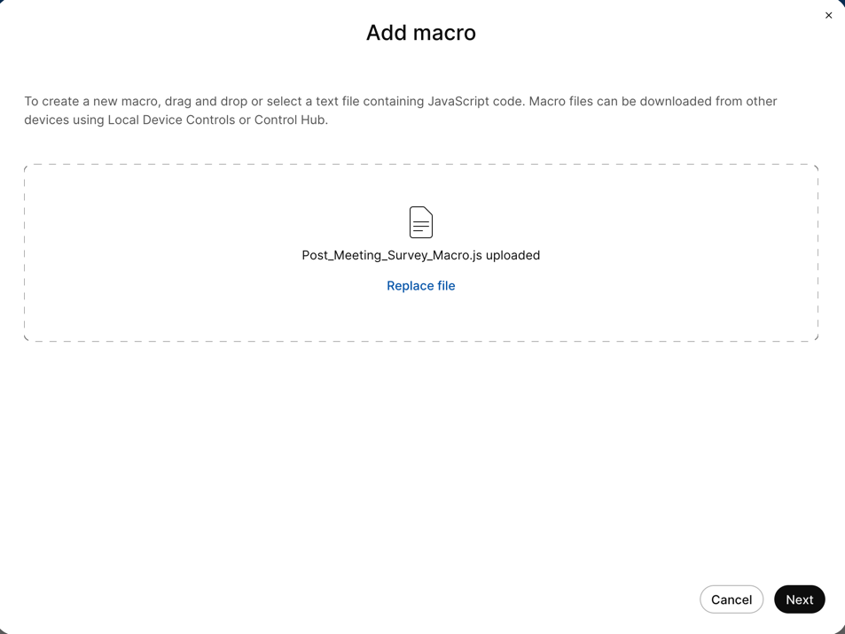

{{ config.cProps.devNotice }}
{{ config.cProps.acronyms }}
# Deploy Macro's via Control Hub

!!! abstract

    As it stand right now our new custom button does nothing. We are about to change that by adding 
    a macro that will act on the button being touched.

    An increasing number of customers are implementing macros and customizations. Without an 
    efficient deployment solution, it is improbable that customers will extend their custom 
    solutions beyond a handful of endpoints. Fortunately, Control Hub and CE-Deploy offer tools 
    that facilitate this process. Control Hub now has the capability to manage both UI and Macro 
    customizations on individual endpoints, while CE-Deploy can assist with bulk deployment.

??? lesson "{{config.cProps.dep.sectionIds.cH}}.6 Lab"
    
    <highlight_1>{{config.cProps.dep.sectionIds.cH}}.6.1</highlight_1> Login to control hub with your lab admin credentials
    
    <highlight_1>{{config.cProps.dep.sectionIds.cH}}.6.2</highlight_1> First step is to enable Control Hub to manage the devices macros. Select Devices->Settings
    
    <highlight_1>{{config.cProps.dep.sectionIds.cH}}.6.3</highlight_1> Scroll down to the Macros section and toggle on -> Allow Control Hub to manage macros
    
    <figure markdown="span">
      { width="350" }
      <figcaption></figcaption>
    </figure>
    
    <highlight_1>{{config.cProps.dep.sectionIds.cH}}.6.4</highlight_1> Next is to deploy our first macro to the Lab device
    
    <highlight_1>{{config.cProps.dep.sectionIds.cH}}.6.5</highlight_1> Choose the lab device. Devices -> LabRoomBar/DeskPro(choose your lab device)
    
    <highlight_1>{{config.cProps.dep.sectionIds.cH}}.6.6</highlight_1> You can now see that there are no macros deployed to this device 
    under Configuration -> Macros
    
    <figure markdown="span">
      { width="300" }
      <figcaption></figcaption>
    </figure>
    
    <highlight_1>{{config.cProps.dep.sectionIds.cH}}.6.7</highlight_1> Click on Macros
    
    <highlight_1>{{config.cProps.dep.sectionIds.cH}}.6.8</highlight_1> Select Add Macro
    
    <figure markdown="span">
      { width="350" }
      <figcaption></figcaption>
    </figure>
    
    <highlight_1>{{config.cProps.dep.sectionIds.cH}}.6.9</highlight_1> Select -> Choose a File and navigate to Post_Meeting_Survey_Macro.js. If the file is not available 
    copy the javascript below, paste into a text editor of your choice and save it as a .js file named Post_Meeting_Survey_Macro.js.
    
    ```javascript title="Post_Meeting_Survey_Macro.js" linenums="1"
    import xapi from 'xapi';
    
    const star_rating_icon = '✪ ';
    
    xapi.Event.CallDisconnect.on(event => {
        setTimeout(Start_Survey, 1000)
    })
    
    let meetingScores = {
        Audio: 4,
        Video: 4,
        Room: 4
    }
    
    async function Start_Survey() {
        //Reset widget values
        meetingScores.Audio = 4
        meetingScores.Video = 4
        meetingScores.Room = 4
        await xapi.Command.UserInterface.Extensions.Widget.SetValue({ WidgetId: 'post_overall_text', Value: '- - - - -' });
        await xapi.Command.UserInterface.Extensions.Widget.SetValue({ WidgetId: 'post_Email_text', Value: '[Enter Email] -- >' });
    
        const buttons = ['post_Audio', 'post_Video', 'post_Room']
        for (let i = 0; i < buttons.length; i++) {
            await xapi.Command.UserInterface.Extensions.Widget.SetValue({ WidgetId: buttons[i], Value: 4 })
        }
    
        await xapi.Command.UserInterface.Message.Rating.Display({ Title: 'Rate your call?', Text: 'How would you rate your overall call experience?', FeedbackId: 'star_rating', Duration: 120 })
    }
    
    function Followup_Survey(rating) {
        xapi.Command.UserInterface.Message.Prompt.Display({
            Title: 'Tell us more of your Experience?',
            Text: `Would you like to take our extended survey so we can learn more about your ${star_rating_icon.repeat(rating)}experience?`,
            FeedbackId: 'extended_survey',
            "Option.1": 'Nah, I\'m Good',
            "Option.2": 'Sure, Happy to Help!'
        })
    }
    
    xapi.Event.UserInterface.Message.Rating.Response.on(event => {
        if (event.FeedbackId == 'star_rating') {
            xapi.Command.UserInterface.Extensions.Widget.SetValue({ WidgetId: 'post_overall_text', Value: `${star_rating_icon.repeat(parseInt(event.Rating))}` });
            if (parseInt(event.Rating) < 5) {
                Followup_Survey(parseInt(event.Rating))
            } else {
                xapi.Command.UserInterface.Message.Prompt.Display({ Title: `Awesome 🥳`, Text: 'Thanks for 5 Star Rating!<p>Have a Great Day!', Duration: 15 })
            }
        }
    
        if (event.FeedbackId == 'star_rating_change') {
            xapi.Command.UserInterface.Extensions.Widget.SetValue({ WidgetId: 'post_overall_text', Value: `${star_rating_icon.repeat(parseInt(event.Rating))}` });
        }
    })
    
    xapi.Event.UserInterface.Message.Prompt.Response.on(event => {
        if (event.FeedbackId == 'extended_survey' && event.OptionId == 2) {
            xapi.Command.UserInterface.Extensions.Panel.Open({ PanelId: 'Post_Meeting_Survey' })
        }
    })
    
    
    xapi.Event.UserInterface.Message.TextInput.Response.on(event => {
        if (event.FeedbackId == 'email') {
            xapi.Command.UserInterface.Extensions.Widget.SetValue({ WidgetId: 'post_Email_text', Value: event.Text })
        }
    })
    
    xapi.Event.UserInterface.Extensions.Widget.Action.on(event => {
        if (event.Type == 'released') {
            switch (event.WidgetId) {
                case 'post_overall_change':
                    xapi.Command.UserInterface.Message.Rating.Display({ Title: 'Rate your call?', Text: 'How would you rate your overall call experience?', FeedbackId: 'star_rating_change', Duration: 120 })
                    break;
                case 'post_Audio':
                    meetingScores.Audio = parseInt(event.Value)
                    break;
                case 'post_Video':
                    meetingScores.Video = parseInt(event.Value)
                    break;
                case 'post_Room':
                    meetingScores.Room = parseInt(event.Value)
                    break;
                case 'post_Email_enter':
                    xapi.Command.UserInterface.Message.TextInput.Display({ Title: 'Add your Email', Text: '(Optional) By providing your Email, we may follow up with you about your Meeting Room Experience', FeedbackId: 'email', Duration: 120 })
                    break;
                case 'post_Submit':
                    xapi.Command.UserInterface.Extensions.Panel.Close()
                    setTimeout(function () {
                        xapi.Command.UserInterface.Message.Prompt.Display({
                            Title: `Thanks for letting us know!`,
                            Text: `We appreciate your feedback and aim to do better next time<p>Room Score: ${meetingScores.Audio + meetingScores.Video + meetingScores.Room} out of 12`,
                            Duration: 15
                        })
                    }, 125)
                    break;
            }
        }
    })
    ```
    <figure markdown="span">
      { width="300" }
      <figcaption></figcaption>
    </figure>
    
    <highlight_1>{{config.cProps.dep.sectionIds.cH}}.6.10</highlight_1>4.6.10 Click Next
    
    <figure markdown="span">
      { width="300" }
      <figcaption></figcaption>
    </figure>
    
    <highlight_1>{{config.cProps.dep.sectionIds.cH}}.6.11</highlight_1>4.6.11 Ensure that your Macro is enabled
    
    <figure markdown="span">
      { width="300" }
      <figcaption></figcaption>
    </figure>
    
    <highlight_1>{{config.cProps.dep.sectionIds.cH}}.6.12</highlight_1>4.6.12 Click Save. Then click Save again
    
    <highlight_1>{{config.cProps.dep.sectionIds.cH}}.6.13</highlight_1>4.6.13 You should now see in the macro engine logs your macro is loaded without error.
    
    <figure markdown="span">
      { width="300" }
      <figcaption></figcaption>
    </figure>
    
    <highlight_1>{{config.cProps.dep.sectionIds.cH}}.6.14</highlight_1>4.6.14 While still in the Macros lets make a change to our uploaded macro. 
    Click on the edit button.
    
    <figure markdown="span">
      { width="300" }
      <figcaption></figcaption>
    </figure>
    
    <highlight_1>{{config.cProps.dep.sectionIds.cH}}.6.15</highlight_1>4.6.15 Type the following line to the Macro on line 2.
    
    ```javascript
    console.log("Post Survey Macro Loading…..");
    ```
    Click save
    
    <highlight_1>{{config.cProps.dep.sectionIds.cH}}.6.16</highlight_1> You should now notice in your logs that the console message now appears 
    as the macro is loaded.
    
    <figure markdown="span">
      { width="300" }
      <figcaption></figcaption>
    </figure>

    !!! Success
    
        Console logging is a great way to debug your macro’s in combination with the 
        macro engine log. To see your new Macro and Extension run try calling another pod and hang up.
        The Survey will appear after you hang up the call.