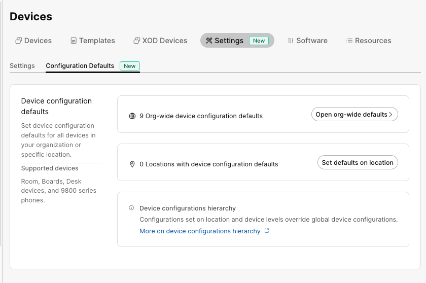
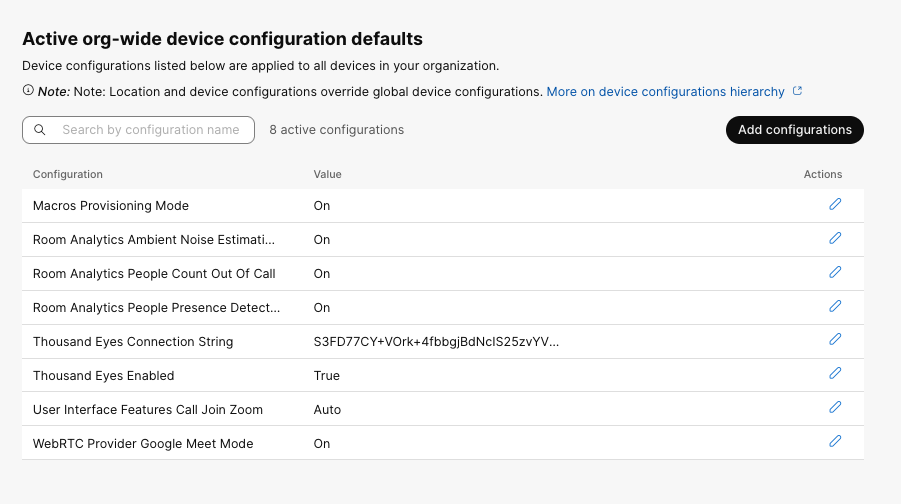
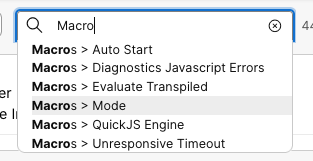
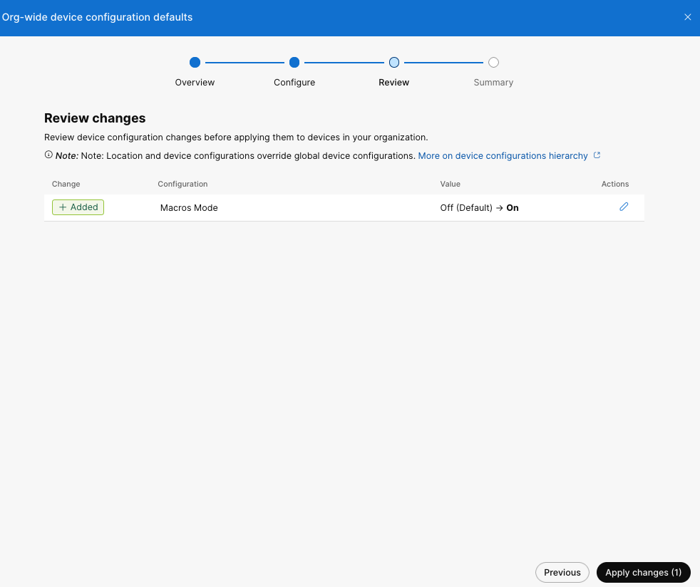
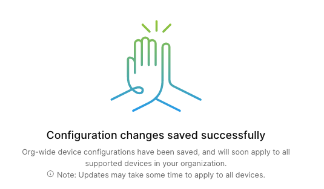

{{ config.cProps.devNotice }}
# Building and deploying Org-Wide configuration templates via Control Hub

!!! abstract

    In the last lab, we built device-specific configuration templates that can be deployed to 
    specific endpoints or groups of selected endpoints. We can make this easier by building a 
    hierarchy of settings that allows us to control these settings at an organization or 
    location level.

!!! Tip
    
    You can set configuration defaults for the whole organization, 
    or for an individual location. These configurations are applied automatically to all devices 
    that are enrolled in an organization, or set to a specific location. This helps you to manage 
    configuration consistency across devices. When default configurations are applied, you can still
    configure an individual device or a set of devices if needed.

??? lesson "{{config.cProps.dep.sectionIds.cH}}.3 Lab"

    <highlight_1>{{config.cProps.dep.sectionIds.cH}}.3.1</highlight_1> Login to control hub with your lab admin credentials
    
    <highlight_1>{{config.cProps.dep.sectionIds.cH}}.3.2</highlight_1> Select Management>Devices>Settings>Configuration Defaults
    
    <figure markdown="span">
      { width="150" }
      <figcaption></figcaption>
    </figure>
    
    <figure markdown="span">
      { width="300" }
      <figcaption></figcaption>
    </figure>
    
    <highlight_1>{{config.cProps.dep.sectionIds.cH}}.3.3</highlight_1> Select Open org-wide defaults
    
    <highlight_1>{{config.cProps.dep.sectionIds.cH}}.3.4</highlight_1> You may notice there are already some defaults provisioned, 
    we are going to select Add configurations
    
    <figure markdown="span">
      { width="300" }
      <figcaption></figcaption>
    </figure>
    
    
    
    <highlight_1>{{config.cProps.dep.sectionIds.cH}}.3.5</highlight_1> This presents a similar configuration selection as device templates. 
    For our org-wide template we are just going 
    to set the Macro mode. In the Search by configuration name type Macro
    
    <figure markdown="span">
      { width="300" }
      <figcaption></figcaption>
    </figure>
    
    <highlight_1>{{config.cProps.dep.sectionIds.cH}}.3.6</highlight_1> Change the Mode from Off to On and select Next
    
    <figure markdown="span">
      { width="300" }
      <figcaption></figcaption>
    </figure>
    
    <highlight_1>{{config.cProps.dep.sectionIds.cH}}.3.7</highlight_1> Review the changes and select **Cancel** changes. Our lab environment contains multiple pods
    so applying the change is not possible for this configuration.
    
    <figure markdown="span">
      { width="300" }
      <figcaption></figcaption>
    </figure>

    !!! Success
    
        Congrats you have now viewed an org-wide configuration template. Now every time a new 
        device is added to this organization by default the settings from org-wide defaults will be applied.
        be set to on unless a more specific location or device configuration supersedes it.
    
        <figure markdown="span">
            { width="300" }
            <figcaption></figcaption>
        </figure>