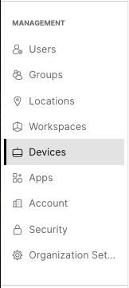
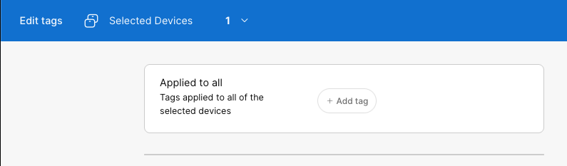
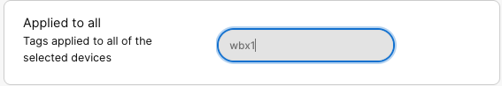
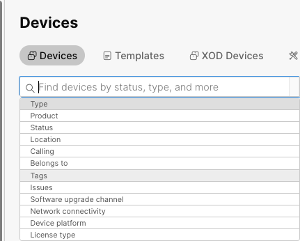
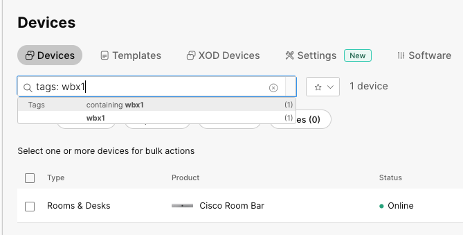

{{ config.labVariables.devNotice }}
# Preparing Your Devices

!!! abstract

    Device Tags are one of the most underutilized features for sorting and filtering devices. 
    Not only are tags useful in Control Hub, but they are also extremely beneficial when working 
    with the Webex RESTful APIs, providing one of the most effective ways to filter devices.

!!! Tip
    
    Add as many tags in this exercise as you please. They will help you identify your pod's device
    in later labs. Hint, a pod"yourPodNumber" tag may be handy. In the real world you could add a tag for 
    each of the following:
        
        - Country
        - State 
        - City
        - Building
        - Room
        - Product

    Using tags in the manner gives you better control over deployments. Imagine an issue is occuring but only on Room Bars. Now
    you have a tag to run a command using CE-Deploy(which you will see in a later lab) that will 
    only affect those devices.

??? lesson "4.1 Lessons"

    4.1.1 Login to the lab's Control Hub with your admin credentials
    
    4.1.2 Select Management>Devices
    
    <figure markdown="span">
      { width="150" }
      <figcaption></figcaption>
    </figure>
    
    4.1.3 Select your lab device(Room Bar or Desk Pro)
    
    <figure markdown="span">
      { width="400" }
      <figcaption></figcaption>
    </figure>
    
    4.1.4 Select ==Edit==
    
    <figure markdown="span">
      { width="100" }
      <figcaption></figcaption>
    </figure>
    
    4.1.5 The Edit tag page will now allow you to set as many tags as you need. 
    For this lab we will be using the tag ==wbx<yourPodNumber>==. As an example wbx101.
    
    <figure markdown="span">
      { width="300" }
      <figcaption></figcaption>
    </figure>
    
    4.1.6 Select Add tag
    
    <figure markdown="span">
      { width="300" }
      <figcaption>Edit tag</figcaption>
    </figure>
    
    4.1.7 Add wbx<YourPodNumber> and press enter
    
    <figure markdown="span">
      { width="300" }
      <figcaption></figcaption>
    </figure>
    
    4.1.8 Select ==Close== to close the Edit tags page.
    
    4.1.9 Close the edit configurations popout and return to the main devices page.
    
    4.1.10 In the Find by devices dialog box type Tags: then enter the device tag previously set.
    
    <figure markdown="span">
      { width="300" }
      <figcaption></figcaption>
    </figure>
    
    <figure markdown="span">
      { width="300" }
      <figcaption></figcaption>
    </figure>

    !!! Success
    
        While this may seem rather insignificant with just one or two devices, if you where deploying 
        100's or 1000's of endpoints this just makes finding your group of endpoints a whole lot easier. 
        In a later lab we will use the wbx1 and your pod tag to do a deployment via the Rest API. This concludes 
        deployment lab one. Now on to using templates.