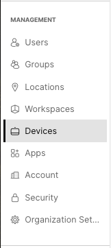
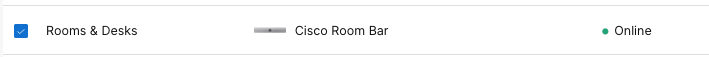
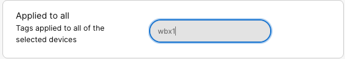
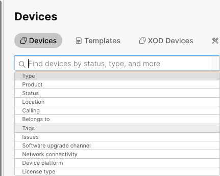
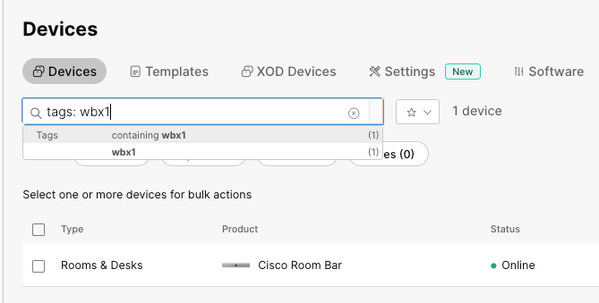

{{ config.cProps.acronyms }}
# Tag Your Pod Device

!!! abstract

    Device Tags are one of the most underutilized features for sorting and filtering devices.
    They're useful in Control Hub, sure, but they really shine once you start working with the
    Webex RESTful APIs and CE-Deploy — tags are one of the fastest ways to filter a fleet down to
    exactly the devices you want. In this lab you'll create a single pod tag, and you'll reuse that
    exact tag for the rest of the Deployment module.

!!! Tip

    In the real world you'd tag on several dimensions at once: Country, State, City, Building,
    Room, Product. That's how you filter a support incident down to "just the Room Bars in
    Building 4" without breaking a sweat. For this lab, one tag is plenty. Pick it carefully though
    — you'll be typing it again in every lesson from here on.

-   <i class="fa-solid fa-location-dot"></i> **Where**

    ---

    Management → Devices, in Control Hub

-   <i class="fa-solid fa-clock"></i> **Time**

    ---

    About 5 minutes

-   <i class="fa-solid fa-bullseye"></i> **Goal**

    ---

    Tag your pod device with the one tag you'll reuse for the rest of this module

??? lesson "{{config.cProps.dep.sectionIds.cH}}.1 Lab"

    <highlight_1>{{config.cProps.dep.sectionIds.cH}}.1.1</highlight_1> Sign in to the lab's Control Hub with your admin credentials if
    necessary.

    [Login to Control Hub.](https://admin.webex.com)

    <highlight_1>{{config.cProps.dep.sectionIds.cH}}.1.2</highlight_1> Select Management>Devices

    <figure markdown="span">
      { width="150" }
      <figcaption></figcaption>
    </figure>

    <highlight_1>{{config.cProps.dep.sectionIds.cH}}.1.3</highlight_1> Select the checkbox beside your lab device (Room Bar or Desk Pro).
    Do not open the device details page; selecting the checkbox makes the bulk ==Edit== action
    available above the device list.

    <figure markdown="span">
      { width="400" }
      <figcaption></figcaption>
    </figure>

    !!! Tip
        In this lab we are only configuring the one device but if you needed to supply the same tag to multiple devices
        it would be at this stage you would just continue selecting more devices before selecting edit.

    <highlight_1>{{config.cProps.dep.sectionIds.cH}}.1.4</highlight_1> Select ==Edit==

    <highlight_1>{{config.cProps.dep.sectionIds.cH}}.1.5</highlight_1> In the Edit panel, select ==Tags==. The tag field allows you to set
    as many tags as you need.
    For this lab, use the format ==podXX==, replacing `XX` with your two-digit pod number. For
    example, pod 1 uses ==pod01==.

    <figure markdown="span">
      { width="300" }
      <figcaption>The tag input field — enter your own pod tag here</figcaption>
    </figure>

    !!! important "One tag, reused everywhere"

        This is the **only** tag you'll create in this module. Every later lesson — Control Hub or
        CE-Deploy — targets your device using this exact tag. Write it down.

    <highlight_1>{{config.cProps.dep.sectionIds.cH}}.1.6</highlight_1> In the tag field, enter
    your ==podXX== tag (for example, ==pod01==), then press Enter. Click outside the field if
    Control Hub still shows the tag as being edited; this applies the tag.

    <figure markdown="span">
      { width="300" }
      <figcaption></figcaption>
    </figure>

    <highlight_1>{{config.cProps.dep.sectionIds.cH}}.1.7</highlight_1> Select ==Close== to close the Tags panel, then close the Edit panel
    to return to the main Devices page.

    <highlight_1>{{config.cProps.dep.sectionIds.cH}}.1.8</highlight_1> Filter the device list by your new tag. Use the ==Tags== filter and
    select your pod tag; if your Control Hub view exposes the ==Find by devices== search box, you
    can instead type ==Tags:== followed by the tag. Confirm your device — and only your device — is
    returned.

    <figure markdown="span">
      { width="300" }
      <figcaption></figcaption>
    </figure>

    <figure markdown="span">
      { width="300" }
      <figcaption></figcaption>
    </figure>

    !!! Success

        This may seem like overkill for one device, but multiply it by a thousand endpoints and
        you'll see why tags matter. That's deployment lab one done — on to configuration templates.
