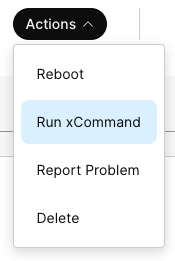
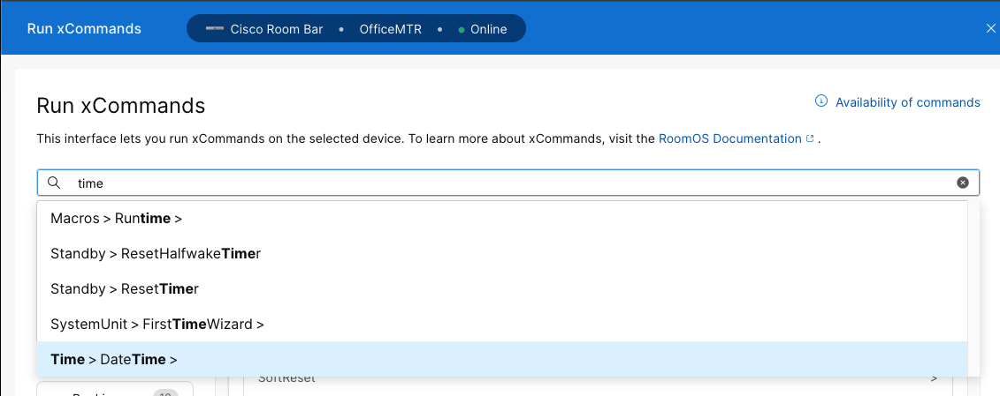
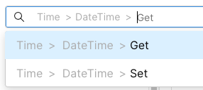
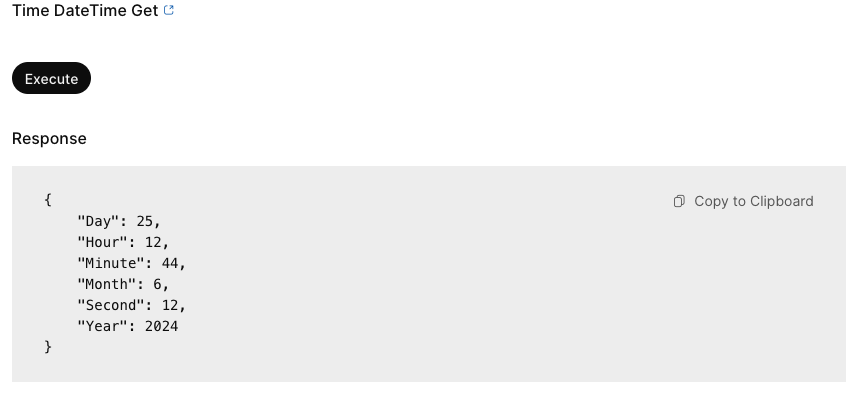

{{ config.cProps.acronyms }}
# Running xAPI commands via Control Hub

!!! abstract

    Running xAPI commands in Control Hub can be done on an endpoint by endpoint basis. In this
    short lab you'll execute a simple xAPI command to get the system time, just to see how to find
    and run a command this way. Control Hub can push a single macro or UI panel to one device by
    hand the same way, but that gets old fast past a handful of devices. Next section, CE-Deploy
    runs this exact command, plus macros and panels, across your **entire fleet** in one shot.

-   <i class="fa-solid fa-location-dot"></i> **Where**

    ---

    Management → Devices → right-click your device, in Control Hub

-   <i class="fa-solid fa-clock"></i> **Time**

    ---

    About 5 minutes

-   <i class="fa-solid fa-bullseye"></i> **Goal**

    ---

    Run one xAPI command against your single device, the old way, before CE-Deploy does it at scale

??? lesson "{{config.cProps.dep.sectionIds.cH}}.3 Lab"

    <highlight_1>{{config.cProps.dep.sectionIds.cH}}.3.1</highlight_1> Login to control hub with your lab admin credentials

    <highlight_1>{{config.cProps.dep.sectionIds.cH}}.3.2</highlight_1> Select Management>Devices

    <highlight_1>{{config.cProps.dep.sectionIds.cH}}.3.3</highlight_1> Right-click on your lab device, no need to highlight the checkbox
    this time(Room Bar or Desk Pro)

    <highlight_1>{{config.cProps.dep.sectionIds.cH}}.3.4</highlight_1> Select Actions and Run xCommand

    <figure markdown="span">
      { width="200" }
      <figcaption></figcaption>
    </figure>

    <highlight_1>{{config.cProps.dep.sectionIds.cH}}.3.5</highlight_1> Type time into the search for a command name text box. Select Time>DateTime

    <figure markdown="span">
      { width="300" }
      <figcaption></figcaption>
    </figure>

    <highlight_1>{{config.cProps.dep.sectionIds.cH}}.3.6</highlight_1> Select Get from the two options for DateTime

    <figure markdown="span">
      { width="300" }
      <figcaption></figcaption>
    </figure>

    <highlight_1>{{config.cProps.dep.sectionIds.cH}}.3.7</highlight_1> Select Execute and confirm the device returns its current time.

    <figure markdown="span">
      { width="300" }
      <figcaption></figcaption>
    </figure>

    !!! Success

        Well done. That's the entire workflow for a single device via Control Hub: search, select,
        execute. Now let's see what happens when you point that same idea at a whole organization.
