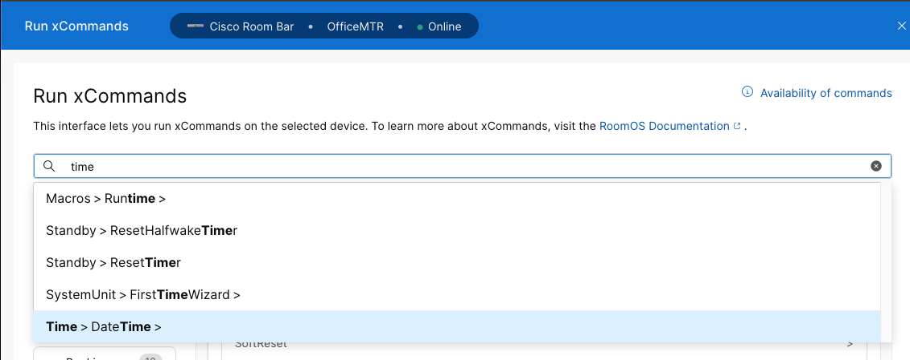

{{ config.labVariables.devNotice }}
# Running xAPI commands via Control Hub

!!! abstract

    Running xAPI commands in Control Hub can be done on an endpoint by endpoint basis. In this lab 
    you will execute a simple xAPI command to get the system time to understand how to 
    execute and find a command. In the next lab we will follow that up with deploying extensions 
    in a similar fashion.

??? lesson "4.4 Lessons"
    
    4.4.1 Login to control hub with your lab admin credentials
    
    4.4.2 Select Management>Devices
    
    <figure markdown="span">
      { width="150" }
      <figcaption></figcaption>
    </figure>
    
    4.4.3 Right-click on your lab device, no need to highlight the checkbox 
    this time(Room Bar or Desk Pro)
    
    4.4.4 Select Actions and Run xCommand
    
    <figure markdown="span">
      { width="200" }
      <figcaption></figcaption>
    </figure>
    
    4.4.5 Type time into the search for a command name text box. Select Time>DateTime
    
    <figure markdown="span">
      { width="300" }
      <figcaption></figcaption>
    </figure>
    
    4.4.6 Select Get from the two options for DateTime
    
    <figure markdown="span">
      { width="300" }
      <figcaption></figcaption>
    </figure>
    
    4.4.7 Select Execute
    
    <figure markdown="span">
      { width="300" }
      <figcaption></figcaption>
    </figure>

    !!! Success
    
        Well done. While this is a simple example we will dive a little deeper next with using 
        the same method to deploy extensions so don’t stray to far. Cancel out the Time > DateTime > Get 
        text in the search bar by using the x button on the left hand side of the text box.