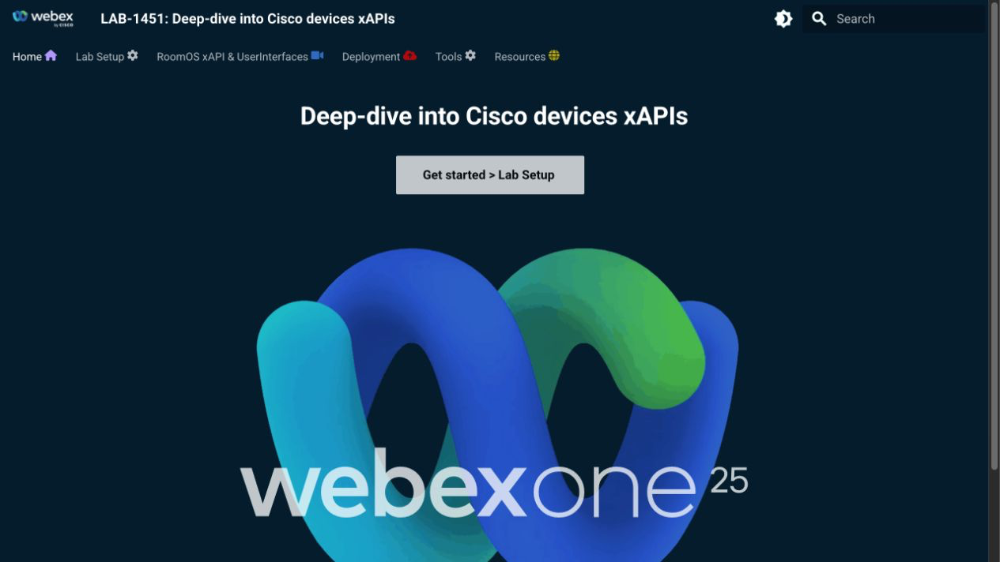

{{ config.cProps.devNotice }}
{{ config.cProps.acronyms }}

# Quick Docs Macro Exercise — Part 1: Start Simple ~(section\ {{ config.cProps.rxp.sectionIds.exe.macros.quickDocs_pt1 }})~

Build a **Quick Docs** panel that opens useful sites on the room display or presents the same destination as a QR code. Part 1 keeps the site list in the UI Extension itself so you can focus on the event and command flow.

## Requirements ~({{ config.cProps.rxp.sectionIds.exe.macros.quickDocs_pt1 }})~

- A RoomOS device with the Macro Editor, UI Extensions Editor, and WebEngine support
- A touch interface on which to open the Quick Docs panel
- Access to the device web interface with permission to edit macros and UI Extensions
- Network access from the RoomOS device to:
    - `https://webexcc-sa.github.io`
    - `https://www.webex.com`
    - `https://api.qrserver.com`

No camera or terminal application is used in this exercise.

## Build the Quick Docs panel ~({{ config.cProps.rxp.sectionIds.exe.macros.quickDocs_pt1 }}.1)~

???+ lesson "Lesson: Create the panel ~({{ config.cProps.rxp.sectionIds.exe.macros.quickDocs_pt1 }}.1.1)~"

    1. Sign in to `https://{{ config.cProps.auth.roomosIp }}/web`.
    2. Open **Customization > UI Extensions Editor**.
    3. Create a panel with these properties:

        | Property | Value |
        | --- | --- |
        | Name | `Quick Docs` |
        | Panel ID | `lab1451_quick_docs` |
        | Location | Home screen |
        | Page name | `Quick Docs` |

    4. Add two rows. Label them **LAB-1451** and **Reimagine Workspaces**.

    !!! tip

        Keep the panel and widget IDs exactly as shown. The macro uses them as a compact message containing the app name, action, and destination URL.

???+ lesson "Lesson: Add solution widgets ~({{ config.cProps.rxp.sectionIds.exe.macros.quickDocs_pt1 }}.1.2)~"

    Add two buttons to each row and assign these exact widget IDs:

    | Row | Button | Widget ID |
    | --- | --- | --- |
    | LAB-1451 | Open Site | `lab1451_quick_docs~OpenSite~https://webexcc-sa.github.io/LAB-1451/` |
    | LAB-1451 | Open QR Code | `lab1451_quick_docs~OpenQrCode~https://webexcc-sa.github.io/LAB-1451/` |
    | Reimagine Workspaces | Open Site | `lab1451_quick_docs~OpenSite~https://www.webex.com/us/en/workspaces.html` |
    | Reimagine Workspaces | Open QR Code | `lab1451_quick_docs~OpenQrCode~https://www.webex.com/us/en/workspaces.html` |

    Preview the panel, then export/save it to the RoomOS device. Open it on the touch interface and confirm that both rows and all four buttons are visible. The buttons will not perform an action until the macro is complete.

## Subscribe to widget events ~({{ config.cProps.rxp.sectionIds.exe.macros.quickDocs_pt1 }}.2)~

???+ lesson "Lesson: Create the Quick Docs macro ~({{ config.cProps.rxp.sectionIds.exe.macros.quickDocs_pt1 }}.2.1)~"

    1. Open **Customization > Macro Editor**.
    2. Create a macro named `Quick Docs`.
    3. Save and activate it.
    4. Add a readiness message below the xAPI import:

        ``` javascript
        import xapi from 'xapi';

        console.log('Quick Docs ready');
        ```

    Confirm that `Quick Docs ready` appears once in the macro console.

???+ lesson "Lesson: Inspect widget actions ~({{ config.cProps.rxp.sectionIds.exe.macros.quickDocs_pt1 }}.2.2)~"

    Subscribe to `UserInterface Extensions Widget Action` and log the event. Then press and release each panel button.

    ``` javascript title="Scaffold"
    xapi.Event.UserInterface.Extensions.Widget.Action.on((event) => {
      // Log the complete event.
    });
    ```

    ??? success "Compare your subscription"

        ``` javascript
        xapi.Event.UserInterface.Extensions.Widget.Action.on((event) => {
          console.log('Widget action:', event);
        });
        ```

    A button can emit `pressed`, `released`, and `clicked`. The solution performs work only for `clicked` so one user action opens one view.

???+ lesson "Lesson: Filter and parse Quick Docs events ~({{ config.cProps.rxp.sectionIds.exe.macros.quickDocs_pt1 }}.2.3)~"

    `WidgetId` is a string. Use [`String.prototype.includes`](https://developer.mozilla.org/en-US/docs/Web/JavaScript/Reference/Global_Objects/String/includes) to keep only IDs containing the Quick Docs prefix. Split a matching ID on `~` to recover the action and URL.

    Complete the scaffold:

    ``` javascript title="Scaffold"
    const APP_PREFIX = 'lab1451_quick_docs';

    xapi.Event.UserInterface.Extensions.Widget.Action.on(({ Type, WidgetId }) => {
      if (Type !== 'clicked' || !WidgetId.includes(/* prefix and delimiter */)) return;

      const [, action, ...urlParts] = WidgetId.split('~');
      const url = urlParts.join('~');

      switch (action) {
        case 'OpenSite':
          console.log(action, url);
          break;
        case 'OpenQrCode':
          console.log(action, url);
          break;
        default:
          console.warn(`Quick Docs ignored unknown action [${action}]`);
      }
    });
    ```

    ??? success "Compare your filter"

        ``` javascript
        const APP_PREFIX = 'lab1451_quick_docs';

        xapi.Event.UserInterface.Extensions.Widget.Action.on(({ Type, WidgetId }) => {
          if (Type !== 'clicked' || !WidgetId.includes(`${APP_PREFIX}~`)) return;

          const [, action, ...urlParts] = WidgetId.split('~');
          const url = urlParts.join('~');

          switch (action) {
            case 'OpenSite':
              console.log(action, url);
              break;
            case 'OpenQrCode':
              console.log(action, url);
              break;
            default:
              console.warn(`Quick Docs ignored unknown action [${action}]`);
          }
        });
        ```

    Open the panel and click all four buttons. The console should report two `OpenSite` and two `OpenQrCode` actions, each with its complete URL.

## Add the web-view behavior ~({{ config.cProps.rxp.sectionIds.exe.macros.quickDocs_pt1 }}.3)~

???+ lesson "Lesson: Define `openSite()` ~({{ config.cProps.rxp.sectionIds.exe.macros.quickDocs_pt1 }}.3.1)~"

    Write an asynchronous `openSite(url)` function that displays `url` in a fullscreen OSD web view. If the command fails, log one actionable error and allow the macro to continue processing later clicks.

    ``` javascript title="Scaffold"
    async function openSite(url) {
      try {
        const result = await xapi.Command.UserInterface.WebView.Display({
          Mode: /* fullscreen mode */,
          Target: /* room display */,
          Url: /* supplied URL */,
        });
        console.log(/* success context */);
      } catch (error) {
        console.error(/* failing URL and next action */, error);
      }
    }
    ```

    ??? success "Compare `openSite()`"

        ``` javascript
        async function openSite(url) {
          try {
            const result = await xapi.Command.UserInterface.WebView.Display({
              Mode: 'Fullscreen',
              Target: 'OSD',
              Url: url,
            });
            console.log(`Quick Docs opened site [${url}]`, result);
          } catch (error) {
            console.error(`Quick Docs could not open site [${url}]. Verify WebEngine and network access.`, error);
          }
        }
        ```

    Replace the `OpenSite` console statement in the event handler with `openSite(url);`. Save the macro, click both **Open Site** buttons, and verify the expected destinations.

    <figure markdown="span">
        { width="700" }
        <figcaption>The lab-owned HTTPS destination used by the LAB-1451 row</figcaption>
    </figure>

???+ lesson "Lesson: Define `openQrCode()` ~({{ config.cProps.rxp.sectionIds.exe.macros.quickDocs_pt1 }}.3.2)~"

    A QR service accepts the destination as the value of its `data` query parameter. Encode the complete destination with `encodeURIComponent()` so its own `?`, `&`, and `#` characters remain data rather than becoming part of the QR-service request.

    Complete this scaffold using one variable name, `qrUrl`, from declaration through command execution:

    ``` javascript title="Scaffold"
    const QR_SERVICE = 'https://api.qrserver.com/v1/create-qr-code/?size=800x800&data=';

    async function openQrCode(url) {
      const qrUrl = /* QR service plus encoded destination */;

      try {
        const result = await xapi.Command.UserInterface.WebView.Display({
          Mode: 'Fullscreen',
          Target: 'OSD',
          Url: /* declared variable */,
        });
        console.log(/* success context */);
      } catch (error) {
        console.error(/* failing destination and next action */, error);
      }
    }
    ```

    ??? success "Compare `openQrCode()`"

        ``` javascript
        const QR_SERVICE = 'https://api.qrserver.com/v1/create-qr-code/?size=800x800&data=';

        async function openQrCode(url) {
          const qrUrl = `${QR_SERVICE}${encodeURIComponent(url)}`;

          try {
            const result = await xapi.Command.UserInterface.WebView.Display({
              Mode: 'Fullscreen',
              Target: 'OSD',
              Url: qrUrl,
            });
            console.log(`Quick Docs opened QR code for [${url}]`, result, qrUrl);
          } catch (error) {
            console.error(`Quick Docs could not open a QR code for [${url}]. Verify QR-service and network access.`, error);
          }
        }
        ```

    Replace the `OpenQrCode` console statement in the event handler with `openQrCode(url);`. The macro now has every function required for the final test.

???+ lesson "Lesson: Verify the complete solution ~({{ config.cProps.rxp.sectionIds.exe.macros.quickDocs_pt1 }}.3.3)~"

    1. Save and activate the macro.
    2. Click each **Open Site** button and confirm the expected page appears.
    3. Click each **Open QR Code** button and confirm a QR code appears.
    4. Temporarily test `openQrCode('https://example.com/?a=1&b=2#section')`. Scan the code and confirm that the complete query string and fragment are preserved, then remove the temporary call.
    5. Confirm the console contains a single contextual result for each click and no `ReferenceError`.

    <figure markdown="span">
        { width="700" }
        <figcaption>QR checkpoint for `https://webexcc-sa.github.io/LAB-1451/`</figcaption>
    </figure>

    ??? success "Complete Quick Docs macro"

        ``` javascript
        import xapi from 'xapi';

        const APP_PREFIX = 'lab1451_quick_docs';
        const QR_SERVICE = 'https://api.qrserver.com/v1/create-qr-code/?size=800x800&data=';

        async function openSite(url) {
          try {
            const result = await xapi.Command.UserInterface.WebView.Display({
              Mode: 'Fullscreen',
              Target: 'OSD',
              Url: url,
            });
            console.log(`Quick Docs opened site [${url}]`, result);
          } catch (error) {
            console.error(`Quick Docs could not open site [${url}]. Verify WebEngine and network access.`, error);
          }
        }

        async function openQrCode(url) {
          const qrUrl = `${QR_SERVICE}${encodeURIComponent(url)}`;

          try {
            const result = await xapi.Command.UserInterface.WebView.Display({
              Mode: 'Fullscreen',
              Target: 'OSD',
              Url: qrUrl,
            });
            console.log(`Quick Docs opened QR code for [${url}]`, result, qrUrl);
          } catch (error) {
            console.error(`Quick Docs could not open a QR code for [${url}]. Verify QR-service and network access.`, error);
          }
        }

        xapi.Event.UserInterface.Extensions.Widget.Action.on(({ Type, WidgetId }) => {
          if (Type !== 'clicked' || !WidgetId.includes(`${APP_PREFIX}~`)) return;

          const [, action, ...urlParts] = WidgetId.split('~');
          const url = urlParts.join('~');

          switch (action) {
            case 'OpenSite':
              openSite(url);
              break;
            case 'OpenQrCode':
              openQrCode(url);
              break;
            default:
              console.warn(`Quick Docs ignored unknown action [${action}]`);
          }
        });

        console.log('Quick Docs ready');
        ```

Expected console messages remain visible as plain text, including the command response:

``` text
Quick Docs ready
Quick Docs opened site [https://webexcc-sa.github.io/LAB-1451/] {"status":"OK"}
Quick Docs opened QR code for [https://webexcc-sa.github.io/LAB-1451/] {"status":"OK"}
```
