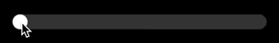
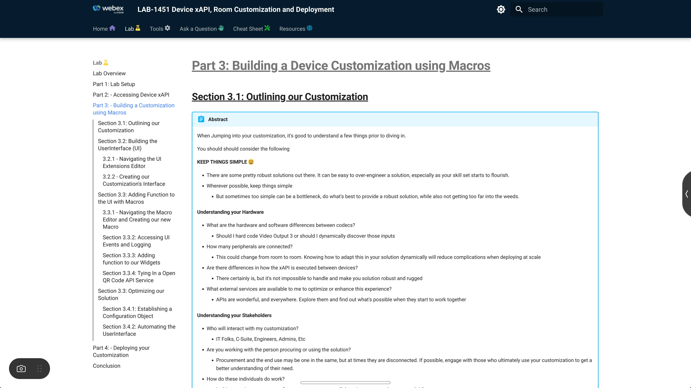

{{ config.cProps.devNotice }}
{{ config.cProps.acronyms }}

# Quick Docs Macro Exercise - Part 1 - Start Simple ~(section\ {{config.cProps.rxp.sectionIds.exe.macros.quickDocs_pt1}})~

## Section {{config.cProps.rxp.sectionIds.exe.macros.quickDocs_pt1}} Requirements

!!! important ""

    !!! note inline end

        This lab assumes you have access to a Cisco RoomOS Device that is already setup and ready for use. If your device is not registered and online, please do so before beginning
    
    **Additional Lessons**
    
    - It's recommended you have run through Accessing RoomOS xAPI via Macros in Macros {{config.cProps.rxp.sectionIds.macro}} at a minimum before proceeding with this Exercise

    **Hardware**

    - A Laptop
    - A Cisco Desk, Board or Room Series Device running the most recent On Premise or Cloud Stable software
        - A Touch Controller is required when working on a Room Series Device. Either Room navigator or 3rd part touch display
        - Preferred Device: Cisco Desk Pro
    - A minimum of 1 camera (Either Integrated or External)

    **Software**

    - Laptop
        - Recommended Browser: Chrome or Firefox
        - Recommended Terminal Software:
            - Command Prompt (Windows)
            - Terminal (MAC)
            - [Putty](https://apps.microsoft.com/detail/xpfnzksklbp7rj?hl=en-US&gl=US) (Windows)
            - [Termius](https://termius.com/) (Windows, MAC, Linux)
    - RoomOS Device
        - Either the current On Premise or Cloud Stable release

    **Network**

    - Local Access to the RoomOS Device over port 80/443
    - General access to the Internet

## Part 1 Solution Outline

!!! abstract ""

    In section {{config.cProps.rxp.sectionIds.exe.macros.quickDocs_pt1}} of this lab, we'll build a Macro that will allow folks to either View a Document or Scan a QR code to take the document with them on your device.

    We'll review how to:

    - Build a UserInterface
    - Map those UserInterface elements to actions driven by an accompanying macro
    - Integrate a 3rd party QR code service, leveraging APIs external to the Codec

## **Start with the UserInterface** ~({{config.cProps.rxp.sectionIds.exe.macros.quickDocs_pt1}}.1)~

???+ lesson "Lesson: Create a New Panel Button ~({{config.cProps.rxp.sectionIds.exe.macros.quickDocs_pt1}}.1.1~)"

    !!! tip ""

        Starting with the UserInterface elements helps use visualize our solution and determine how to then structure our Macro

    !!! tool inline end "Save Extension Button"

        <figure markdown="span">
            
            <!-- <figcaption>Adding a new Panel</figcaption> -->
        </figure>

    - **Task**: 

        - Create a new Panel
        - Assign this panel's ==id== as: <pre><code>wx1_QrDocs</code></pre>
        - Assign this panel's ==name== as: <pre><code>Room Docs</code></pre>
        - Assign this panel's ==location== as: `HomeScreenAndCallControls`
        - Pick any icon you wish
        - Pick any Panel Color you wish
        - Save your Extension
            - You should be able to see your Panel on the Codec's Touch Interface

    ??? success "View Successful UI Execution"

        === "OSD"

            <figure markdown="span">
                { width="600" }
                <!-- <figcaption>Adding a new Panel</figcaption> -->
            </figure>

        === "Opened Panel"

            <figure markdown="span">
                { width="600" }
                <!-- <figcaption>Adding a new Panel</figcaption> -->
            </figure>

        === "UI Properties"

            <figure markdown="span">
                { width="150" }
                <!-- <figcaption>Adding a new Panel</figcaption> -->
            </figure>
        
    ??? challenge "Challenge: Rename the Page to Room Docs"

        - Rename the Page Name from `Page` to: <pre><code>Room Docs</code></pre>
        - Assign the PageId as: <pre><code>wx1_QrDocs\~RoomDocs</code></pre>

??? lesson "Lesson: Add Solution Widgets  ~({{config.cProps.rxp.sectionIds.exe.macros.quickDocs_pt1}}.1.2)~"

    !!! tool inline end "Save Extension Button"

        <figure markdown="span">
            
            <!-- <figcaption>Adding a new Panel</figcaption> -->
        </figure>

    - **Task**: 

        - Rename Row 1 to: <pre><code>Lab 1451</code></pre>
            - Add 2 Buttons to this row
                - Set the following properties for the left button
                    - Rename Button Text `Button` to: <pre><code>Open Site</code></pre>
                    - Assign WidgetId: <pre><code>wx1_QrDocs\~OpenSite\~https://webexcc-sa.github.io/LAB-1451/wx1_1451_part_3/</code></pre>
                    - Set the Widget Width to 2
                - Set the following properties for the Right button
                    - Rename Button Text `Button` to: <pre><code>Open QrCode 🔳</code></pre>
                    - Assign WidgetId: <pre><code>wx1_QrDocs\~OpenQrCode\~https://webexcc-sa.github.io/LAB-1451/wx1_1451_part_3/</code></pre>
                    - Set the Widget Width to 2
        - Add a second row, with the name: <pre><code>Reimagine Workspaces</code></pre>
            - Add 2 Buttons to this row
                - Set the following properties for the left button
                    - Rename Button Text `Button` to: <pre><code>Open Site</code></pre>
                    - Assign WidgetId: <pre><code>wx1_QrDocs\~OpenSite\~https://www.webex.com/us/en/workspaces.html</code></pre>
                    - Set the Widget Width to 2
                - Set the following properties for the Right button
                    - Rename Button Text `Button` to: <pre><code>Open QrCode 🔳</code></pre>
                    - Assign WidgetId: <pre><code>wx1_QrDocs\~OpenQrCode\~https://www.webex.com/us/en/workspaces.html</code></pre>
                    - Set the Widget Width to 2
        - Save your Extension
            - You should be able to see your Panel on the Codec's Touch Interface

    ??? success "View Successful UI Execution"

        <figure markdown="span">
            { width="600" }
            <!-- <figcaption>Adding a new Panel</figcaption> -->
        </figure>

    ??? challenge "Add your Organization's HomePage :smiley:"

        You may have noticed the WidgetIds have a URL as apart of the ID

        We'll be using this in the Macro we write later, to open this page

        Here is how we're structuring WidgetIds for this lab

        !!! example

            - WidgetId Structure: appName\~Action\~URL

                - appName: `wx1_QrDocs` -> Let's us associate this interface with our Macro Script and helps make the WidgetId more unique
                - action: `OpenSite` or `OpenQrCode` -> This will tell use how we want to open our URL
                - URL: This is the URL we want to open, or build a QR Code for
                - String Separator: `~` -> Using a unique character, such as this tilde, can help use split up and access this information later in the Macro

            ??? curious "Is this WidgetId format mandatory?"

                Widget Ids are strings. This is just one of many examples of how you can structure your widgets. It's not required to structure them like this, {++with the exception of this lab++}. 
                
                So long as they are unique in your customization, you should be good to go

        - Task: 
            - Create a 3rd Row
            - Add in an ==Open== Site button and an ==Open QrCode 🔳== with your Organizations Home Page as the Url
            - Be sure to assign `wx1_QrDocs` as the appName and the correct action to the button they represent

        ??? tip "Hint"

            OpenSite: <pre><code>wx1_QrDocs\~OpenSite\~==YOUR_ORG_HOMEPAGE==</code></pre>
            OpenQrCode: <pre><code>wx1_QrDocs\~OpenQrCode\~==YOUR_ORG_HOMEPAGE==</code></pre>

- - -
- - -

## **Create a New Macro and Subscribe** ~({{config.cProps.rxp.sectionIds.exe.macros.quickDocs_pt1}}.2)~

!!! Abstract

    Now that we have our UserInterface in place, we can start to build our solution

    We'll be using the Macro Editor for this solution, but know that you can do these very same tasks from any other avenue we explored in Part 2 of this lab

    The benefit of Macros, is that they come with every Cisco Codec running Ce9.2 or newer (with the exception of the Sx10). So no need to procure hardware or spin up a service to start building a solution :smiley:

???+ lesson "Lesson: Create a new Macro ~({{config.cProps.rxp.sectionIds.exe.macros.quickDocs_pt1}}.2.1)~"

    If you missed Section 2.6 in part 2 of this lab, please watch this Vidcast

    ??? vidcast "Vidcast: Macro Editor IDE Review"

        <div style="padding-bottom:56.25%; position:relative; display:block; width: 100%">
          <iframe src="https://app.vidcast.io/share/embed/d6dacbb3-9792-4d27-b1fa-434f2ff37f03" width="100%" height="100%" title="Macro Editor IDE Review" frameborder="0" loading="lazy" allowfullscreen style="position:absolute; top:0; left: 0;border: solid; border-radius:12px;"></iframe>
        </div>

     - **Task**:

        - Select ==Create new macro== in the Macro Editor
        - Name this macro ==Room Docs==
        - {++Save++} and {++Activate+++} the ==Room Docs== Macro

        ??? success "Review how To"

            === "Device Login"

                !!! failure ""

                    if NOT already logged into the endpoint, follow these steps
                
                    - Open a Browser and enter your Codec's IP as a URL and hit enter
                    - Login with your Username and Password

                    <figure markdown="span">
                        { width="400" }
                        <figcaption>Device Login Page</figcaption>
                    </figure>

                !!! warning ""

                    If in the UI Extensions Editor

                    - Click on the Device Name in the Top Left hand corner of the UI Extensions Editor to get back to the Device Home Page

            === "Device Home"

                <figure markdown="span">
                    { width="600" }
                    <figcaption>Device Home Page</figcaption>
                </figure>

            === "Macro Editor"

                <figure markdown="span">
                    { width="700" }
                    <figcaption>The Macro Editor</figcaption>
                </figure>

            === "Create, Save and Activate a Macro"

                !!! gif "Create, Save and Activate a Macro"

                    <figure markdown="span">
                        { width="600" }
                        <figcaption>Create, Save and Activate a Macro</figcaption>
                    </figure>


??? lesson "Lesson: Subscribing to Widget Actions ~({{config.cProps.rxp.sectionIds.exe.macros.quickDocs_pt1}}.2.2)~"

    - **xAPI**: xEvent UserInterface Widget Action

    - **Task**:

        - Subscribe the xAPI Path above using Macro Syntax

        - Take the Callback information generated by this event, and log it to the Macro Console using `console.log()`

        - Once complete, ==Save== and Activate the macro (if inactive)

        - Start pressing the ==Open Site== and ==Open QrCode 🔳== buttons contained within your `Room Docs` panel
        - Monitor the Macro Console Output

    ??? success "Compare your Macro"

        !!! Note

            It's ok if your macro's structure doesn't match 1:1 with the examples below

            As long as they information we access is the same, then format is up to the developers preference

        ```javascript
        import xapi from 'xapi';

        xapi.Event.UserInterface.Extensions.Widget.Action.on(({WidgetId, Type, Value}) => {
          console.log({WidgetId, Type, Value})
        })
        ```

    ??? success "Compare your Macro Console"

        | Time     | Macro      | WidgetId                                                                                         | Type     | Value |
        |----------|-----------|--------------------------------------------------------------------------------------------------|----------|-------|
        | HH:MM:SS | Room Docs | wx1_QrDocs\~OpenQrCode\~https://webexcc-sa.github.io/LAB-1451/wx1_1451_part_3/                  | {++pressed++}  |`    `|
        | HH:MM:SS | Room Docs | wx1_QrDocs\~OpenQrCode\~https://webexcc-sa.github.io/LAB-1451/wx1_1451_part_3/                  | ==released== |`    `|
        | HH:MM:SS | Room Docs | wx1_QrDocs\~OpenQrCode\~https://webexcc-sa.github.io/LAB-1451/wx1_1451_part_3/                  | `clicked`  |`    `|
        | HH:MM:SS | Room Docs | wx1_QrDocs\~OpenQrCode\~https://webexcc-sa.github.io/LAB-1451/wx1_1451_part_3/                   | {++pressed++}  |`    `|
        | HH:MM:SS | Room Docs | wx1_QrDocs\~OpenQrCode\~https://webexcc-sa.github.io/LAB-1451/wx1_1451_part_3/                   | ==released== |`    `|
        | HH:MM:SS | Room Docs | wx1_QrDocs\~OpenQrCode\~https://webexcc-sa.github.io/LAB-1451/wx1_1451_part_3/                   | `clicked`  |`    `|
        | HH:MM:SS | Room Docs | wx1_QrDocs\~OpenSite\~https://www.webex.com/us/en/workspaces.html                               | {++pressed++}  |`    `|
        | HH:MM:SS | Room Docs | wx1_QrDocs\~OpenSite\~https://www.webex.com/us/en/workspaces.html                               | ==released== |`    `|
        | HH:MM:SS | Room Docs | wx1_QrDocs\~OpenSite\~https://www.webex.com/us/en/workspaces.html                               | `clicked`  |`    `|
        | HH:MM:SS | Room Docs | wx1_QrDocs\~OpenQrCode\~https://www.webex.com/us/en/workspaces.html                             | {++pressed++}  |`    `|
        | HH:MM:SS | Room Docs | wx1_QrDocs\~OpenQrCode\~https://www.webex.com/us/en/workspaces.html                             | ==released== |`    `|
        | HH:MM:SS | Room Docs | wx1_QrDocs\~OpenQrCode\~https://www.webex.com/us/en/workspaces.html                             | `clicked`  |`    `|

    ??? curious "Why does each Widget click have 3 events fire?"

        Good Catch :smiley:! Many widgets offer 1-3 events that will fire based on the conditions of the action

        This is important to know, as you may only want an action to happen once, not upwards of 3 times, when building your automation

        We can use techniques in ES6 JS to filter out what we're interested in for these scenarios

        For reference, here's a list of Widgets and their event payloads

        !!! experiment "Click on each table below to review each Widget"

            === "Toggle"

                !!! gif inline end

                    <figure markdown="span">
                        
                        <figcaption>Toggle Action</figcaption>
                    </figure>

                |Key|Value|
                |:--|:----|
                |WidgetId|`Assigned by the Developer on Widget Instantiation`|
                |Type| `changed`|
                |Value| `on` or `off` |

            === "Slider"

                !!! gif inline end

                    <figure markdown="span">
                        
                        <figcaption>Slider Action</figcaption>
                    </figure>

                |Key|Value|
                |:--|:----|
                |WidgetId|`Assigned by the Developer on Widget Instantiation`|
                |Type|`pressed`, `released`, or `changed`|
                |Value| `Integer between 0 and 255` |

            === "Button"

                !!! gif inline end

                    <figure markdown="span">
                        
                        <figcaption>Button Action</figcaption>
                    </figure>

                |Key|Value|
                |:--|:----|
                |WidgetId|`Assigned by the Developer on Widget Instantiation`|
                |Type|`pressed`, `released`, or `clicked`|
                |Value| N/A |

            === "GroupButton"

                !!! gif inline end

                    <figure markdown="span">
                        
                        <figcaption>Group Button Action</figcaption>
                    </figure>

                |Key|Value|
                |:--|:----|
                |WidgetId|`Assigned by the Developer on Widget Instantiation`|
                |Type|`pressed`, `released`|
                |Value| `Assigned by the Developer on Widget Instantiation` |

            === "Icon Button"

                !!! gif inline end

                    <figure markdown="span">
                        
                        <figcaption>Icon Button Icons</figcaption>
                    </figure>

                |Key|Value|
                |:--|:----|
                |WidgetId|`Assigned by the Developer on Widget Instantiation`|
                |Type|`pressed`, `released`, or `clicked`|
                |Value| N/A |

            === "Spinner"

                !!! gif inline end

                    <figure markdown="span">
                        
                        <figcaption>Spinner Icons</figcaption>
                    </figure>

                |Key|Value|
                |:--|:----|
                |WidgetId|`Assigned by the Developer on Widget Instantiation`|
                |Type|`pressed`, `released`, or `clicked`|
                |Value| `increment` or `decrement` |

            === "TextBox"

                !!! failure "Does not fire events"

            === "Directional Pad"

                !!! gif inline end

                    <figure markdown="span">
                        
                        <figcaption>Directional Pad Action</figcaption>
                    </figure>

                |Key|Value|
                |:--|:----|
                |WidgetId|`Assigned by the Developer on Widget Instantiation`|
                |Type|`pressed`, `released`, or `clicked`|
                |Value| `up`, `down`, `left`, `right`, `center` |

            === "Spacer"

                !!! failure "Does not fire events"

??? lesson "Lesson: Refine and Filter our Widget information ~({{config.cProps.rxp.sectionIds.exe.macros.quickDocs_pt1}}.2.3)~"

    !!! info 

        As you saw in the previous example Widgets can produce 1-3 events to fire whenever you interact with them

        It's best to filter this down to the specific even in question

        In macros, we can use the tools offered to us by ES6 JS to complete this task

    - **xAPI**: xEvent UserInterface Widget Action

    - **Task**: 

        - Replace your original ==console.log== with {++console.debug++}
            - This will hide this log in the debug group, we can use this later to check our work
        - Use an `if` ES6 JS statement to filter our WidgetId Event and confirm the widget belongs to our customization
            - This can be done using ES6 JS's `.includes('wx1_QrDocs')` prototype
        - Use an `if` ES6 JS statement to filter our Type event and check to see if it matches ==released==
            - This can be done using ES6 JS's **Equality** `==` or **Strict Equality** `===` operators
            - We won't be using {--pressed--} or {--clicked--}
        - Use the `.split('~')` ES6 JS prototype to split out our app, action and url and assign them to objects using our tilde as the string separator
        - Use a `switch` ES6 JS statement to handle `OpenSite` and `OpenQrCode` actions respectively
            - Place ==console.log(action, url)== below the `OpenSite` case and ==console.warn(action, url)== below the `OpenQrCode` case
    
        !!! example "Click the Tabs Below to see how each Task above is implemented"

            === "Verify WidgetID with `if` and `includes`>"

                ``` javascript
                import xapi from 'xapi';

                xapi.Event.UserInterface.Extensions.Widget.Action.on(({ WidgetId, Type, Value }) => {
                  console.debug({ WidgetId, Type, Value }); // <-- Changed to Debug
                  if (WidgetId.includes(`wx1_QrDocs`)) {    // <-- Asks if WidgetIn includes wx1_QrDocs

                  };
                });
                ```

                ??? question "Why Use `includes()`?"

                    We structured all of our WidgetIds with the same prefix ==wx1_QrDocs==

                    This helps make our Widget References Unique, but also helps us ignore any widgets that don't include ==wx1_QrDocs==

                    If a solution were to have the same widgetId, then that 1 widget could have solutions fire from 2 different integration sources. In some cases, that's fine or even necessary, but it's best practice to make your widgets as unique to your solution as possible and for your solution to ignore any other chatter on the Codec

                <div style="display: flex; gap: 10px;">
                    <a class="md-button md-button--primary" href="https://developer.mozilla.org/en-US/docs/Web/JavaScript/Reference/Global_Objects/Array/includes" target="_blank" >
                      Learn more about the `.includes()` prototype <i class="fa-solid fa-square-up-right"></i>
                    </a>
                    <a class="md-button md-button--primary" href="https://developer.mozilla.org/en-US/docs/Web/JavaScript/Reference/Statements/if...else" target="_blank" >
                      Learn more about `if` statements <i class="fa-solid fa-square-up-right"></i>
                    </a>
                </div>

            === "Compare Type using `if` and `==`>"

                ```javascript
                import xapi from 'xapi';

                xapi.Event.UserInterface.Extensions.Widget.Action.on(({ WidgetId, Type, Value }) => {
                  console.debug({ WidgetId, Type, Value });
                  if (WidgetId.includes(`wx1_QrDocs`)) {
                    if (Type == 'released') { // <-- Asked if the Type is equal to released
                      
                    };
                  };
                });
                ```

                <div style="display: flex; gap: 10px;">
                    <a class="md-button md-button--primary" href="https://developer.mozilla.org/en-US/docs/Web/JavaScript/Reference/Statements/if...else" target="_blank" >
                      Learn more about `if` statements <i class="fa-solid fa-square-up-right"></i>
                    </a>
                    <a class="md-button md-button--primary" href="https://developer.mozilla.org/en-US/docs/Web/JavaScript/Reference/Operators" target="_blank" >
                      Learn more about `Operators` <i class="fa-solid fa-square-up-right"></i>
                    </a>
                </div>

            === "Assign app, action and URL using `split` >"

                ```javascript
                import xapi from 'xapi';

                xapi.Event.UserInterface.Extensions.Widget.Action.on(({ WidgetId, Type, Value }) => {
                  console.debug({ WidgetId, Type, Value });
                  if (WidgetId.includes(`wx1_QrDocs`)) {
                    if (Type == 'released') {
                      const [app, action, url] = WidgetId.split(`~`); // <-- Extract our App, Action and Url and assigned them to the object they represent
                    };
                  };
                });
                ```

                ??? question "Why `.split()` our widget?"

                    This gives use new objects to work with. The benefit of how we implemented our WidgetId structure[==app\~action\~url==] allows us to make our code a bit more flexible

                    Now, if you wanted to add more sites, all you would need to do is add more buttons to the UI Extension following the WidgetId structure we set, and your Macro Code doesn't need to be modified to allow it to work

                <div style="display: flex; gap: 10px;">
                    <a class="md-button md-button--primary" href="https://developer.mozilla.org/en-US/docs/Web/JavaScript/Reference/Global_Objects/String/split" target="_blank" >
                      Learn more about the `.split()` prototype <i class="fa-solid fa-square-up-right"></i>
                    </a>
                    <a class="md-button md-button--primary" href="https://developer.mozilla.org/en-US/docs/Web/JavaScript/Reference/Operators/Destructuring_assignment" target="_blank" >
                      Learn more about the `Destructuring` assignments <i class="fa-solid fa-square-up-right"></i>
                    </a>
                    <a class="md-button md-button--primary" href="https://developer.mozilla.org/en-US/docs/Web/JavaScript/Reference/Global_Objects/Array" target="_blank" >
                      Learn more about `Arrays` <i class="fa-solid fa-square-up-right"></i>
                    </a>
                </div>

            === "Use `switch` to handle actions"

                ```javascript
                import xapi from 'xapi';

                xapi.Event.UserInterface.Extensions.Widget.Action.on(({ WidgetId, Type, Value }) => {
                  console.debug({ WidgetId, Type, Value });
                  if (WidgetId.includes(`wx1_QrDocs`)) {
                    if (Type == 'released') {
                      const [app, action, url] = WidgetId.split(`~`);

                      switch (action) {   // <-- Switch what code we run when:
                        case 'OpenSite':  // <-- The OpenSite action comes in
                          console.log(action, url);
                          break;
                        case 'OpenQrCode':// <-- The OpenQrCode action comes in
                          console.warn(action, url);
                          break;
                        default:          // <-- The When an Unknown action comes in
                          console.error(`Unknown Action Fired: [${action}]`)
                          break;
                      };
                    };
                  };
                });
                ```

                ??? question "Why not use `if` statement instead of `switch`"

                    If statements could work, but as you use more and more if statements, the code becomes a bit harder to read

                    Using switches, if we wanted to define another action, it would be as simple as adding another case and adding codec below it to define how that case runs

                    Both do the same job, some implementations are easier on the eyes than others

                <div style="display: flex; gap: 10px;">
                    <a class="md-button md-button--primary" href="https://developer.mozilla.org/en-US/docs/Web/JavaScript/Reference/Statements/switch" target="_blank" >
                      Learn more about `switch...case` <i class="fa-solid fa-square-up-right"></i>
                    </a>
                </div>

        - Once complete, ==Save== and Activate the macro (if inactive)

        - Start pressing the ==Open Site== and ==Open QrCode 🔳== buttons contained within your `Room Docs` panel
        - Monitor the Macro Console Output

    ??? success "Compare your Macro"

        ```javascript
        import xapi from 'xapi';

        xapi.Event.UserInterface.Extensions.Widget.Action.on(({ WidgetId, Type, Value }) => {
          console.debug({ WidgetId, Type, Value });
          if (WidgetId.includes(`wx1_QrDocs`)) {
            if (Type == 'released') {
              const [app, action, url] = WidgetId.split(`~`);

              switch (action) {
                case 'OpenSite':
                  console.log(action, url);
                  break;
                case 'OpenQrCode':
                  console.warn(action, url);
                  break;
                default:
                  console.error(`Unknown Action Fired: [${action}]`)
                  break;
              };
            };
          };
        });
        ```

    ??? success "Compare your Macro Console"

        | Time      | Macro     | Logs                                                   |
        |-----------|-----------|--------------------------------------------------------|
        | HH:MM:SS  | Room Docs | QJS Ready                                              |
        | HH:MM:SS  | Room Docs | ==OpenQrCode== https://webexcc-sa.github.io/LAB-1451/wx1_1451_part_3/ |
        | HH:MM:SS  | Room Docs | {++OpenSite++} https://www.webex.com/us/en/workspaces.html  |
        | HH:MM:SS  | Room Docs | {++OpenSite++} https://webexcc-sa.github.io/LAB-1451/wx1_1451_part_3/ |
        | HH:MM:SS  | Room Docs | ==OpenQrCode== https://www.webex.com/us/en/workspaces.html  |

- - -
- - -

## **Define and finalize solution** ~({{config.cProps.rxp.sectionIds.exe.macros.quickDocs_pt1}}.3)~

!!! info

    Now that we can access the data from our widgets as we expect, we can start to implement the function of opening a Web Page on out touch interface

???+ lesson "Lesson: Defining our `OpenSite` function ~({{config.cProps.rxp.sectionIds.exe.macros.quickDocs_pt1}}.3.1)~"

    !!! important

        We'll be using the WebView Display API

        If you're working on a Desk or Board Series Endpoint use the parameter ==Target:&#160;=={++OSD++} in the following lessons

        If you're working on a Room Series Endpoint with a Room Navigator attached use the parameter ==Target:&#160;=={++Controller++} in the following lessons

        !!! Note

            - Room Series with 3rd Party Touch can use ==OSD== as a Target value
            - Room Series with Touch 10 CAN NOT use the ==Controller== Target Value
                - If you have no touch display or room Navigator, you will need to build a WebView Close Panel
                - This is not covered in this lab

    - **xAPI**: xCommand UserInterface WebView Display

    - **Task**: 

        - Declare a new async function called ==openSite== with the following function parameters
            - url
            - target = 'OSD'
                - Note: change ==OSD== to ==Controller== if a Room Navigator touch panel is available
        - Within this function:
            - Structure the xAPI reference above using Macro Syntax with the following parameters and values
                - Url: `url`
                - Target: `target`
            - Log a Successful response from your xAPI call
            - Catch and log an error from your xAPI call
        - Replace `console.log(action, url);` under the ==OpenSite== case within your WidgetActions event with this new {++openSite()++} function call and pass in the `url` object into your function

        ??? example "View `openSite(url, target)` function"

            ```javascript
            async function openSite(url, target = 'OSD') {
              try {
                const openPage = await xapi.Command.UserInterface.WebView.Display({
                  Url: url,
                  Target: target
                })
                console.log(`Site Webview Opened for: [${url}]`, openPage);
              } catch (e) {
                const err = {
                  Context: `Failed to open Site WebView to: [${url}]`,
                  ...e
                };
                console.error(err);
              }
            }
            ```

            <div style="display: flex; gap: 10px;">
                <a class="md-button md-button--primary" href="https://developer.mozilla.org/en-US/docs/Web/JavaScript/Reference/Statements/async_function" target="_blank" >
                  Learn more about `Async Functions` <i class="fa-solid fa-square-up-right"></i>
                </a>
                <a class="md-button md-button--primary" href="https://developer.mozilla.org/en-US/docs/Web/JavaScript/Reference/Statements/try...catch" target="_blank" >
                  Learn more about `try..catch` statements <i class="fa-solid fa-square-up-right"></i>
                </a>
            </div>

        - Once complete, ==Save== and Activate the macro (if inactive)

        - Start pressing the ==Open Site== and ==Open QrCode 🔳== buttons contained within your `Room Docs` panel
        - Monitor the Device OSD and Macro Console Output


    ??? success "View OSD Output"

        === "Lab 1451"

            <figure markdown="span">
                { width="600" }
                <figcaption>Lab 1451 WebView</figcaption>
            </figure>

        === "Reimagine Workspaces"

            <figure markdown="span">
                { width="600" }
                <figcaption>Reimagine Workspaces WebView</figcaption>
            </figure>


    ??? success "Compare your Macro"

        ```javascript
        import xapi from 'xapi';

        async function openSite(url, target = 'OSD') { //<-- Declare and define your openSite function
          try {
            const openPage = await xapi.Command.UserInterface.WebView.Display({
              Url: url,
              Target: target
            })
            console.log(`Site Webview Opened for: [${url}]`, openPage);  //<-- Log a Successful Response
          } catch (e) {
            const err = {
              Context: `Failed to open Site WebView to: [${url}]`,
              ...e
            };
            console.error(err); //<-- Catch and log an Error
          }
        }

        xapi.Event.UserInterface.Extensions.Widget.Action.on(({ WidgetId, Type, Value }) => {
          console.debug({ WidgetId, Type, Value });
          if (WidgetId.includes(`wx1_QrDocs`)) {
            if (Type == 'released') {
              const [app, action, url] = WidgetId.split(`~`);
                                // ↑ url object
              switch (action) {
                case 'OpenSite':
                  openSite(url); //<-- Run the openSite() function and pass in the url object
                  break;
                case 'OpenQrCode':
                  console.warn(action, url); 
                  break;
                default:
                  console.error(`Unknown Action Fired: [${action}]`);
                  break;
              };
            };
          };
        });
        ```

    ??? success "Compare your Macro Console"

        | Time      | Macro     | Logs                                                               |
        |-----------|-----------|--------------------------------------------------------------------|
        | HH:MM:SS  | Room Docs | QJS Ready                                                          |
        | HH:MM:SS  | Room Docs | Site Webview Opened for: [https://webexcc-sa.github.io/LAB-1451/wx1_1451_part_3/] {"status":"OK"} |
        | HH:MM:SS  | Room Docs | OpenQrCode  https://webexcc-sa.github.io/LAB-1451/wx1_1451_part_3/  |
        | HH:MM:SS  | Room Docs | Site Webview Opened for: [https://www.webex.com/us/en/workspaces.html] {"status":"OK"} |
        | HH:MM:SS  | Room Docs | OpenQrCode  https://www.webex.com/us/en/workspaces.html          |

    
??? lesson "Lesson: Defining our `OpenQrCode` function ~({{config.cProps.rxp.sectionIds.exe.macros.quickDocs_pt1}}.3.2)~"

    !!! tip "Making QR Codes is NOT a normal function of the Codec"

        In this lesson, in order to generate a QR code for our customization, then we'll need to leverage a 3rd party QR API Service

        This is how you can introduce more functionality to your device by leveraging the World of APIs

        !!! important "Always Keep Security Top of Mind!"

            It's easy to fall outside your organization's security policy especially when building new solutions.

            Make sure you work with your, or your Customer's, Information Security teams before implementing a new solution that requires Integration Authentication of any kind or reaches out on the internet.

            The security implications of a solution can force you building your solution using a different integration method, or even stop a project all together.

            <div style="display: flex; gap: 10px;">
                <a class="md-button md-button--primary" href="https://www.cisco.com/c/en/us/td/docs/voice_ip_comm/uc_system/design/guides/wx_security.html" target="_blank" >
                  Checkout Webex's <i class="fa-solid fa-shield" style="color: #ff3a65;"></i> Security Technical References <i class="fa-solid fa-square-up-right"></i>
                </a>
            </div>

    - **xAPI**: xCommand UserInterface WebView Display

    - **Task**: 

        - Declare a new async function called ==openQrCode== with the following function parameters
            - url
            - target = 'OSD'
                - Note: change ==OSD== to ==Controller== if a Room Navigator touch panel is available
        - Within this function:
            - Use ES6 JS's `encodeURI()` function to modify the URL in and assign it to a new object called `encodedUrl`
                - This is because we'll be wrapping our target URL within a URL from our QR Code Service
            - Add your `encodedUrl` object to the data Url Parameter in the URL and assign it to a new object called `qrURL`
                - <pre><code>https://api.qrserver.com/v1/create-qr-code/?data={++encodedUrl++}</code></pre>
            - Structure the xAPI reference above using Macro Syntax with the following parameters and values
                - Url: `formattedURL`
                - Target: `target`
            - Log a Successful response from your xAPI call
            - Catch and log an error from your xAPI call
        - Replace `console.warn(action, url);` under the ==OpenQrCode== case within your WidgetActions event with this new {++openQrCode()++} function call and pass in the `url` object into your function

        ??? example "View `openQrCode(url, target)` function"

            ```javascript
            async function openQrCode(url, target = 'OSD') { //<-- Declare and define your openQrCode function
              const encodedUrl = encodeURI(url);             //<-- Encode the URL that was provided
              const qrURL = `https://api.qrserver.com/v1/create-qr-code/?data=` + encodedUrl;
              try {
                const openPage = await xapi.Command.UserInterface.WebView.Display({
                  Url: qrURL,
                  Target: target
                })
                console.log(`QR Webview Opened for: [${url}]`, openPage, qrURL); //<-- Log a Successful Response
              } catch (e) {
                const err = {
                  Context: `Failed to open QR WebView to: [${url}]`,
                  QrUrl: qrURL,
                  ...e
                };
                console.error(err); //<-- Catch and log an Error
              }
            }
            ```

            <div style="display: flex; gap: 10px;">
                <a class="md-button md-button--primary" href="https://developer.mozilla.org/en-US/docs/Web/JavaScript/Reference/Statements/async_function" target="_blank" >
                  Learn more about `Async Functions` <i class="fa-solid fa-square-up-right"></i>
                </a>
                <a class="md-button md-button--primary" href="https://developer.mozilla.org/en-US/docs/Web/JavaScript/Reference/Statements/try...catch" target="_blank" >
                  Learn more about `try..catch` statements <i class="fa-solid fa-square-up-right"></i>
                </a>
            </div>

        - Once complete, ==Save== and Activate the macro (if inactive)

        - Start pressing the ==Open Site== and ==Open QrCode 🔳== buttons contained within your `Room Docs` panel
        - Monitor the Device OSD and Macro Console Output


    ??? success "View OSD Output"

        === "Lab 1451"

            <figure markdown="span">
                { width="600" }
                <figcaption>Lab 1451 WebView</figcaption>
            </figure>

        === "Reimagine Workspaces"

            <figure markdown="span">
                { width="600" }
                <figcaption>Reimagine Workspaces WebView</figcaption>
            </figure>


    ??? success "Compare your Macro"

        ```javascript
        import xapi from 'xapi';

        async function openSite(url, target = 'OSD') {
          try {
            const openPage = await xapi.Command.UserInterface.WebView.Display({
              Url: url,
              Target: target
            })
            console.log(`Site Webview Opened for: [${url}]`, openPage);
          } catch (e) {
            const err = {
              Context: `Failed to open Site WebView to: [${url}]`,
              ...e
            };
            throw new Error(err);
          }
        }

        async function openQrCode(url, target = 'OSD') { //<-- Declare and define your openQrCode function
          const encodedUrl = encodeURI(url);             //<-- Encode the URL that was provided
          const qrURL = `https://api.qrserver.com/v1/create-qr-code/?data=` + encodedUrl;
          try {
            const openPage = await xapi.Command.UserInterface.WebView.Display({
              Url: qrURL,
              Target: target
            })
            console.log(`QR Webview Opened for: [${url}]`, openPage, qrURL); //<-- Log a Successful Response
          } catch (e) {
            const err = {
              Context: `Failed to open QR WebView to: [${url}]`,
              QrUrl: qrURL,
              ...e
            };
            console.error(err); //<-- Catch and log an Error
          }
        }

        xapi.Event.UserInterface.Extensions.Widget.Action.on(({ WidgetId, Type, Value }) => {
          console.debug({ WidgetId, Type, Value });
          if (WidgetId.includes(`wx1_QrDocs`)) {
            if (Type == 'released') {
              const [app, action, url] = WidgetId.split(`~`);
                                // ↑ url object
              switch (action) {
                case 'OpenSite':
                  openSite(url);
                  break;
                case 'OpenQrCode':
                  openQrCode(url); //<-- Run the openQrCode() function and pass in the url object
                  break;
                default:
                  console.error(`Unknown Action Fired: [${action}]`);
                  break;
              };
            };
          };
        });
        ```

    ??? success "Compare your Macro Console"

        | Time      | Macro     | Logs                                                               |
        |-----------|-----------|--------------------------------------------------------------------|
        | HH:MM:SS  | Room Docs | QJS Ready                                                          |
        | HH:MM:SS  | Room Docs | Site Webview Opened for: [https://webexcc-sa.github.io/LAB-1451/wx1_1451_part_3/] {"status":"OK"} |
        | HH:MM:SS  | Room Docs | QR Webview Opened for: [https://webexcc-sa.github.io/LAB-1451/wx1_1451_part_3/] {"status":"OK"} |
        | HH:MM:SS  | Room Docs | Site Webview Opened for: [https://www.webex.com/us/en/workspaces.html] {"status":"OK"} |
        | HH:MM:SS  | Room Docs | QR Webview Opened for: [https://www.webex.com/us/en/workspaces.html] {"status":"OK"} |

- - -
- - -

!!! Abstract

    <h2>🥳 You made a UI and a Macro 🎉</h2>

    But we can do a few more things to make this a really rugged solution that enabled simpler deployment and allows us to scale a bit better

    And we can do this in several ways