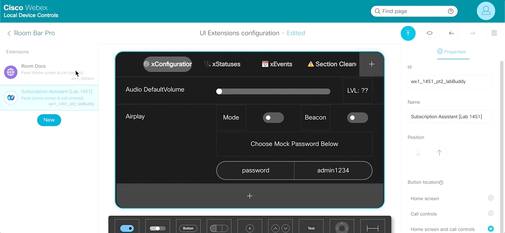

{{ config.cProps.devNotice }}
{{ config.cProps.acronyms }}

# Quick Docs Macro Exercise - Part 2 - Optimize ~(section\ {{config.cProps.rxp.sectionIds.exe.macros.quickDocs_pt2}})~

## Section {{config.cProps.rxp.sectionIds.exe.macros.quickDocs_pt1}} Requirements

!!! important ""

    !!! note inline end

        This lab assumes you have access to a Cisco RoomOS Device that is already setup and ready for use. If your device is not registered and online, please do so before beginning
    
    **Additional Lessons**
    
    - It's recommended you have run through Accessing RoomOS xAPI via Macros in Macros {{config.cProps.rxp.sectionIds.macro}} at a minimum before proceeding with this Exercise
    - Complete Quick Docs Part 1 ^{{config.cProps.rxp.sectionIds.exe.macros.quickDocs_pt1}}^ before proceeding

    **Hardware**

    - A Laptop
    - A Cisco Desk, Board or Room Series Device running the most recent On Premise or Cloud Stable software
        - A Touch Controller is required when working on a Room Series Device. Either Room navigator or 3rd part touch display
        - Preferred Device: Cisco Desk Pro
    - A minimum of 1 camera (Either Integrated or External)

    **Software**

    - Laptop
        - Recommended Browser: Chrome or Firefox
        - Recommended Terminal Software:
            - Command Prompt (Windows)
            - Terminal (MAC)
            - [Putty](https://apps.microsoft.com/detail/xpfnzksklbp7rj?hl=en-US&gl=US) (Windows)
            - [Termius](https://termius.com/) (Windows, MAC, Linux)
    - RoomOS Device
        - Either the current On Premise or Cloud Stable release

    **Network**

    - Local Access to the RoomOS Device over port 80/443
    - General access to the Internet

## Part 2 Solution Outline

!!! abstract ""

    !!! example "Note" 

        In Quick Docs Part 1 ^{{config.cProps.rxp.sectionIds.exe.macros.quickDocs_pt1}}^, we built a complete solution, but the information we wrote into the solution is hardcoded in the Macro. This means every time we want to make a change, we then have to update the macro on all X devices we manage.

        In Quick Docs Part 2 ^{{config.cProps.rxp.sectionIds.exe.macros.quickDocs_pt2}}^ of this lab, we'll expand our quick docs solution that enables use new ways to centralize and scale our solution across our device portfolio.

        This may be fine for a small number of rooms, but should you have a few hundred or thousand rooms, we'll want to leverage what we can simplify our workload

        We also may not want to allow this Macro to be edited by our content creators as they may be unfamiliar with the environment and could incur larger changes to the macro's operation. This could lead to additional support time for you but we don't want to have to be the sole curator of the content. To tackle this, we'll host an additional manifest file with Document references that we can share with our content creators and edit our macro on the fly based on that nee external resource.

        These 2 changes are great, but introduces a problem; we hard coded our UI too. Luckily, by making clever use of the Panel Save command, we can generate this UI as new information enters the Macro

    !!! abstract "Outline"

        In Quick Docs Part 2 ^{{config.cProps.rxp.sectionIds.exe.macros.quickDocs_pt2}}^ we'll:

        - Re-organize our macro to improve readability
        - Modify our Macro to fetch a new list of documents on the network
        - Maintain Backwards compatibility by allowing hard coded docs to continue to live on the device
          - Good for local super users, who may need special documents on a per room basis
        - Automate the UserInterface so we can spawn all new buttons based on this new information


## Implementing imports and exports ~({{config.cProps.rxp.sectionIds.exe.macros.quickDocs_pt2}}.1)~


???+ lesson "Lesson: Create another Macro ~({{config.cProps.rxp.sectionIds.exe.macros.quickDocs_pt2}}.1.1)~"

    - **Task**:

        - Select ==Create new macro== in the Macro Editor
        - Name this macro ==Room Docs Configuration==
        - {++Save++} and keep the ==Room Docs Configuration== Macro {++Inactive++}

    ??? gif "Review how to Create and Save a Macro"

        <figure markdown="span">
            { width="600" }
            <figcaption>Create, Save and Activate a Macro</figcaption>
        </figure>

??? lesson "Lesson: Establish a Config Object ~({{config.cProps.rxp.sectionIds.exe.macros.quickDocs_pt2}}.1.2)~"

    - **xAPI**: N/A

    - **Task**:

        - Select the ==Room Docs Configuration== Macro and perform the next few tasks in this Macro

        - Remove `import xapi from 'xapi';` from the ==Room Docs Configuration== Macro

        - Copy the `config` object outlined below and paste this into the ==Room Docs Configuration== Macro

        ``` { .javascript , title="Copy this `config` Object" }
        const config = {
          manifestVisibility: 'merge', // localOnly, remoteOnly, merge
          remoteSiteManifest: '',
          localSiteManifest: [
            {
              Name: 'Lab 1451',
              Url: 'https://webexcc-sa.github.io/LAB-1451/wx1_1451_part_3/',
              QrEnabled: false
            },
            {
              Name: 'Reimagine Workspaces',
              Url: 'https://www.webex.com/us/en/workspaces.html',
              QrEnabled: true
            }
          ]
        };

        console.log('Config:', config);
        ```

        - Once complete, ==Save==, and activate this macro

        - Look at the Macro Console, you should see the contents of the config object print to the console.

        ??? success "Compare your `Room Docs Configuration` Macro"

            ```javascript
            const config = {
              manifestVisibility: 'merge', // localOnly, remoteOnly, merge
              remoteSiteManifest: '',
              localSiteManifest: [
                {
                  Name: 'Lab 1451',
                  Url: '',
                  QrEnabled: false
                },
                {
                  Name: 'Reimagine Workspaces',
                  Url: '',
                  QrEnabled: true
                }
              ]
            };

            console.log('Config:', config);
            ```

??? lesson "Lesson: Export your Config Object ~({{config.cProps.rxp.sectionIds.exe.macros.quickDocs_pt2}}.1.3)~"

    Now that we've established a config in our new `Room Docs Configuration` macro, in order to make use of it in any other macros on the device, we'll need to export it

    - **Task**: 

        - Below the `console.log('Config:', config);` in the ==Room Docs Configuration== Macro add the following code

        ```javascript
        export { config };
        ```

        - Once complete, ==Save== your macro.

        - Look at the Macro Console, you should still see the contents of the config object print to the console.

        ??? success "Compare your `Room Docs Configuration` Macro"

            ```javascript
            const config = {
              manifestVisibility: 'merge', // localOnly, remoteOnly, merge
              remoteSiteManifest: '',
              localSiteManifest: [
                {
                  Name: 'Lab 1451',
                  Url: '',
                  QrEnabled: false
                },
                {
                  Name: 'Reimagine Workspaces',
                  Url: '',
                  QrEnabled: true
                }
              ]
            };

            console.log('Config:', config);

            export { config };
            ```

??? lesson "Lesson: Import your Config Object ~({{config.cProps.rxp.sectionIds.exe.macros.quickDocs_pt2}}.1.4)~"

    With the config object now being exported in your Macro Editor, it's now accessible to any other macro running on the device.

    - **xAPI**: N/A

    - **Task**:

        - Select the ==Room Docs== Macro and perform the next few tasks in this Macro

        - Below `import xapi from 'xapi';` add the following

        ```javascript
        import { config } from './Room Docs Configuration';
        ```

        - add a new line and add

        ```javascript
        console.log('Imported Config:', config);
        ```

        - Once complete, ==Save== and Activate the ==Room Docs== Macro (if inactive)

        - Monitor your log output
            - You should now see 2 instances of the config object print to the console
            - This illustrates how both macros are accessing the same object and can perform separate tasks using the same information
        - However, it's not necessary to have both macros running now. At this time, deactivate the ==Room Docs Configuration== macro

    ??? curious "Why deactivate the Room Docs Configuration Macro?"

        ??? danger inline end " 2mb of Storage?!?!?"
            Not to worry, 2mb may sound small, but this is the storage for the text contained within your macro, and you can store ALOT of tex in 2mb
            
            It will take you time to max this out, but should you it may be time for you to help us proctor this lab :smiley:

        The Macro Editor can only support 10 active macros at a time per device, however it can support any number of inactive macros so long as long as you haven't exceeded the 2mb of storage for Macro Code.

        So, by disabling the Room Docs Configuration macro, we free up an active macro slot for our device, and we'll still be able to access this information.

        Now, this doesn't mean you couldn't have a solution with 2 macros running and still use exporting/importing information. In our case, our Room Docs Configuration macro is only serving as a library of information and not executing any tasks for use, so best to leave off as to not waste an active macro slot.

    ??? success "Compare your `Room Docs` Macro"

        ```javascript
        import xapi from 'xapi';
        import { config } from './Room Docs Configuration'; // <-- Imports should always be on the top level

        console.log('Config:', config); // <-- Log the config object here

        async function openSite(url, target = 'OSD') {
          try {
            const openPage = await xapi.Command.UserInterface.WebView.Display({
              Url: url,
              Target: target
            })
            console.log(`Site Webview Opened for: [${url}]`, openPage);
          } catch (e) {
            const err = {
              Context: `Failed to open Site WebView to: [${url}]`,
              ...e
            };
            throw new Error(err);
          }
        }

        async function openQrCode(url, target = 'OSD') {
          const encodedUrl = encodeURI(url);
          const qrURL = `https://api.qrserver.com/v1/create-qr-code/?data=` + encodedUrl;
          try {
            const openPage = await xapi.Command.UserInterface.WebView.Display({
              Url: qrURL,
              Target: target
            })
            console.log(`QR Webview Opened for: [${url}]`, openPage, qrURL);
          } catch (e) {
            const err = {
              Context: `Failed to open QR WebView to: [${url}]`,
              QrUrl: qrURL,
              ...e
            };
            console.error(err);
          }
        }

        xapi.Event.UserInterface.Extensions.Widget.Action.on(({ WidgetId, Type, Value }) => {
          console.debug({ WidgetId, Type, Value });
          if (WidgetId.includes(`wx1_QrDocs`)) {
            if (Type == 'released') {
              const [app, action, url] = WidgetId.split(`~`);

              switch (action) {
                case 'OpenSite':
                  openSite(url);
                  break;
                case 'OpenQrCode':
                  openQrCode(url);
                  break;
                default:
                  console.error(`Unknown Action Fired: [${action}]`);
                  break;
              };
            };
          };
        });
        ```

    ??? success "Compare your Macro Console"

        | Time      | App       | Logs                                                                                          |
        |-----------|-----------|-----------------------------------------------------------------------------------------------|
        | HH:MM:SS  | Room Docs | QJS Ready                                                                                     |
        | HH:MM:SS  | Room Docs | Config: {"manifestVisibility":"localOnly","remoteSiteManifest":"","localSiteManifest":[{"Name":"Lab 1451","Url":"","QrEnabled":false},{"Name":"Reimagine Workspaces","Url":"","QrEnabled":true}]} |

- - -
- - -

## Automating the UserInterface ~({{config.cProps.rxp.sectionIds.exe.macros.quickDocs_pt2}}.2)~

!!! abstract 

    Now that we have a config object established and it's accessible in our Room Docs macro, we can iterate over this config object and build the UserInterface dynamically. We can use a combination of the Device xAPI and some string manipulation techniques available in ES6 JS to form a new XML payload which we can load in as soon as the script starts

???+ lesson "Lesson: Download our current UserInterface XML ~({{config.cProps.rxp.sectionIds.exe.macros.quickDocs_pt2}}.2.1)~"

    !!! example "Click on the Tabs Below to learn how to download the UI XML"

        === "Device Home"

            - Select the UI Extensions Editor on the Left-Hand Navigation Bar

            <figure markdown="span">
                { width="600" }
                <figcaption>Device Home Page</figcaption>
            </figure>

        === "UI Extensions Editor"

            - The Options to download the UI Extension Panel is in the Extensions ToolBar

            <figure markdown="span">
                { width="600" }
                <figcaption>UI Extensions Editor</figcaption>
            </figure>

        === "Download Options"

            - Select the Room Docs Panel
            - Select the Editor Menu ("Pancake" icon) in the Extensions Toolbar
            - Select ==Export current panel to file==

            <figure markdown="span">
                { width="600" }
                <figcaption>UI Extensions ToolBar Expanded</figcaption>
            </figure>

        === "Download Operation"

            - UI Extensions Downloads come with the name <hl_0>roomcontrolconfig&#160;-&#160;0000-00-00T00:00:00.000.xml</hl_0>
            - The Most Recent Timestamp is the one you just downloaded

            <figure markdown="span">
                { width="600" }
                <figcaption>UI Extensions Download Operation</figcaption>
            </figure>

    - **xAPI**: N/A

    - **Task**:

        - Open the <hl_0>roomcontrolconfig&#160;-&#160;0000-00-00T00:00:00.000.xml</hl_0> file
            - Use Notepad for Windows
            - Use TextEdit for MAC

        - Review the contents of your UI Extension's XML
        - We'll be taking parts of this XML in the next lesson, and re-structuring it based on our `config` object

??? lesson "Lesson: Add a `buildUI()` function to the ==Room Docs== Macro  ~({{config.cProps.rxp.sectionIds.exe.macros.quickDocs_pt2}}.2.2)~"

    - **xAPI**: xCommand UserInterface Extensions Panel Save

    - **Task**:

        - Declare a new async function called ==buildUI== without function parameters

        - Within this function:

            - Declare a `rows` object with a value of `''` (Yes, no value assigned)
            - Use ES6 JS's ==forEach== prototype to loop through `config.localSiteManifest` Array
                ```javascript
                let rows = '';

                config.localSiteManifest.forEach(site => {
                  console.log(`Appending [${site.Name}] Site to UI`);
                  rows = rows + `<Row>
                                  <Name>${site.Name}</Name>
                                  <Widget>
                                    <WidgetId>wx1_QrDocs~OpenSite~${site.Url}</WidgetId>
                                    <Name>Open Site</Name>
                                    <Type>Button</Type>
                                    <Options>size=${site.QrEnabled ? 2 : 4}</Options>
                                  </Widget>
                                  ${site.QrEnabled ? `<Widget>
                                    <WidgetId>wx1_QrDocs~OpenQrCode~${site.Url}</WidgetId>
                                    <Name>Open QrCode 🔳</Name>
                                    <Type>Button</Type>
                                    <Options>size=2</Options>
                                  </Widget>`: ''}
                                </Row>`
                })
                ```

            ??? curious "Ok, what's going above???"

                It's alot to unpack, I know, but it's just too cool to NOT show you :nerd_face:

                In the <hl_0>roomcontrolconfig&#160;-&#160;0000-00-00T00:00:00.000.xml</hl_0> file we found one of our rows of sites we built out in the UI Extensions Editor

                We took a Row, which is surrounded by <hl_7>`<Row>[More Row Content]</Row>`</hl_7> XML tags that matched our Site information

                We then declared a new <hl_6>rows</hl_6> object and looped through it using the `forEach()` ES6 JS prototype

                In this loop, we accessed the properties of each site, that was configured in the <hl_4>config</hl_4> object under the <hl_4>localSiteManifest</hl_4> Array and as the for the `forEach()` prototype did cycled through each new doc, we took the Name and URL values and injected them into the correct locations within the XML structure. 
                
                We do this by referencing the <hl_4>config</hl_4> and making use of ES6 JS's Template Literal feature to place the data as well as leveraging ES6 JS's Conditional Operator to check if the QrEnabled value is set to true

                Each time the `forEach()` prototype loops, it takes the <hl_6>rows</hl_6> object and concatenates another row of information and will do so for each site defined in the <hl_4>localSiteManifest</hl_4> Array

                <div style="display: flex; gap: 10px;">
                    <a class="md-button md-button--primary" href="https://developer.mozilla.org/en-US/docs/Web/JavaScript/Reference/Global_Objects/Array/forEach" target="_blank" >
                      Learn more about the `.forEach()` prototype <i class="fa-solid fa-square-up-right"></i>
                    </a>
                    <a class="md-button md-button--primary" href="https://developer.mozilla.org/en-US/docs/Web/JavaScript/Reference/Global_Objects/Array" target="_blank" >
                      Learn more about `Arrays` <i class="fa-solid fa-square-up-right"></i>
                    </a>
                    <a class="md-button md-button--primary" href="https://developer.mozilla.org/en-US/docs/Web/JavaScript/Reference/Template_literals" target="_blank" >
                      Learn more about `Template Literals` <i class="fa-solid fa-square-up-right"></i>
                    </a>
                    <a class="md-button md-button--primary" href="https://developer.mozilla.org/en-US/docs/Web/JavaScript/Reference/Operators/Conditional_operator" target="_blank" >
                      Learn more about `Conditional Operators` <i class="fa-solid fa-square-up-right"></i>
                    </a>
                    <a class="md-button md-button--primary" href="https://developer.mozilla.org/en-US/docs/Web/JavaScript/Reference/Operators/Addition" target="_blank" >
                      Learn more about `Concatenation` using the `+` operator <i class="fa-solid fa-square-up-right"></i>
                    </a>
                </div>

            - In your <hl_0>roomcontrolconfig&#160;-&#160;0000-00-00T00:00:00.000.xml</hl_0> make the following changes

            !!! example ""

                === "Remove Version Tag and Content"

                    - This allows the Codec to assign an XML version and avoid conflicts

                    ```xml title="Remove ME"
                    <Version>1.11</Version> 
                    ```

                === "Remove PanelId"

                    - The PanelId is provided as apart of the Panel Save command, so having a mismatch could be problematic
                    - Removing this tag prevents the chance of a mismatch and allows the Codec to assign the PanelId based on the command execution

                    ```xml title="Remove ME"
                    <PanelId>wx1_QrDocs</PanelId>
                    ```

                === "Replace All Site Rows"

                    - replace All site rows with `${rows}`, which is out object where we instantiated our new row information based on our `config` object

                    ```xml title="Replace ME with ${rows}"
                    <Row>
                      <Name>Lab 1451</Name>
                      <Widget>
                        <WidgetId>wx1_QrDocs~OpenSite~https://webexcc-sa.github.io/LAB-1451/wx1_1451_part_3/</WidgetId>
                        <Name>Open Site</Name>
                        <Type>Button</Type>
                        <Options>size=2</Options>
                      </Widget>
                      <Widget>
                        <WidgetId>wx1_QrDocs~OpenQrCode~https://webexcc-sa.github.io/LAB-1451/wx1_1451_part_3/</WidgetId>
                        <Name>Open QrCode 🔳</Name>
                        <Type>Button</Type>
                        <Options>size=2</Options>
                      </Widget>
                    </Row>
                    <Row>
                      <Name>Reimagine Workspaces</Name>
                      <Widget>
                        <WidgetId>wx1_QrDocs~OpenSite~https://www.webex.com/us/en/workspaces.html</WidgetId>
                        <Name>Open Site</Name>
                        <Type>Button</Type>
                        <Options>size=2</Options>
                      </Widget>
                      <Widget>
                        <WidgetId>wx1_QrDocs~OpenQrCode~https://www.webex.com/us/en/workspaces.html</WidgetId>
                        <Name>Open QrCode 🔳</Name>
                        <Type>Button</Type>
                        <Options>size=2</Options>
                      </Widget>
                    </Row>
                    ```
                
                === "View Fully Edited XML"

                    ```xml title="Should look something like..."
                    <Extensions>
                      <Panel>
                        <Order>1</Order>
                        <Origin>local</Origin>
                        <Location>HomeScreenAndCallControls</Location>
                        <Icon>Language</Icon>
                        <Color>#875AE0</Color>
                        <Name>Room Docs</Name>
                        <ActivityType>Custom</ActivityType>
                        <Page>
                          <Name>Room Docs</Name>
                          ${rows}
                          <PageId>wx1_QrDocs~RoomDocs</PageId>
                          <Options/>
                        </Page>
                      </Panel>
                    </Extensions>
                    ```
            
            - Declare a new object called `xml` and assign it the value of your edited xml

            - Structure the xAPI reference above using Macro Syntax with the following parameters and values
                - PanelId: wx1_QrDocs
                - body: `xml`
            
            - Place this xAPI call in a `try...catch` block and handle it's response and error appropriately

            - Then run this function after it has been defined

            - Once complete, ==Save== and Activate the ==Room Docs== Macro (if inactive)

    ??? Success "View `buildUI()` function"

          ```javascript
          async function buildUI() {
            let rows = '';

            config.localSiteManifest.forEach(site => {
              console.log(`Appending [${site.Name}] Site to UI`);
              rows = rows + `<Row>
                              <Name>${site.Name}</Name>
                              <Widget>
                                <WidgetId>wx1_QrDocs~OpenSite~${site.Url}</WidgetId>
                                <Name>Open Site</Name>
                                <Type>Button</Type>
                                <Options>size=${site.QrEnabled ? 2 : 4}</Options>
                              </Widget>
                              ${site.QrEnabled ? `<Widget>
                                <WidgetId>wx1_QrDocs~OpenQrCode~${site.Url}</WidgetId>
                                <Name>Open QrCode 🔳</Name>
                                <Type>Button</Type>
                                <Options>size=2</Options>
                              </Widget>`: ''}
                            </Row>`;
            });

            const xml = `<Extensions>
                          <Panel>
                            <Order>1</Order>
                            <Origin>local</Origin>
                            <Location>HomeScreenAndCallControls</Location>
                            <Icon>Language</Icon>
                            <Color>#875AE0</Color>
                            <Name>Room Docs</Name>
                            <ActivityType>Custom</ActivityType>
                            <Page>
                              <Name>Room Docs</Name>
                              ${rows}
                              <PageId>wx1_QrDocs~RoomDocs</PageId>
                              <Options/>
                            </Page>
                          </Panel>
                        </Extensions>`;

            try {
              const build = await xapi.Command.UserInterface.Extensions.Panel.Save({
                PanelId: 'wx1_QrDocs'
              }, xml);
              console.log('UserInterface Built!', build);
            } catch (e) {
              const err = {
                Context: `Failed to Build UserInterface`,
                ...e
              };
              console.error(err);
            };
          };
          ```

    ??? Success "Compare your `Room Docs` Macro"

        ```javascript
        import xapi from 'xapi';
        import { config } from './Room Docs Configuration';

        console.log('Config:', config);

        async function openSite(url, target = 'OSD') {
          try {
            const openPage = await xapi.Command.UserInterface.WebView.Display({
              Url: url,
              Target: target
            })
            console.log(`Site Webview Opened for: [${url}]`, openPage);
          } catch (e) {
            const err = {
              Context: `Failed to open Site WebView to: [${url}]`,
              ...e
            };
            throw new Error(err);
          }
        }

        async function openQrCode(url, target = 'OSD') {
          const encodedUrl = encodeURI(url);
          const qrURL = `https://api.qrserver.com/v1/create-qr-code/?data=` + encodedUrl;
          try {
            const openPage = await xapi.Command.UserInterface.WebView.Display({
              Url: qrURL,
              Target: target
            })
            console.log(`QR Webview Opened for: [${url}]`, openPage, qrURL);
          } catch (e) {
            const err = {
              Context: `Failed to open QR WebView to: [${url}]`,
              QrUrl: qrURL,
              ...e
            };
            console.error(err);
          }
        }

        async function buildUI() { // <-- Declare and Define your buildUI() function
          let rows = '';  // <-- declare your rows object

          config.localSiteManifest.forEach(site => { // <-- use forEach() to loop through the localSiteManifest Array
            console.log(`Appending [${site.Name}] Site to UI`);

            // Re-assign the value of rows with the current value of rows, plus the XML for a new row
            //  passing in the data for each item listed in the localSiteManifest Array
            rows = rows + `<Row> 
                            <Name>${site.Name}</Name>
                            <Widget>
                              <WidgetId>wx1_QrDocs~OpenSite~${site.Url}</WidgetId>
                              <Name>Open Site</Name>
                              <Type>Button</Type>
                              <Options>size=${site.QrEnabled ? 2 : 4}</Options>
                            </Widget>
                            ${site.QrEnabled ? `<Widget>
                              <WidgetId>wx1_QrDocs~OpenQrCode~${site.Url}</WidgetId>
                              <Name>Open QrCode 🔳</Name>
                              <Type>Button</Type>
                              <Options>size=2</Options>
                            </Widget>`: ''}
                          </Row>`;
          });

          // Declare and assign the rest of the XML for your panel, and pass in the rows data
          const xml = `<Extensions>
                        <Panel>
                          <Order>1</Order>
                          <Origin>local</Origin>
                          <Location>HomeScreenAndCallControls</Location>
                          <Icon>Language</Icon>
                          <Color>#875AE0</Color>
                          <Name>Room Docs</Name>
                          <ActivityType>Custom</ActivityType>
                          <Page>
                            <Name>Room Docs</Name>
                            ${rows /* Contains all the rows from the forEach() loop*/}
                            <PageId>wx1_QrDocs~RoomDocs</PageId>
                            <Options/>
                          </Page>
                        </Panel>
                      </Extensions>`;

          try {
            const build = await xapi.Command.UserInterface.Extensions.Panel.Save({ // structure xCommand UserInterface Extensions Panel Save
              PanelId: 'wx1_QrDocs'
            }, xml);
            console.log('UserInterface Built!', build); // Log it's repsonse
          } catch (e) {
            const err = {
              Context: `Failed to Build UserInterface`,
              ...e
            };
            console.error(err); // Catch and log it's error
          };
        };

        buildUI();  //<-- Run the buildUI() function at the top level of your Macro

        xapi.Event.UserInterface.Extensions.Widget.Action.on(({ WidgetId, Type, Value }) => {
          console.debug({ WidgetId, Type, Value });
          if (WidgetId.includes(`wx1_QrDocs`)) {
            if (Type == 'released') {
              const [app, action, url] = WidgetId.split(`~`);

              switch (action) {
                case 'OpenSite':
                  openSite(url);
                  break;
                case 'OpenQrCode':
                  openQrCode(url);
                  break;
                default:
                  console.error(`Unknown Action Fired: [${action}]`);
                  break;
              };
            };
          };
        });
        ```
        
    ??? Success "Compare your Macro Console"
        <!-- // EDIT MANIFEST URL HERE -->

        | Time      | App       | Logs                                                                                                         |
        |-----------|-----------|--------------------------------------------------------------------------------------------------------------|
        | HH:MM:SS  | Room Docs | QJS Ready                                                                                                   |
        | HH:MM:SS  | Room Docs | Config: {"manifestVisibility":"localOnly","remoteSiteManifest":"","localSiteManifest":[{"Name":"Lab 1451","Url":"https://webexcc-sa.github.io/LAB-1451/wx1_1451_part_3/","QrEnabled":true},{"Name":"Reimagine Workspaces","Url":"https://www.webex.com/us/en/workspaces.html","QrEnabled":true},{"Name":"Cisco","Url":"https://www.cisco.com","QrEnabled":true}]} |
        | HH:MM:SS  | Room Docs | Appending [Lab 1451] Site to UI                                                                             |
        | HH:MM:SS  | Room Docs | Appending [Reimagine Workspaces] Site to UI                                                                 |
        | HH:MM:SS  | Room Docs | Appending [Cisco] Site to UI                                                                                 |
        | HH:MM:SS  | Room Docs | UserInterface Built! {"status":"OK"}                                                                        |
        | HH:MM:SS  | Room Docs | Site Webview Opened for: [https://webexcc-sa.github.io/LAB-1451/wx1_1451_part_3/] {"status":"OK"}       |
        | HH:MM:SS  | Room Docs | QR Webview Opened for: [https://webexcc-sa.github.io/LAB-1451/wx1_1451_part_3/] {"status":"OK"} https://api.qrserver.com/v1/create-qr-code/?data=https://webexcc-sa.github.io/LAB-1451/wx1_1451_part_3/ |
        | HH:MM:SS  | Room Docs | Site Webview Opened for: [https://www.webex.com/us/en/workspaces.html] {"status":"OK"}                    |
        | HH:MM:SS  | Room Docs | QR Webview Opened for: [https://www.webex.com/us/en/workspaces.html] {"status":"OK"} https://api.qrserver.com/v1/create-qr-code/?data=https://www.webex.com/us/en/workspaces.html |

??? lesson "Lesson: Add a new Site to the Config ~({{config.cProps.rxp.sectionIds.exe.macros.quickDocs_pt2}}.2.3)~"

    !!! Note

        To check our work, let's expand our `localSiteManifest` to include 2 new sites

    
    - **xAPI**: N/A

    - **Task**: 

        - Select the ==Room Docs Configuration== Macro and perform the next few tasks in this Macro
        - Under the `localSiteManifest` Array add the following 2 sites and additional Properties following the same JSON format as the other sites
            - Site 1
                - Name: Cisco
                - Url: https://www.cisco.com
                - QrEnabled: false
            - Set 2 [Add Your Organizations Home Page]
                - Name: Your Org Name
                - Url: Your Org Site
                - QrEnabled: true

        - Once complete, ==Save== and Activate the ==Room Docs== Macro (if inactive)

        - Start pressing the ==Open Site== and ==Open QrCode 🔳== buttons contained within your `Room Docs` panel
        - Monitor the Device OSD and Macro Console Output

    ??? success "Compare your `Room Docs` Panel UI"

        <figure markdown="span">
            { width="600" }
            <figcaption>Local Panel UI</figcaption>
        </figure>

    ??? success "Compare your ==Room Docs Configuration== Macro"

        ```javascript
        // EDIT MANIFEST URL HERE
        const config = {
          manifestVisibility: 'merge', // localOnly, remoteOnly, merge
          remoteSiteManifest: 'https://raw.githubusercontent.com/WebexCC-SA/LAB-1451/refs/heads/main/docs/assets/downloadable_resources/3-4-3_remoteManifest.json',
          localSiteManifest: [
            {
              Name: 'Lab 1451',
              Url: 'https://webexcc-sa.github.io/LAB-1451/wx1_1451_part_3/',
              QrEnabled: true
            },
            {
              Name: 'Reimagine Workspaces',
              Url: 'https://www.webex.com/us/en/workspaces.html',
              QrEnabled: true
            },
            {
              Name: 'Cisco',                // <-- Cisco Homepage Added
              Url: 'https://www.cisco.com',
              QrEnabled: true
            },
            // Your Org Details Below Here
          ]
        };

        export { config };
        ```

## Centralize your Document List ~({{config.cProps.rxp.sectionIds.exe.macros.quickDocs_pt2}}.3)~

!!! abstract

    Now that we have an interface that can build itself with small changes to a config file, let's make this a bit easier for our content creators and ourselves to manage

    We can do this by leveraging the Codec's HTTPClient xAPIs to reach out to a single endpoint over HTTP that's hosting all of our document references and pull it down into the Codec before running the buildUI() function

    !!! note

        This lab is hosting a file called `QuickDocs_remoteManifest.json` on GitHub which contains 6 additional sites pre-configured in the same format as the local sites configured on the endpoint

        <a class="md-button md-button--primary" href="https://github.com/WebexCC-SA/LAB-1451/blob/main/docs/assets/downloadable_resources/3-4-3_remoteManifest.json" target="_blank" >
          Review the Remote Manifest File <i class="fa-solid fa-square-up-right"></i>
        </a>

???+ lesson "Lesson: Add a Remote Site URL to your `config` object ~({{config.cProps.rxp.sectionIds.exe.macros.quickDocs_pt2}}.3.1)~"

    - **xAPI**: N/A

    - Task:

        - Select the ==Room Docs Configuration== macro
        - Edit the `remoteSiteManifest` object and assign the following url as a string
            <!-- // EDIT MANIFEST URL HERE -->
            - https://raw.githubusercontent.com/WebexCC-SA/LAB-1451/refs/heads/main/docs/assets/downloadable_resources/3-4-3_remoteManifest.json
        - Once complete, ==Save==, keep this macro Inactive
        
    ??? "Compare your ==Room Docs Configuration== Macro"

        ``` javascript
        // EDIT MANIFEST URL HERE
        const config = {
          manifestVisibility: 'merge', // localOnly, remoteOnly, merge
          remoteSiteManifest: 'https://raw.githubusercontent.com/WebexCC-SA/LAB-1451/refs/heads/main/docs/assets/downloadable_resources/3-4-3_remoteManifest.json',
          localSiteManifest: [
            {
              Name: 'Lab 1451',
              Url: 'https://webexcc-sa.github.io/LAB-1451/wx1_1451_part_3/',
              QrEnabled: true
            },
            {
              Name: 'Reimagine Workspaces',
              Url: 'https://www.webex.com/us/en/workspaces.html',
              QrEnabled: true
            },
            {
              Name: 'Cisco',
              Url: 'https://www.cisco.com',
              QrEnabled: true
            }
          ]
        };

        export { config };
        ```

??? lesson "Lesson: Declare a `getRemoteSiteManifest()` function ~({{config.cProps.rxp.sectionIds.exe.macros.quickDocs_pt2}}.3.2)~"

    !!! Note

        Here, we'll be making an HTTP Get request using the HTTPClient xAPI stack to reach out and pull information from a site external to the codec

        ??? important "Always Keep Security Top of Mind!"
            It's easy to fall outside your organization's security policy especially when building new solutions.
            Make sure you work with your, or your Customer's, Information Security teams before implementing a new solution that requires Integration Authentication of any kind or reaches out on the internet.
            The security implications of a solution can force you building your solution using a different integration method, or even stop a project all together.
            <div style="display: flex; gap: 10px;">
                <a class="md-button md-button--primary" href="https://www.cisco.com/c/en/us/td/docs/voice_ip_comm/uc_system/design/guides/wx_security.html" target="_blank" >
                  Checkout Webex's <i class="fa-solid fa-shield" style="color: #ff3a65;"></i> Security Technical References <i class="fa-solid fa-square-up-right"></i>
                </a>
            </div>
      
    
    - **xAPI**: xCommand HTTPClient Get

    - **Task**:

        - Select the ==Room Docs== macro

        - Declare a new async function called ==getRemoteSiteManifest== with no parameters

        - Within this function:

            - Declare a `request` object with a value of `''` (Yes, no value assigned)
            - Declare a `remoteData` object with a value of `[]` (Yes, no value assigned)            
            - Within a `try...catch` block, structure the xAPI path above in Macro Syntax with the following parameters and assign this to the `request` object
            - Use the ==JSON.parse()== method on the `request.Body` (the response captured in the `request` object) and assign this to the `remoteData` object
                - ==JSON.parse()== allows us to later handler the data from the external site as if it were a JSON object, not a string
            - Use console.debug to log the `remoteData` object
            - Return the `remoteData` object
            - Catch and log any errors

            !!! example "Click the Tabs below to see each step outlined above"

                === "Declare Function and Objects"

                    ```javascript
                    async function getRemoteSiteManifest() {
                      let request = ''; // <-- Declare request object
                      let remoteData = []; // <-- Declare remoteData object

                    }
                    ```

                === "Assign Request with xAPI"

                    ```javascript
                    async function getRemoteSiteManifest() {
                      let request = '';
                      let remoteData = [];

                      try { // <-- Setup try...catch block
                        request = await xapi.Command.HttpClient.Get({ // <-- Assign xCommand HTTPClient Get
                          Url: config.remoteSiteManifest // <-- Assign remoteManifest URL from the config
                        })

                      } catch (e) {

                      }
                    }
                    ```

                === "Parse Response and Return"

                    ```javascript
                    async function getRemoteSiteManifest() {
                      let request = '';
                      let remoteData = [];

                      try {
                        request = await xapi.Command.HttpClient.Get({
                          Url: config.remoteSiteManifest
                        })
                        remoteData = JSON.parse(request.Body); // <-- Use JSON.parse to process the request.Body
                        console.debug(`Remote Site Manifest Found`, remoteData); // <-- log the response to the debug console
                        return remoteData // <-- return the remote site data
                      } catch (e) {
                        
                      }
                    }
                    ```

                === "Catch and Log Errors (Full Func)"

                    ```javascript
                    async function getRemoteSiteManifest() {
                      let request = '';
                      let remoteData = [];

                      try {
                        request = await xapi.Command.HttpClient.Get({
                          Url: config.remoteSiteManifest
                        })
                        remoteData = JSON.parse(request.Body);
                        console.debug(`Remote Site Manifest Found`, remoteData);
                        return remoteData
                      } catch (e) { // <-- Handle the possible Error
                        const err = {
                          Context: 'Failed to Get remote site manifest', // <-- Leave yourself clues to troubleshoot
                          ...e
                        }
                        console.error(err); // <-- Log the error
                      }
                    }
                    ```

            - Once complete, ==Save== and Activate the ==Room Docs== Macro (if inactive)
                
??? lesson "Lesson: Integrate the `getRemoteSiteManifest()` function into the `buildUI()` function ~({{config.cProps.rxp.sectionIds.exe.macros.quickDocs_pt2}}.3.3)~"

    - **xAPI(s)**:

        - xCommand HTTPClient Get
        - xCommand UserInterface Extensions Panel Save

    - **Task**:

        - Select the ==Room Docs== macro
        - Edit the `buildUI()` function
            - Below the `let rows` declaration and above the `config.localSiteManifest.forEach(...)` loop, start a `switch` statement
            - We'll switch based on the `config` object's ==manifestVisibility== value. This can be 1 of 3 values and should apply the following behaviors
                - localOnly: The UI will only build sites that are found locally in the Codec's ==Room Docs Configuration== macro
                - remoteOnly: The UI will only build sites that are configured in our ==remoteSiteManifest== Url
                - merge: The UI will combine local and remote sites into the UI
                - if the ==remoteSiteManifest== Url is missing, you should ignore these values

            !!! blank "Copy the Switch Statement below into your buildUI() function"
            
                ```javascript
                switch (config.manifestVisibility) {
                  case 'remoteOnly':
                    if (config.remoteSiteManifest != '' && config.remoteSiteManifest != undefined) { // <-- Check to see if the ==remoteSiteManifest== Url is configured
                      config.localSiteManifest = await getRemoteSiteManifest(); // <-- overwrite configured localSiteManifest with the remoteSiteManifest
                    }
                    break;
                  case 'merge':
                    if (config.remoteSiteManifest != '' && config.remoteSiteManifest != undefined) { // <-- Check to see if the ==remoteSiteManifest== Url is configured
                      config.localSiteManifest = [...config.localSiteManifest, ...await getRemoteSiteManifest()] // <-- overwrite configured localSiteManifest with a new Array, using both the current localSiteManifest and the remoteSiteManifest
                    }
                    break;
                  case 'localOnly':
                    // No Action Required
                    break;
                  default:
                    console.warn(`Unknown manifestVisibility assignment: [${config.manifestVisibility}]`) // <-- Log unknown manifestVisibility values to the console
                    break;
                }
                ```

        - Once complete, ==Save== and Activate the ==Room Docs== Macro (if inactive)
        - Start pressing the ==Open Site== and ==Open QrCode 🔳== buttons contained within your `Room Docs` panel
        - Monitor the Macro Console Output


    ??? success "Compare your `Room Docs` Panel UI"

        - Remote Sites are marked with a `🔗` emoji for clarity

        <figure markdown="span">
            { width="600" }
            <figcaption>Remote and Local Panel UI</figcaption>
        </figure>


    ??? success "Compare your `Room Docs` Macro"

        ``` javascript
        import xapi from 'xapi';
        import { config } from './Room Docs Configuration';

        console.log('Config:', config);

        async function openSite(url, target = 'OSD') {
          try {
            const openPage = await xapi.Command.UserInterface.WebView.Display({
              Url: url,
              Target: target
            })
            console.log(`Site Webview Opened for: [${url}]`, openPage);
          } catch (e) {
            const err = {
              Context: `Failed to open Site WebView to: [${url}]`,
              ...e
            };
            throw new Error(err);
          }
        }

        async function openQrCode(url, target = 'OSD') {
          const encodedUrl = encodeURI(url);
          const qrURL = `https://api.qrserver.com/v1/create-qr-code/?data=` + encodedUrl;
          try {
            const openPage = await xapi.Command.UserInterface.WebView.Display({
              Url: qrURL,
              Target: target
            })
            console.log(`QR Webview Opened for: [${url}]`, openPage, qrURL);
          } catch (e) {
            const err = {
              Context: `Failed to open QR WebView to: [${url}]`,
              QrUrl: qrURL,
              ...e
            };
            console.error(err);
          }
        }

        async function getRemoteSiteManifest() {
          let request = '';
          let remoteData = [];

          try {
            request = await xapi.Command.HttpClient.Get({
              Url: config.remoteSiteManifest
            })
            remoteData = JSON.parse(request.Body);
            console.debug(`Remote Site Manifest Found`, remoteData);
            return remoteData
          } catch (e) {
            const err = {
              Context: 'Failed to Get remote site manifest',
              ...e
            }
            console.error(err);
          }
        }

        async function buildUI() {
          let rows = '';

          switch (config.manifestVisibility) {
            case 'remoteOnly':
              if (config.remoteSiteManifest != '' && config.remoteSiteManifest != undefined) {
                config.localSiteManifest = await getRemoteSiteManifest();
              }
              break;
            case 'merge':
              if (config.remoteSiteManifest != '' && config.remoteSiteManifest != undefined) {
                config.localSiteManifest = [...config.localSiteManifest, ...await getRemoteSiteManifest()]
              }
              break;
            case 'localOnly':
              // No Action Required
              break;
            default:
              console.warn(`Unknown manifestVisibility assignment: [${config.manifestVisibility}]`)
              break;
          }

          config.localSiteManifest.forEach(site => {
            console.log(`Appending [${site.Name}] Site to UI`);

            rows = rows + `<Row> 
                            <Name>${site.Name}</Name>
                            <Widget>
                              <WidgetId>wx1_QrDocs~OpenSite~${site.Url}</WidgetId>
                              <Name>Open Site</Name>
                              <Type>Button</Type>
                              <Options>size=${site.QrEnabled ? 2 : 4}</Options>
                            </Widget>
                            ${site.QrEnabled ? `<Widget>
                              <WidgetId>wx1_QrDocs~OpenQrCode~${site.Url}</WidgetId>
                              <Name>Open QrCode 🔳</Name>
                              <Type>Button</Type>
                              <Options>size=2</Options>
                            </Widget>`: ''}
                          </Row>`;
          });

          const xml = `<Extensions>
                        <Panel>
                          <Order>1</Order>
                          <Origin>local</Origin>
                          <Location>HomeScreenAndCallControls</Location>
                          <Icon>Language</Icon>
                          <Color>#875AE0</Color>
                          <Name>Room Docs</Name>
                          <ActivityType>Custom</ActivityType>
                          <Page>
                            <Name>Room Docs</Name>
                            ${rows}
                            <PageId>wx1_QrDocs~RoomDocs</PageId>
                            <Options/>
                          </Page>
                        </Panel>
                      </Extensions>`;

          try {
            const build = await xapi.Command.UserInterface.Extensions.Panel.Save({
              PanelId: 'wx1_QrDocs'
            }, xml);
            console.log('UserInterface Built!', build);
          } catch (e) {
            const err = {
              Context: `Failed to Build UserInterface`,
              ...e
            };
            console.error(err);
          };
        };

        buildUI();

        xapi.Event.UserInterface.Extensions.Widget.Action.on(({ WidgetId, Type, Value }) => {
          console.debug({ WidgetId, Type, Value });
          if (WidgetId.includes(`wx1_QrDocs`)) {
            if (Type == 'released') {
              const [app, action, url] = WidgetId.split(`~`);

              switch (action) {
                case 'OpenSite':
                  openSite(url);
                  break;
                case 'OpenQrCode':
                  openQrCode(url);
                  break;
                default:
                  console.error(`Unknown Action Fired: [${action}]`);
                  break;
              };
            };
          };
        });
        ```

    ??? success "Compare your Macro Console"
        <!-- // EDIT MANIFEST URL HERE -->
        | Time       | Macro      | Log                                                                                                                                                        |
        |------------|------------|------------------------------------------------------------------------------------------------------------------------------------------------------------|
        | 23:50:16   | Room Docs  | QJS Ready                                                                                                                                                  |
        | 23:50:16   | Room Docs  | Config: {"manifestVisibility":"merge","remoteSiteManifest":"https://raw.githubusercontent.com/WebexCC-SA/LAB-1451/refs/heads/main/docs/assets/downloadable_resources/3-4-3_remoteManifest.json","localSiteManifest":[{"Name":"Lab 1451","Url":"https://webexcc-sa.github.io/LAB-1451/wx1_1451_part_3/","QrEnabled":true},{"Name":"Reimagine Workspaces","Url":"https://www.webex.com/us/en/workspaces.html","QrEnabled":true},{"Name":"Cisco","Url":"https://www.cisco.com","QrEnabled":true}]} |
        | 23:50:16   | Room Docs  | Appending [Lab 1451] Site to UI                                                                                                                          |
        | 23:50:16   | Room Docs  | Appending [Reimagine Workspaces] Site to UI                                                                                                              |
        | 23:50:16   | Room Docs  | Appending [Cisco] Site to UI                                                                                                                              |
        | 23:50:16   | Room Docs  | Appending [Room Kit EQX 🔗] Site to UI                                                                                                                  |
        | 23:50:16   | Room Docs  | Appending [WebexOne 🔗] Site to UI                                                                                                                        |
        | 23:50:16   | Room Docs  | Appending [RoomOS xAPI References 🔗] Site to UI                                                                                                          |
        | 23:50:16   | Room Docs  | Appending [Crossview Room Pre Guidelines 🔗] Site to UI                                                                                                   |
        | 23:50:16   | Room Docs  | Appending [Using Extra LoudSpeakers 🔗] Site to UI                                                                                                        |
        | 23:50:16   | Room Docs  | Appending [Webex AI Codec 🔗] Site to UI                                                                                                                  |
        | 23:50:16   | Room Docs  | UserInterface Built! {"status":"OK"}                                                                                                                     |
        | 23:50:31   | Room Docs  | Site Webview Opened for: [https://webexcc-sa.github.io/LAB-1451/wx1_1451_part_3/] {"status":"OK"}                                                    |
        | 23:50:50   | Room Docs  | QR Webview Opened for: [https://www.cisco.com] {"status":"OK"} https://api.qrserver.com/v1/create-qr-code/?data=https://www.cisco.com                 |
        | 23:50:54   | Room Docs  | Site Webview Opened for: [https://roomos.cisco.com/xapi] {"status":"OK"}                                                                                |
        | 23:51:02   | Room Docs  | QR Webview Opened for: [https://www.cisco.com/c/dam/en/us/td/docs/telepresence/endpoint/ce97/extra-loudspeakers-local-reinforcement-guide-ce97.pdf] {"status":"OK"} https://api.qrserver.com/v1/create-qr-code/?data=https://www.cisco.com/c/dam/en/us/td/docs/telepresence/endpoint/ce97/extra-loudspeakers-local-reinforcement-guide-ce97.pdf |
        | 23:51:04   | Room Docs  | Site Webview Opened for: [https://blog.webex.com/collaboration/hybrid-work/next-level-audio-with-webex-ai-codec/] {"status":"OK"}                     |

??? lesson "Lesson: Refresh you UI More Frequently ~({{config.cProps.rxp.sectionIds.exe.macros.quickDocs_pt2}}.3.3)~"

    !!! note ""

        With the external manifest file now being fetched and integrated into our UserInterface, we've introduced a new problem. Now we have a hard coded manifest, which will always refresh when we save over the Room Docs Configuration macro, but will only update the external manifest when the Macro Runtime Restarts

        The Macro Runtime is what processes and executes the code we provide. It's what makes all of this come to life and it only restarts when

        - The RoomOS Device Restarts
        - The Runtime is restarted or activated via the RoomOS xAPI
        - Or by toggling Macros either on the Device Web UI or through Control Hub

        Where as this can happen less frequently, we'll need to add in some logic to request that manifest more frequently.

        For our case, subscribing to the Panel Clicked event and re-running our `buildUI()` function should do fine.

    - **xAPI**: xEvent UserInterface Extensions Panel Clicked

    - **Task**:

        - Subscribe the xAPI Path above using Macro Syntax

        - Take the Callback information generated by this event, and log it to the Macro Console using `console.log()`

        - Use and `if` statement to listen for when our PanelId <hl_5>wx1_QrDocs</hl_5>

          - When this resolves <hl_0>true</hl_0>, re-run the `buildUI()` function
          - Else, do nothing

        - Once complete, ==Save== and Activate the macro (if inactive)

        - Press the Room Docs and Monitor the Macro Console Output. You should see the same output as in Lesson {{config.cProps.rxp.sectionIds.exe.macros.quickDocs_pt2}}.3.2

    ??? Success "View a successful Panel Clicked Subscription"

        ```javascript
        xapi.Event.UserInterface.Extensions.Panel.Clicked.on(({ PanelId}) => {
          console.log({ PanelId});
          if (PanelId == 'wx1_QrDocs') {
            buildUI();
          };
        });
        ```

    ??? success "Compare your Macro"

        ??? success "Compare your `Room Docs` Macro"

        ``` javascript
        import xapi from 'xapi';
        import { config } from './Room Docs Configuration';

        console.log('Config:', config);

        async function openSite(url, target = 'OSD') {
          try {
            const openPage = await xapi.Command.UserInterface.WebView.Display({
              Url: url,
              Target: target
            })
            console.log(`Site Webview Opened for: [${url}]`, openPage);
          } catch (e) {
            const err = {
              Context: `Failed to open Site WebView to: [${url}]`,
              ...e
            };
            throw new Error(err);
          }
        }

        async function openQrCode(url, target = 'OSD') {
          const encodedUrl = encodeURI(url);
          const qrURL = `https://api.qrserver.com/v1/create-qr-code/?data=` + encodedUrl;
          try {
            const openPage = await xapi.Command.UserInterface.WebView.Display({
              Url: qrURL,
              Target: target
            })
            console.log(`QR Webview Opened for: [${url}]`, openPage, qrURL);
          } catch (e) {
            const err = {
              Context: `Failed to open QR WebView to: [${url}]`,
              QrUrl: qrURL,
              ...e
            };
            console.error(err);
          }
        }

        async function getRemoteSiteManifest() {
          let request = '';
          let remoteData = [];

          try {
            request = await xapi.Command.HttpClient.Get({
              Url: config.remoteSiteManifest
            })
            remoteData = JSON.parse(request.Body);
            console.debug(`Remote Site Manifest Found`, remoteData);
            return remoteData
          } catch (e) {
            const err = {
              Context: 'Failed to Get remote site manifest',
              ...e
            }
            console.error(err);
          }
        }

        async function buildUI() {
          let rows = '';

          switch (config.manifestVisibility) {
            case 'remoteOnly':
              if (config.remoteSiteManifest != '' && config.remoteSiteManifest != undefined) {
                config.localSiteManifest = await getRemoteSiteManifest();
              }
              break;
            case 'merge':
              if (config.remoteSiteManifest != '' && config.remoteSiteManifest != undefined) {
                config.localSiteManifest = [...config.localSiteManifest, ...await getRemoteSiteManifest()]
              }
              break;
            case 'localOnly':
              // No Action Required
              break;
            default:
              console.warn(`Unknown manifestVisibility assignment: [${config.manifestVisibility}]`)
              break;
          }

          config.localSiteManifest.forEach(site => {
            console.log(`Appending [${site.Name}] Site to UI`);

            rows = rows + `<Row> 
                            <Name>${site.Name}</Name>
                            <Widget>
                              <WidgetId>wx1_QrDocs~OpenSite~${site.Url}</WidgetId>
                              <Name>Open Site</Name>
                              <Type>Button</Type>
                              <Options>size=${site.QrEnabled ? 2 : 4}</Options>
                            </Widget>
                            ${site.QrEnabled ? `<Widget>
                              <WidgetId>wx1_QrDocs~OpenQrCode~${site.Url}</WidgetId>
                              <Name>Open QrCode 🔳</Name>
                              <Type>Button</Type>
                              <Options>size=2</Options>
                            </Widget>`: ''}
                          </Row>`;
          });

          const xml = `<Extensions>
                        <Panel>
                          <Order>1</Order>
                          <Origin>local</Origin>
                          <Location>HomeScreenAndCallControls</Location>
                          <Icon>Language</Icon>
                          <Color>#875AE0</Color>
                          <Name>Room Docs</Name>
                          <ActivityType>Custom</ActivityType>
                          <Page>
                            <Name>Room Docs</Name>
                            ${rows}
                            <PageId>wx1_QrDocs~RoomDocs</PageId>
                            <Options/>
                          </Page>
                        </Panel>
                      </Extensions>`;

          try {
            const build = await xapi.Command.UserInterface.Extensions.Panel.Save({
              PanelId: 'wx1_QrDocs'
            }, xml);
            console.log('UserInterface Built!', build);
          } catch (e) {
            const err = {
              Context: `Failed to Build UserInterface`,
              ...e
            };
            console.error(err);
          };
        };

        buildUI();

        xapi.Event.UserInterface.Extensions.Widget.Action.on(({ WidgetId, Type, Value }) => {
          console.debug({ WidgetId, Type, Value });
          if (WidgetId.includes(`wx1_QrDocs`)) {
            if (Type == 'released') {
              const [app, action, url] = WidgetId.split(`~`);

              switch (action) {
                case 'OpenSite':
                  openSite(url);
                  break;
                case 'OpenQrCode':
                  openQrCode(url);
                  break;
                default:
                  console.error(`Unknown Action Fired: [${action}]`);
                  break;
              };
            };
          };
        });

        xapi.Event.UserInterface.Extensions.Panel.Clicked.on(({ PanelId}) => {
          console.log({ PanelId});
          if (PanelId == 'wx1_QrDocs') {
            buildUI();
          };
        });
        ```


??? lesson "Lesson: Adjust the `manifestVisibility` value in the `config` object ~({{config.cProps.rxp.sectionIds.exe.macros.quickDocs_pt2}}.3.4)~"

    !!! info

        Last, but certainly not least, is a demonstration that shows what the `manifestVisibility` value can affect when changed

    - **xAPI**: N/A

    - Task:

        - Select the ==Room Docs Configuration== macro
        - Change the value of `manifestVisibility` to 1 of the 3 values below
            - localOnly
            - remoteOnly
            - merge
        
        - Once complete, ==Save== and Activate the ==Room Docs== Macro (if inactive)
        - Start pressing the ==Open Site== and ==Open QrCode 🔳== buttons contained within your `Room Docs` panel

        - Repeat for each `manifestVisibility` Value
        
        !!! example "Click the tabs below to see the differences of each `manifestVisibility` Value"

            === "localOnly"

                ```javascript title="Syntax"
                manifestVisibility: 'localOnly',
                ```

                <figure markdown="span">
                    { width="600" }
                    <figcaption>Local Panel UI</figcaption>
                </figure>

            === "remoteOnly"

                ```javascript title="Syntax"
                manifestVisibility: 'remoteOnly',
                ```

                <figure markdown="span">
                    { width="600" }
                    <figcaption>Remote Panel UI</figcaption>
                </figure>
          
            === "merge"

                ```javascript title="Syntax"
                manifestVisibility: 'merge',
                ```

                <figure markdown="span">
                    { width="600" }
                    <figcaption>Remote and Local Panel UI</figcaption>
                </figure>