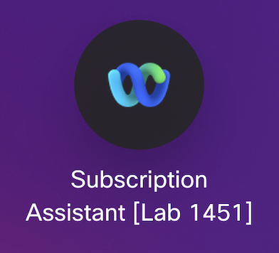
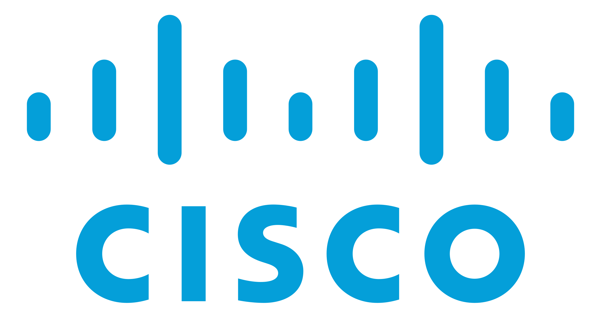
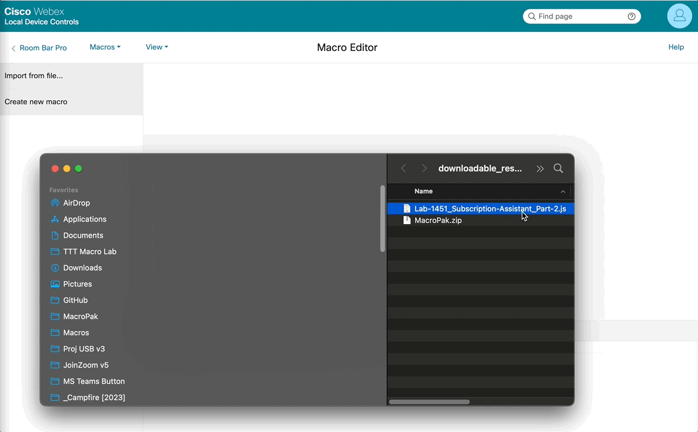
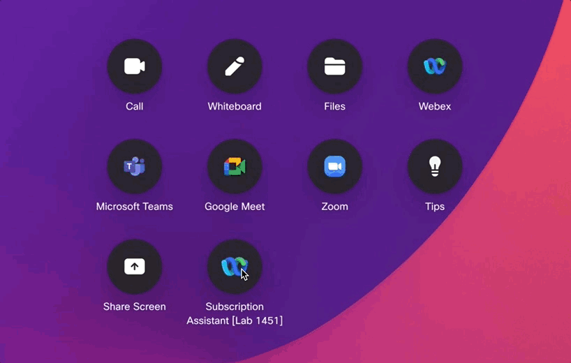
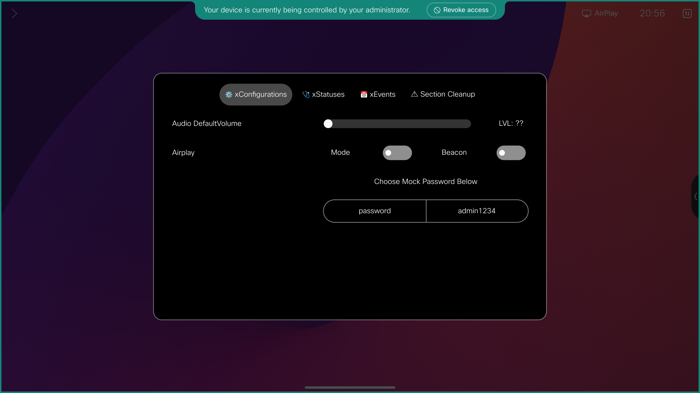
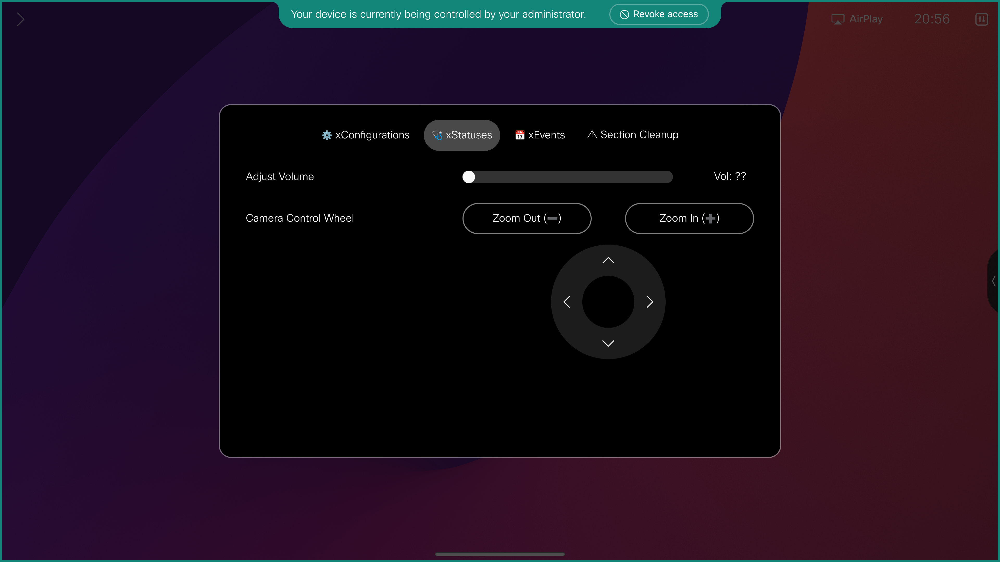
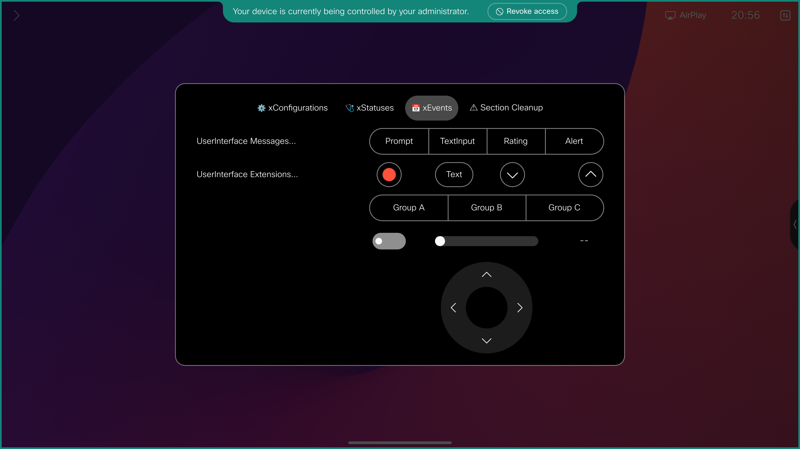
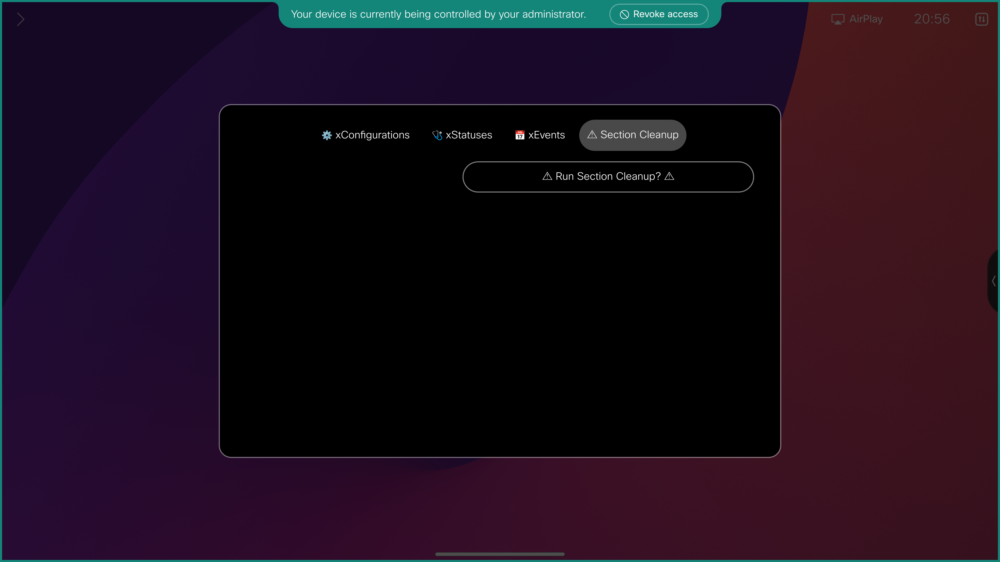

{{ config.cProps.devNotice }}
{{ config.cProps.acronyms }}

!!! example "Welcome"

    This part of the Lab Guide consists of three Lab Sections.

    RoomOS xAPI teaches you to interact with the RoomOS xAPI through several Integration Methods, including SSH, HTTP, and macros. The xAPI branches are the building blocks you use to bring a solution to life.

    RoomOS User Interfaces guides you through the customizable interfaces of a RoomOS device. These surfaces help you communicate with users and build new experiences.

    Solution Exercises discusses customization best practices and contains complete solutions that build on the RoomOS xAPI and RoomOS User Interface sections.

    !!! important 

        Before you start, if you're running through this lab at Webex One, please ensure the Subscription Assistant UI is available on your RoomOS Device. 
        
        If it's not, follow the instructions below to download and install the Subscription Assistant Macro.

        <figure markdown="span">
            { width="400" }
            <figcaption>Subscription Assistant Icon</figcaption>
        </figure>

        This Macro assists with Lessons in which you create Feedback Subscriptions to RoomOS xAPI paths. Do not modify it during the lab, but feel free to review how it operates afterward.

        The implementation is not reviewed in the lab, so keep the downloaded copy if you want to study it later.

        === "Download and Install"

            === "Download"

                <figure markdown="span">
                    [{ width="300" }](https://raw.githubusercontent.com/WebexCC-SA/LAB-1451/main/docs/Main-Lab/DownloadContent/Lab-1451_Subscription-Assistant.zip)
                    <figcaption>Download the Lab-1451 Subscription Assistant archive</figcaption>
                </figure>

            === "Install"

                !!! gif

                    - Locate the downloaded `Lab-1451_Subscription-Assistant.zip` archive.
                    - Extract its contents. The archive contains `Lab-1451_Subscription-Assistant_Part-2.js`.
                    - Sign in to the web interface of your RoomOS device.
                    <pre><code>https://{{config.cProps.auth.roomosIp}}</code></pre>
                    - Navigate to **Macro Editor**.
                    - Drag `Lab-1451_Subscription-Assistant_Part-2.js` into Macro Editor.
                    - Save and activate the Macro.

                    <figure markdown>
                        { width="600" }
                    </figure>

        === "How to Use"

            === "Home Screen"

                { width="600" , align=right }

                After you install and activate the Subscription Assistant Macro, it generates a UI Extension on the RoomOS device's touch interface.

                Select this button to open the tools used throughout the RoomOS xAPI Lessons.

                ??? gif "View UI Operation"

                    <figure markdown>
                    { width="600" }
                    </figure>

            === "xConfigurations"

                { width="600" , align=right }

                In the xConfigurations Page, you'll have tools for modifying xConfigurations on your device. 
                
                Use these tools when creating Feedback Subscriptions to xConfigurations throughout the Integration Method Lessons.

            === "xStatuses"

                { width="600" , align=right }

                In the xStatuses Page, you'll have tools that will issue certain xCommands that will cause certain xStatus events to fire on your device. 
                
                Use these tools when creating Feedback Subscriptions to xStatuses throughout the Integration Method Lessons.

            === "xEvents"

                { width="600" , align=right }

                In the xEvents Page, you'll have tools that will cause certain xEvent events to fire on your device. 
                
                Use these tools when creating Feedback Subscriptions to xEvents throughout the Integration Method Lessons.

            === "Section Cleanup"

                { width="600" , align=right }

                Throughout the RoomOS xAPI section, you will subscribe to the same xAPI paths from each Integration Method. This repetition helps you recognize how each method expresses the same RoomOS xAPI path.

                Run **Section Cleanup** whenever the Lab Guide prompts you. It reverses the current section's changes and prepares the RoomOS device for the next Integration Method.

<!-- !!! important "Abstract"

    Throughout the {{ config.cProps.rxp.name }} section, we'll run through many examples on how you can interface with your Codec's xAPI through the following integration methods

    - - -

    | **Integration Method** | **Port** | **Common Field Uses**                                                                                                                      |
    |------------------------|----------|--------------------------------------------------------------------------------------------------------------------------------------------|
    | SSH                    | 22       | AV Room Controllers [Room Automation]                                                                                                      |
    | HTTP                   | 80/443   | AV Room Controllers [Room Automation], Telepresence Management Suite (TMS[EoL]), 3rd Party Management Systems and/or Analytics             |
    | WebHooks               | 80/443   | Telepresence Management Suite (TMS[EoL]), 3rd Party Management Systems and/or Analytics                                                    |
    | WebSockets             | 80/443   | AV Room Controllers [Room Automation], Web Applications, Webex Control Hub, 3rd Party Management Systems and/or AnalyticsWeb Applications, |
    | Cloud xAPI             | 80/443   | Web Applications,  Webex Control Hub, 3rd Party Management Systems and/or Analytics                                                        |
    | Macros                 | Local    | Room Automation                                                                                                                            |

    Some topics that aren't covered in this lab are the following Integration Methods

    | **Integration Method**     | **Common Field Uses**                                                                                                  | Closest Integration Method and Differences                                                                                                                                                                                                                                   |
    |----------------------------|------------------------------------------------------------------------------------------------------------------------|------------------------------------------------------------------------------------------------------------------------------------------------------------------------------------------------------------------------------------------------------------------|
    | Serial Rs232               | AV Room Controllers [Room Automation], Non-Networked AV solutions                                                      | SSH - Serial Rs232 interacts with the terminal in the same way as SSH, but requires additional configurations on the Codec and String Terminators to complete the instruction set                                                                                |
    | jsxapi [Javascript Module] | AV Room Controllers [Room Automation], Web Applications, 3rd Party Management Systems and/or AnalyticsWeb Applications | Macros - Macros are a derivative of the jsxapi. Syntax is largely the same, except the added steps to establish an SSH or WebSocket Connection. Following the SSH, WebSocket and Macro Lessons will teach you format and communication that the jsxapi relies on |
    | Workspace Integrations     | Web Applications,  Webex Control Hub, 3rd Party Management Systems and/or Analytics                                    | Cloud xAPI - WorkSpace integrations functions as the Subscription mechanism for Cloud xAPI. There isn't a close example in this lab, but it a worthwhile topic on it's own to explore for solutions that scale in a cloud environment                            |

    - - -

    As you move forward in {{ config.cProps.rxp.name }}, we'd love for you to cover all integration methods outlined throughout {{ config.cProps.rxp.name }}, but we understand it may be alot of information to take in

    At a minimum, if you could review sections before the 90 minutes concludes

    - SSH ^{{config.cProps.rxp.sectionIds.ssh}}^
    - HTTP ^{{config.cProps.rxp.sectionIds.http}}^
    - Macros ^{{config.cProps.rxp.sectionIds.macro}}^

    These will lay the base ground work when it comes to building your First Automation and Deployment, which will be covered in the remainder of the lab

    !!! Note

        Each Section has a `Cleanup` Process. These are important when moving from each integration method

        It requires you to have an active SSH session against the endpoint, so once you're done with section within {{ config.cProps.rxp.name }}, keep that terminal session alive

    Time Permitting, certainly check out the sections on WebSockets ^{{config.cProps.rxp.sectionIds.websocket}}^ and Webex Cloud ^{{config.cProps.rxp.sectionIds.cloud}}^

    Every integration method serves a purpose, whether your a customer optimizing your workflow, an integrator wanting a deeper understanding on how all these pieces connect or a partner wanting to building new opportunities for your business with Cisco RoomOS Devices -->
