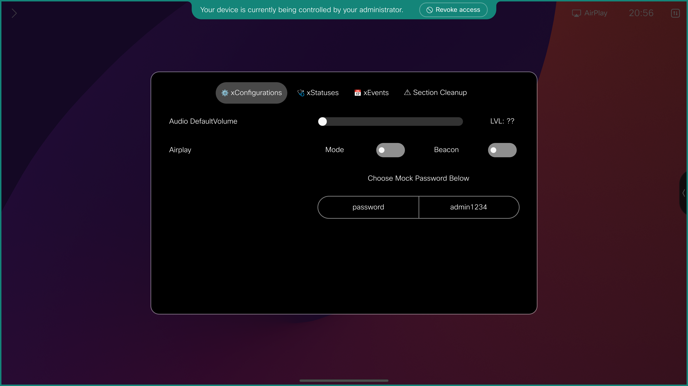

{{ config.cProps.devNotice }}
{{ config.cProps.acronyms }}

!!! example "Welcome"

    This section of the lab consists 3 main sections. 

    RoomOS xAPI will teach you to interact with the RoomOS xAPI stack from several different integration points, such as SSH, HTTP and Macros. The xAPI are the building blocks to help you bring your solution to life.

    RoomOS UserInterfaces will guide you through the customizable interfaces of the device. These pieces help you communicate with your users and build new experiences.

    Solution Exercises discusses best practices for developing any customization with the RoomOS xAPI and contains walkthroughs of real solutions for you to build leveraging what you learned from the RoomOS xAPI and UserInterfaces sections

    !!! important 

        Before you start, if you're running through this lab at Webex One, please ensure the Subscription Assistant UI is available on your RoomOS Device. 
        
        If it's not, follow the instructions below to download and install the Subscription Assistant Macro.

        <figure markdown="span">
            { width="400" }
            <figcaption>Subscription Assistant Icon</figcaption>
        </figure>

        This macro was built to assist you for lessons where you'll Subscribe/Register Feedback to various xAPI Paths. Do not modify this macro, but feel free to learn from this macro and how it operates. 

        We won't be reviewing this macro in this lab, so if we'd encourage you take a copy home with you and review outside this course

        === "Download and Install"

            === "Download"

                <figure markdown="span">
                    [{ width="300" }](https://raw.githubusercontent.com/WebexCC-SA/LAB-1451/main/docs/Main-Lab/DownloadContent/Lab-1451_Subscription-Assistant.zip)
                    <figcaption>Lab-1451_Subscription-Assistant Macro</figcaption>
                </figure>

            === "Install"

                !!! gif

                    - Locate the `Lab-1451_Subscription-Assistant_Part-2.zip` file you downloaded
                    - Unzip it's Contents
                    - Login into the WebUI of your RoomOS Device
                    <pre><code>https://{{config.cProps.auth.roomosIp}}</code></pre>
                    - Navigate to Macro Editor
                    - Drag and Drop the Subscription Assistant Macro into the Macro Editor
                    - Save the Macro and Activate the Macro

                    <figure markdown>
                        { width="600" }
                    </figure>

        === "How to Use"

            === "Home Screen"

                { width="600" , align=right }

                After installing and enabling the Subscription Assistant Macro, the macro will generate a UI extension on your Codec's Touch Control Surface

                Clicking on this button, will open various tools for you to use when running through Part 2

                ??? gif "View UI Operation"

                    <figure markdown>
                    { width="600" }
                    </figure>

            === "xConfigurations"

                { width="600" , align=right }

                In the xConfigurations Page, you'll have tools for modifying xConfigurations on your device. 
                
                Use these tools when Subscribing/Registering feedback to xConfigurations throughout the various lessons in Part 2

            === "xStatuses"

                { width="600" , align=right }

                In the xStatuses Page, you'll have tools that will issue certain xCommands that will cause certain xStatus events to fire on your device. 
                
                Use these tools when Subscribing/Registering feedback to xStatus throughout the various lessons in Part 2

            === "xEvents"

                { width="600" , align=right }

                In the xEvents Page, you'll have tools that will cause certain xEvent events to fire on your device. 
                
                Use these tools when Subscribing/Registering feedback to xEvents throughout the various lessons in Part 2

            === "Section Cleanup"

                { width="600" , align=right }

                Throughout Part 2, we will Subscribe to the same xAPI paths from each Integration Method. This is to familiarize you more with the Syntax of each integration method and how to structure that xApi Path.

                That Said, we need to clean up the Codec at the end of each Section. When prompted to by the Lab Guide, run the Section Cleanup button. This will prepare the device for the next set of lessons in Part 2

<!-- !!! important "Abstract"

    Throughout the {{ config.cProps.rxp.name }} section, we'll run through many examples on how you can interface with your Codec's xAPI through the following integration methods

    - - -

    | **Integration Method** | **Port** | **Common Field Uses**                                                                                                                      |
    |------------------------|----------|--------------------------------------------------------------------------------------------------------------------------------------------|
    | SSH                    | 22       | AV Room Controllers [Room Automation]                                                                                                      |
    | HTTP                   | 80/443   | AV Room Controllers [Room Automation], Telepresence Management Suite (TMS[EoL]), 3rd Party Management Systems and/or Analytics             |
    | WebHooks               | 80/443   | Telepresence Management Suite (TMS[EoL]), 3rd Party Management Systems and/or Analytics                                                    |
    | WebSockets             | 80/443   | AV Room Controllers [Room Automation], Web Applications, Webex Control Hub, 3rd Party Management Systems and/or AnalyticsWeb Applications, |
    | Cloud xAPI             | 80/443   | Web Applications,  Webex Control Hub, 3rd Party Management Systems and/or Analytics                                                        |
    | Macros                 | Local    | Room Automation                                                                                                                            |

    Some topics that aren't covered in this lab are the following Integration Methods

    | **Integration Method**     | **Common Field Uses**                                                                                                  | Closest Integration Method and Differences                                                                                                                                                                                                                                   |
    |----------------------------|------------------------------------------------------------------------------------------------------------------------|------------------------------------------------------------------------------------------------------------------------------------------------------------------------------------------------------------------------------------------------------------------|
    | Serial Rs232               | AV Room Controllers [Room Automation], Non-Networked AV solutions                                                      | SSH - Serial Rs232 interacts with the terminal in the same way as SSH, but requires additional configurations on the Codec and String Terminators to complete the instruction set                                                                                |
    | jsxapi [Javascript Module] | AV Room Controllers [Room Automation], Web Applications, 3rd Party Management Systems and/or AnalyticsWeb Applications | Macros - Macros are a derivative of the jsxapi. Syntax is largely the same, except the added steps to establish an SSH or WebSocket Connection. Following the SSH, WebSocket and Macro Lessons will teach you format and communication that the jsxapi relies on |
    | Workspace Integrations     | Web Applications,  Webex Control Hub, 3rd Party Management Systems and/or Analytics                                    | Cloud xAPI - WorkSpace integrations functions as the Subscription mechanism for Cloud xAPI. There isn't a close example in this lab, but it a worthwhile topic on it's own to explore for solutions that scale in a cloud environment                            |

    - - -

    As you move forward in {{ config.cProps.rxp.name }}, we'd love for you to cover all integration methods outlined throughout {{ config.cProps.rxp.name }}, but we understand it may be alot of information to take in

    At a minimum, if you could review sections before the 90 minutes concludes

    - SSH ^{{config.cProps.rxp.sectionIds.ssh}}^
    - HTTP ^{{config.cProps.rxp.sectionIds.http}}^
    - Macros ^{{config.cProps.rxp.sectionIds.macro}}^

    These will lay the base ground work when it comes to building your First Automation and Deployment, which will be covered in the remainder of the lab

    !!! Note

        Each Section has a `Cleanup` Process. These are important when moving from each integration method

        It requires you to have an active SSH session against the endpoint, so once you're done with section within {{ config.cProps.rxp.name }}, keep that terminal session alive

    Time Permitting, certainly check out the sections on WebSockets ^{{config.cProps.rxp.sectionIds.websocket}}^ and Webex Cloud ^{{config.cProps.rxp.sectionIds.cloud}}^

    Every integration method serves a purpose, whether your a customer optimizing your workflow, an integrator wanting a deeper understanding on how all these pieces connect or a partner wanting to building new opportunities for your business with Cisco RoomOS Devices -->