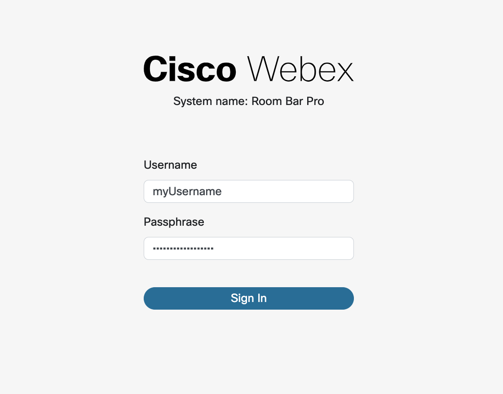
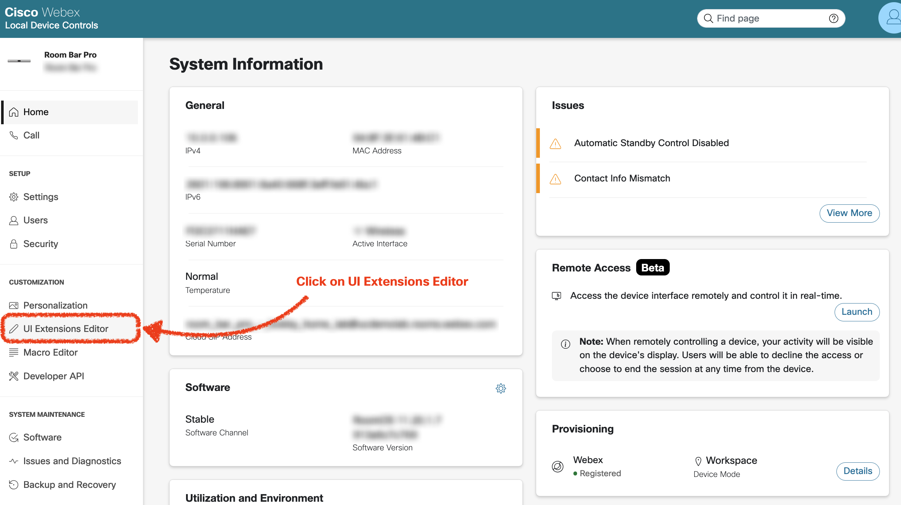
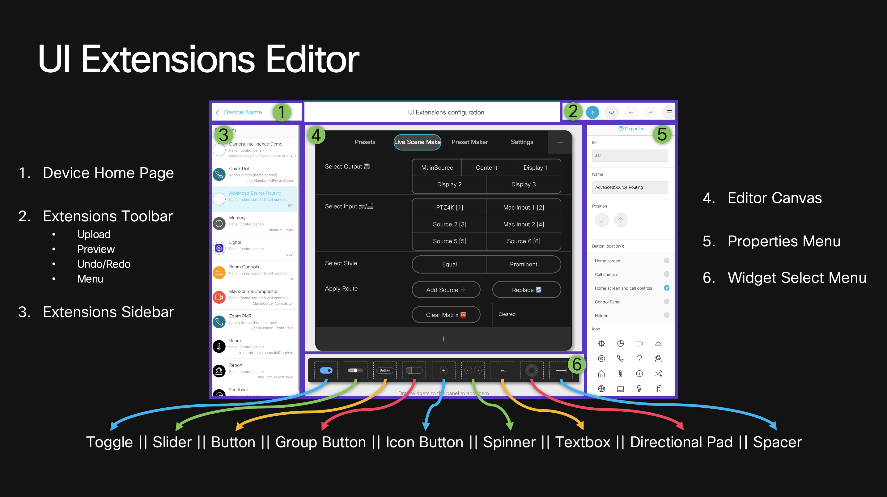
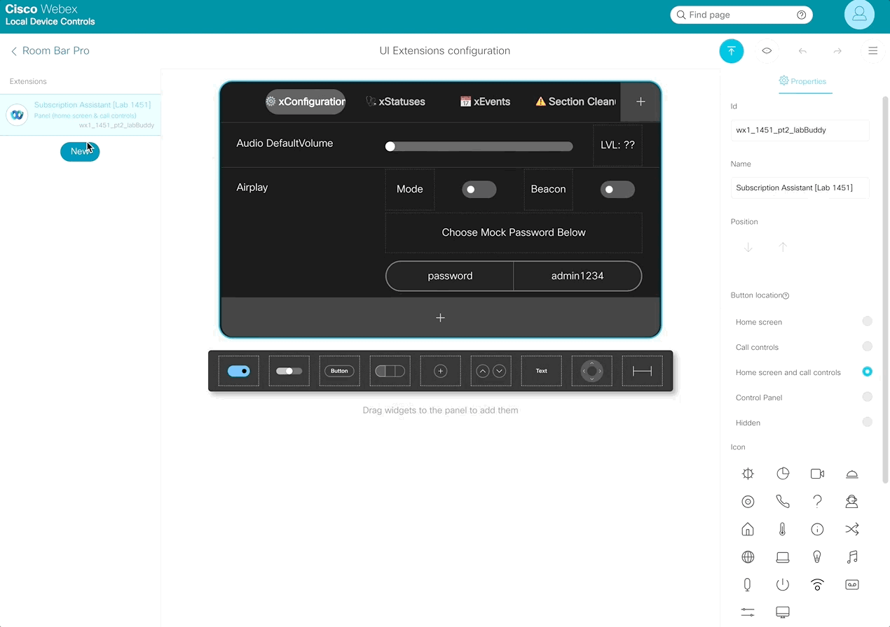
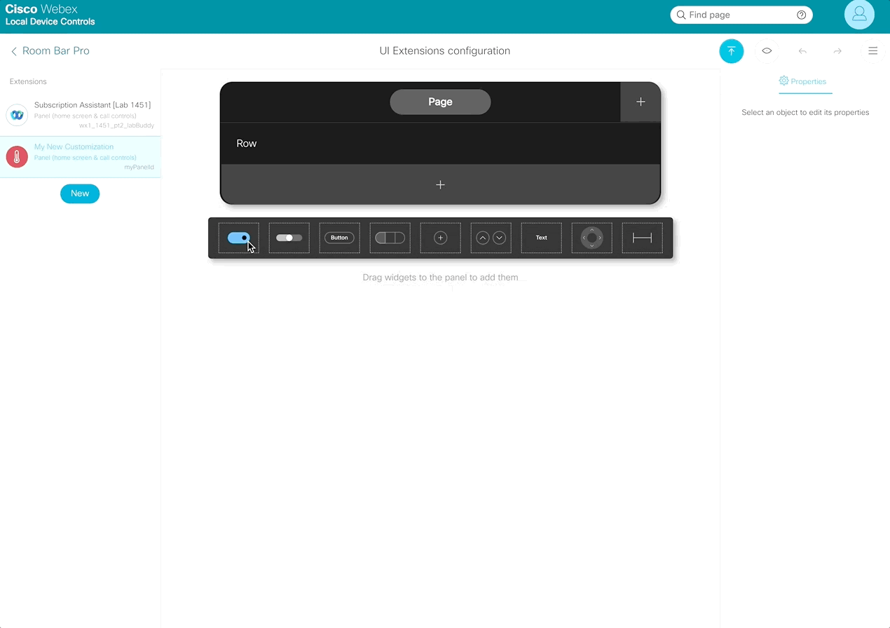
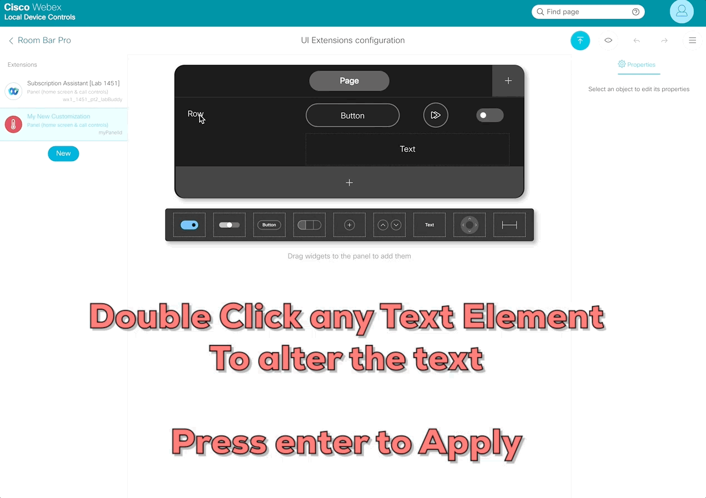
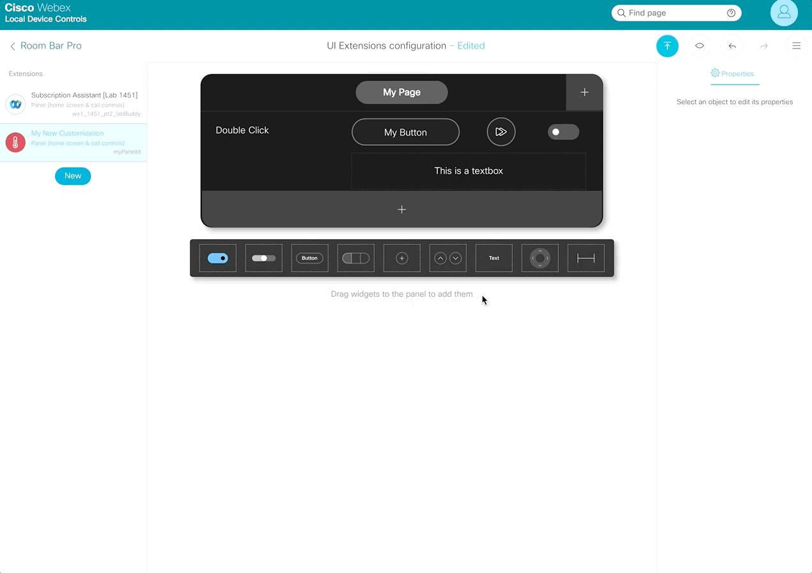

{{ config.cProps.devNotice }}
{{ config.cProps.acronyms }}

# Extensions ~(section\ {{ config.cProps.rxp.sectionIds.ui.extensions }})~

UI Extensions are visual components with no built-in control logic. A panel or action button becomes useful when a macro or external integration listens for its events and performs the intended action.

## Navigate the UI Extensions Editor ~({{ config.cProps.rxp.sectionIds.ui.extensions }}.1)~

Follow this sequence from sign-in through deployment. Complete each step before moving to the next.

1. Open `https://{{ config.cProps.auth.roomosIp }}/web` in a browser and sign in.

    - **Username:** `{{ config.cProps.auth.roomosUser }}`
    - **Password:** `{{ config.cProps.auth.roomosPass }}`

    <figure markdown="span">
        { width="400" }
        <figcaption>Sign in to the RoomOS device web interface</figcaption>
    </figure>

2. In the left navigation, select **Customization > UI Extensions Editor**.

    <figure markdown="span">
        { width="700" }
        <figcaption>Open the UI Extensions Editor</figcaption>
    </figure>

3. Select **New** and review the available extension types.

    <figure markdown="span">
        { width="800" }
        <figcaption>Choose the extension that matches the intended experience</figcaption>
    </figure>

    | Extension | Capability |
    | --- | --- |
    | Panel | Opens one or more pages containing rows and widgets such as buttons, sliders, and toggles. |
    | Action button | Adds a button that emits a panel-click event. A macro or integration must implement the action. |
    | Web app | Adds a launcher that opens a hosted page on a WebEngine-capable touch interface. |
    | Web widget | Shows a noninteractive hosted view on the device home screen. Only one web widget can be active at a time. |

4. Add a **Panel**. Assign a solution-specific panel ID such as `lab1451_ui_extensions`; another developer may be using the same RoomOS device.

    <figure markdown="span">
        { width="400" }
        <figcaption>Create a panel and assign a unique panel ID</figcaption>
    </figure>

5. Add at least one **Button**, **Toggle**, and **Slider**. Give every interactive widget a unique ID beginning with `lab1451_`.

    <figure markdown="span">
        { width="400" }
        <figcaption>Add interactive widgets to the panel</figcaption>
    </figure>

    Common widget events include:

    | Widget | Typical `Type` | Typical `Value` |
    | --- | --- | --- |
    | Button or icon button | `pressed`, `released`, `clicked` | No value |
    | Toggle | `changed` | `on` or `off` |
    | Slider | `pressed`, `released`, `changed` | Integer from `0` through `255` |
    | Group button | `pressed`, `released` | The selected value assigned by the developer |
    | Spinner | `pressed`, `released`, `clicked` | `increment` or `decrement` |
    | Directional pad | `pressed`, `released`, `clicked` | `up`, `down`, `left`, `right`, or `center` |
    | Text box or spacer | No widget-action event | Not applicable |

6. Double-click labels to rename them, and use rows and pages to keep related controls together. Press ++enter++ after changing a label.

    <figure markdown="span">
        { width="400" }
        <figcaption>Edit panel, page, row, and widget labels</figcaption>
    </figure>

    <figure markdown="span">
        { width="400" }
        <figcaption>Organize controls with pages and rows</figcaption>
    </figure>

## Build, Deploy, Verify, and Clean Up ~({{ config.cProps.rxp.sectionIds.ui.extensions }}.2)~

1. Finish a small panel named **LAB-1451 Controls** with the panel ID `lab1451_ui_extensions`.
2. Select **Preview** and check that all labels fit and that the page layout is clear.
3. Select **Export** (labeled **Save** on some RoomOS releases) to deploy the extension to the RoomOS device.
4. On the device or Room Navigator, open **LAB-1451 Controls** and interact with every widget. At this stage the controls change visually but do not control anything because no integration logic has been attached.
5. Return to the editor, select the panel, delete it, and export/save the change.
6. Confirm that **LAB-1451 Controls** no longer appears. If the editor cannot remove it, use SSH:

    ``` shell title="Remove only the panel created in this lesson"
    xCommand UserInterface Extensions Panel Remove PanelId: lab1451_ui_extensions
    ```

<roomosfind>UserInterface Extensions</roomosfind>
