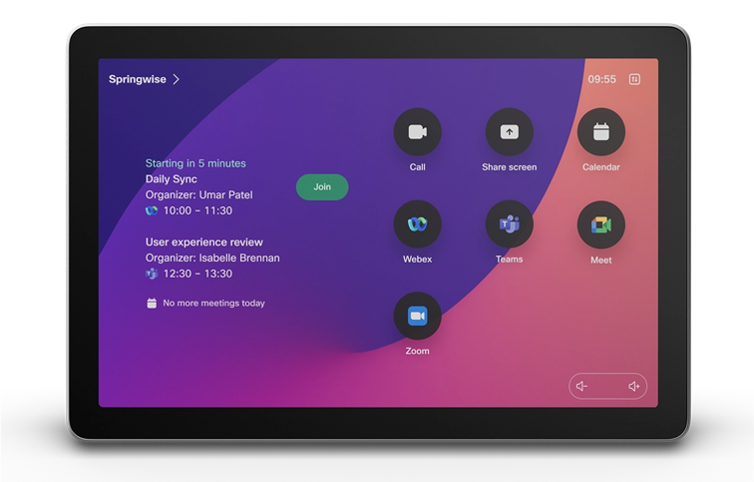
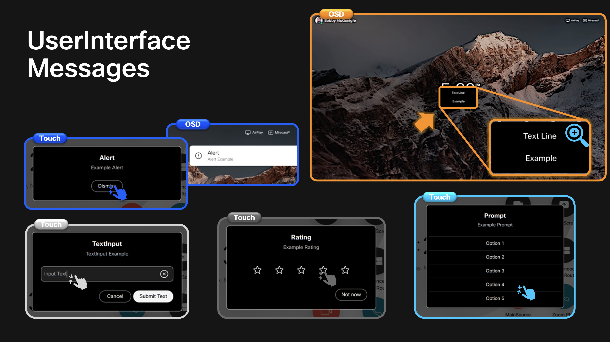
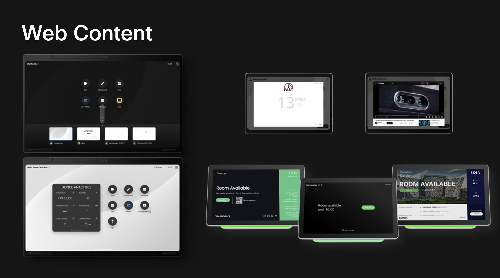

{{ config.cProps.devNotice }}
{{ config.cProps.acronyms }}

# What Are RoomOS User Interfaces?

RoomOS user interfaces include both the controls built into RoomOS and custom controls that you create with the RoomOS xAPI. They give people a visible way to interact with your solution while commands, configurations, statuses, and events provide the underlying behavior.

This section introduces four major areas:

## Features

<figure markdown="span">
    { width="600" }
    <figcaption>Built-in controls on a Room Navigator home screen</figcaption>
</figure>

<pre><code>x[Path] UserInterface Features...</code></pre>

The `UserInterface Features` configurations control the visibility of many built-in RoomOS controls, including calling, sharing, whiteboarding, and meeting-platform buttons.

## Extensions

<figure markdown="span">
    { width="800" }
    <figcaption>UI Extensions Editor</figcaption>
</figure>

<pre><code>x[Path] UserInterface Extensions...</code></pre>

UI Extensions let you add panels, action buttons, widgets, and web-app launchers. You design them in the device's UI Extensions Editor or provision them through the xAPI, then use events and integration logic to make interactive controls do something.

## Messages

<figure markdown="span">
    { width="800" }
    <figcaption>RoomOS message styles and display surfaces</figcaption>
</figure>

<pre><code>x[Path] UserInterface Message...</code></pre>

The `UserInterface Message` commands display alerts, prompts, ratings, text-input dialogs, and text lines on supported device and controller surfaces. Interactive messages produce response events that an integration can process.

## Web Content

<figure markdown="span">
    { width="800" }
    <figcaption>Web content experiences powered by the RoomOS WebEngine</figcaption>
</figure>

There is no single `WebContent` xAPI branch. RoomOS instead exposes several WebEngine-powered experiences: web apps, API-driven web views, web widgets, digital signage, and kiosk mode. Their capabilities and device support differ, so the final lesson describes each one separately.
