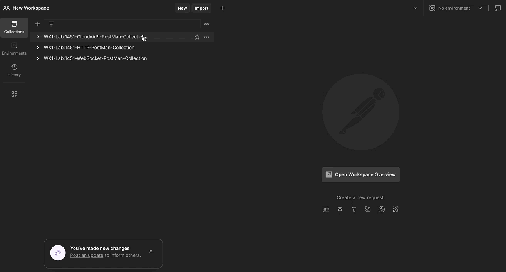

{{ config.cProps.devNotice }}
{{ config.cProps.acronyms }}

# Access RoomOS xAPI via Webex Cloud ~(section\ {{ config.cProps.rxp.sectionIds.cloud }})~

!!! abstract

    Webex Cloud xAPI lets an authorized application address a cloud-registered RoomOS device through `https://webexapis.com/v1`, rather than through a direct connection to the device. The RoomOS xAPI paths remain familiar; the HTTP method, endpoint, authentication, and request body are specific to the cloud service.

    This Lesson uses Postman to practice one RoomOS device at a time. Cloud xAPI is useful when direct device reachability is unavailable, but a command still requires the device to be online. Configuration changes are stored by Webex and can be applied after an offline device reconnects.

## Section {{ config.cProps.rxp.sectionIds.cloud }} Requirements

!!! important

    - Use a Webex cloud-registered RoomOS device that your lab account is allowed to administer.
    - Install or open Postman. This Lesson uses its collection as a request scaffold; do not paste a personal access token into screenshots, shared collections, or source control.
    - A personal access token is suitable only for this guided lab. A deployed integration needs an appropriate OAuth or Workspace Integration authorization model.

    Download [the Cloud xAPI Postman collection](../../DownloadContent/PostMan%20Collections/WX1-Lab-1451-CloudxAPI-PostMan-Collection.postman_collection.json.zip){:target="_blank"}.

## Cloud xAPI Authentication and Format ~({{ config.cProps.rxp.sectionIds.cloud }}.1)~

All requests use `Authorization: Bearer <token>`. Set `Accept: application/json`; use `Content-Type: application/json` for commands and `Content-Type: application/json-patch+json` for configuration patches.

| RoomOS xAPI branch | Cloud request form | What changes |
| --- | --- | --- |
| `xCommand` | `POST /v1/xapi/command/<Command.Key>` | Put `deviceId` and arguments in the JSON body. |
| `xStatus` | `GET /v1/xapi/status?deviceId=<id>&name=<Status.Key>` | Query a current cloud-visible status value. |
| `xConfiguration` | `GET` or `PATCH /v1/deviceConfigurations?deviceId=<id>` | Read configurations or submit a JSON Patch. |
| feedback | Workspace Integration | Notifications require an integration approved in Control Hub. |

!!! note

    Cloud xAPI permissions are token-scope dependent. Commands and statuses use their respective xAPI scopes; device configuration reads and writes require the relevant administrator device scopes. If Postman returns `401` or `403`, check the token and its granted permissions before changing the request syntax.

## Get a token and configure Postman ~({{ config.cProps.rxp.sectionIds.cloud }}.2)~

1. Go to [Webex for Developers](https://developer.webex.com){:target="_blank"}, sign in with the lab account, and copy its personal access token.
2. Import the downloaded collection, select its root folder, and open **Variables**.
3. Set `developer_Token` and `device_Id` in the current value column. Keep the token out of exported collections.
4. To find the device ID, run the pre-provided **List Devices** request and copy the `id` for the RoomOS device you will use. You may also obtain it from the device's `xStatus Webex DeveloperId` output.

??? tip "View the collection setup"

    <figure markdown="span">
      { width="600" }
      <figcaption>Set the collection variables before sending a request.</figcaption>
    </figure>

## Webex Devices and Workspaces APIs ~({{ config.cProps.rxp.sectionIds.cloud }}.3)~

Webex device and workspace APIs provide organization inventory context; they are not RoomOS xAPI branches. A device belongs to one workspace, while a workspace can contain zero or more devices.

???+ lesson "Lesson: List Devices"

    Send the collection's **List Devices** request. Locate your RoomOS device and record its `id` as `device_Id`.

    ??? success "Successful syntax and response"

        ```http
        GET https://webexapis.com/v1/devices
        Authorization: Bearer <token>
        ```

        A successful response contains an `items` array. The RoomOS device object's `id`, `displayName`, `workspaceId`, and `connectionStatus` help you select the correct target.

??? lesson "Lesson: List Workspaces"

    Send the collection's **List Workspaces** request. Compare the workspace `id` with the device's `workspaceId` and identify the corresponding workspace name.

    ??? success "Successful syntax and response"

        ```http
        GET https://webexapis.com/v1/workspaces
        Authorization: Bearer <token>
        ```

## Executing xCommands ~({{ config.cProps.rxp.sectionIds.cloud }}.4)~

For every command in this section, start from the terminal form, convert its space-separated RoomOS xAPI path to a dot-separated `Command.Key`, and construct the Cloud request. Run it, observe the RoomOS device, then compare your work with the collapsed answer.

???+ lesson "Lesson: Execute an xCommand"

    Terminal form:

    ```shell
    xCommand Video Selfview Set Mode: On FullScreenMode: On OnMonitorRole: First
    ```

    In the **Execute an xCommand** Postman request, derive the command key for the URL and add the three arguments to the `arguments` object. Send the request and observe the device self-view.

    ??? success "Successful syntax and log output"

        ```http
        POST https://webexapis.com/v1/xapi/command/Video.Selfview.Set
        ```

        ```json
        {
          "deviceId": "{{device_Id}}",
          "arguments": {
            "Mode": "On",
            "FullScreenMode": "On",
            "OnMonitorRole": "First"
          }
        }
        ```

        ```json
        { "deviceId": "{{device_Id}}", "result": {} }
        ```

??? lesson "Lesson: Execute an xCommand with multiple arguments with the same name"

    Terminal form:

    ```shell
    xCommand Video Input SetMainVideoSource ConnectorId: 1 ConnectorId: 1 Layout: Equal
    ```

    Use the next request in the collection. Convert the repeated `ConnectorId` arguments into a JSON array, retain `Layout`, and send the command.

    ??? success "Successful syntax and log output"

        ```http
        POST https://webexapis.com/v1/xapi/command/Video.Input.SetMainVideoSource
        ```

        ```json
        {
          "deviceId": "{{device_Id}}",
          "arguments": { "ConnectorId": [1, 1], "Layout": "Equal" }
        }
        ```

??? lesson "Lesson: Execute an xCommand with a multiline argument"

    Terminal form:

    ```shell
    xCommand UserInterface Extensions Panel Save PanelId: wx1_lab_multilineCommand
    <Extensions><Panel><PanelId>wx1_lab_multilineCommand</PanelId><Location>HomeScreen</Location><Icon>Info</Icon><Color>#FF70CF</Color><Name>Cloud xAPI multiline command</Name><ActivityType>Custom</ActivityType></Panel></Extensions>
    .
    ```

    Use the multiline request. Keep `PanelId` in `arguments` and turn the XML line into a JSON string in `body`; the body is not another argument. Send the request and confirm that the panel appears.

    ??? success "Successful syntax and log output"

        ```json
        {
          "deviceId": "{{device_Id}}",
          "arguments": { "PanelId": "wx1_lab_multilineCommand" },
          "body": "<Extensions><Panel><PanelId>wx1_lab_multilineCommand</PanelId><Location>HomeScreen</Location><Icon>Info</Icon><Color>#FF70CF</Color><Name>Cloud xAPI multiline command</Name><ActivityType>Custom</ActivityType></Panel></Extensions>"
        }
        ```

??? lesson "Lesson: Execute an xCommand that generates data and returns a response"

    Terminal form:

    ```shell
    xCommand UserInterface Extensions List ActivityType: Custom
    ```

    Construct and send the Cloud command. Inspect `result.Extensions.Panel` for the panel created in the previous Lesson.

    ??? success "Successful syntax and log output"

        ```http
        POST https://webexapis.com/v1/xapi/command/UserInterface.Extensions.List
        ```

        ```json
        {
          "deviceId": "{{device_Id}}",
          "arguments": { "ActivityType": "Custom" }
        }
        ```

## Getting and setting xConfigurations ~({{ config.cProps.rxp.sectionIds.cloud }}.5)~

Cloud configuration requests use the `deviceConfigurations` resource. A `GET` reads a key; a `PATCH` uses JSON Patch to set (`replace`) or clear (`remove`) a configured value. The path ends in `/sources/configured/value`.

???+ lesson "Lesson: Get an xConfiguration value"

    Terminal form:

    ```shell
    xConfiguration Audio DefaultVolume
    ```

    In the collection's request, derive the dot-separated configuration key, send it, and identify the effective `value` in the response.

    ??? success "Successful syntax and log output"

        ```http
        GET https://webexapis.com/v1/deviceConfigurations?deviceId={{device_Id}}&key=Audio.DefaultVolume
        ```

??? lesson "Lesson: Get multiple xConfiguration values under a common node"

    Terminal form:

    ```shell
    xConfiguration Audio
    ```

    Query the `Audio` node using the collection request. Compare the returned child keys with the single-key response.

    ??? success "Successful syntax and log output"

        ```http
        GET https://webexapis.com/v1/deviceConfigurations?deviceId={{device_Id}}&key=Audio
        ```

??? lesson "Lesson: Set a new xConfiguration value"

    Terminal form:

    ```shell
    xConfiguration Audio DefaultVolume: 100
    ```

    In the PATCH scaffold, construct one JSON Patch operation that sets the configured value to `100`. Send it and compare the returned effective value.

    ??? success "Successful syntax and log output"

        ```http
        PATCH https://webexapis.com/v1/deviceConfigurations?deviceId={{device_Id}}
        Content-Type: application/json-patch+json
        ```

        ```json
        [
          {
            "op": "replace",
            "path": "Audio.DefaultVolume/sources/configured/value",
            "value": 100
          }
        ]
        ```

??? lesson "Lesson: Set an xConfiguration to its default value"

    Remove the configured `Audio.DefaultVolume` value. This returns control to the default or a higher-precedence configuration source.

    ??? success "Successful syntax and log output"

        ```json
        [
          {
            "op": "remove",
            "path": "Audio.DefaultVolume/sources/configured/value"
          }
        ]
        ```

??? lesson "Lesson: Set multiple xConfiguration values in a single request"

    Create two `replace` operations for these terminal forms:

    ```shell
    xConfiguration Video Input AirPlay Mode: On
    xConfiguration Video Input AirPlay Beacon: Auto
    ```

    ??? success "Successful syntax and log output"

        ```json
        [
          {
            "op": "replace",
            "path": "Video.Input.AirPlay.Mode/sources/configured/value",
            "value": "On"
          },
          {
            "op": "replace",
            "path": "Video.Input.AirPlay.Beacon/sources/configured/value",
            "value": "Auto"
          }
        ]
        ```

## Getting xStatuses ~({{ config.cProps.rxp.sectionIds.cloud }}.6)~

Cloud xAPI status requests query the current status data retained by Webex. The RoomOS device must be cloud connected for current data to be available.

???+ lesson "Lesson: Get an xStatus value"

    Terminal form:

    ```shell
    xStatus Audio Volume
    ```

    Construct the status `name` value and send the request. Change the volume through the device UI, then send it again to observe the new value.

    ??? success "Successful syntax and log output"

        ```http
        GET https://webexapis.com/v1/xapi/status?deviceId={{device_Id}}&name=Audio.Volume
        ```

        ```json
        { "deviceId": "{{device_Id}}", "result": { "Audio": { "Volume": 50 } } }
        ```

??? lesson "Lesson: Get multiple xStatus values under a common node"

    Terminal form:

    ```shell
    xStatus Audio
    ```

    Query the common `Audio` node, send the request, and compare the child values with the single `Audio.Volume` result.

    ??? success "Successful syntax and log output"

        ```http
        GET https://webexapis.com/v1/xapi/status?deviceId={{device_Id}}&name=Audio
        ```

## Subscribing to xConfigurations, xStatuses, and xEvents ~({{ config.cProps.rxp.sectionIds.cloud }}.7)~

!!! info

    The Postman collection deliberately stops at request/response xAPI. Cloud notifications are implemented through a **Workspace Integration**, which an administrator enables in Control Hub. The integration receives approved status and event changes through either a public HTTPS webhook or long polling; it is an application deployment, not a one-device Postman request.

    This lab does not create, configure, or activate a Workspace Integration. Review the [Workspace Integrations guide](https://developer.webex.com/docs/workspace-integrations){:target="_blank"} after completing the fundamentals. When you build one, request the narrowest xAPI access necessary and validate webhook signatures before processing payloads.

!!! challenge "Challenge: identify the notification model"

    Choose one visible event from this Lesson, such as `UserInterface.Extensions.Panel.Clicked`. Explain why its cloud notification needs an approved Workspace Integration rather than a direct device feedback subscription. Then identify whether a webhook or long polling better suits an internal service that cannot accept public inbound traffic.

## Section {{ config.cProps.rxp.sectionIds.cloud }} Cleanup ~({{ config.cProps.rxp.sectionIds.cloud }}.8)~

{{ config.cProps.rxp.sectionCleanup }}
