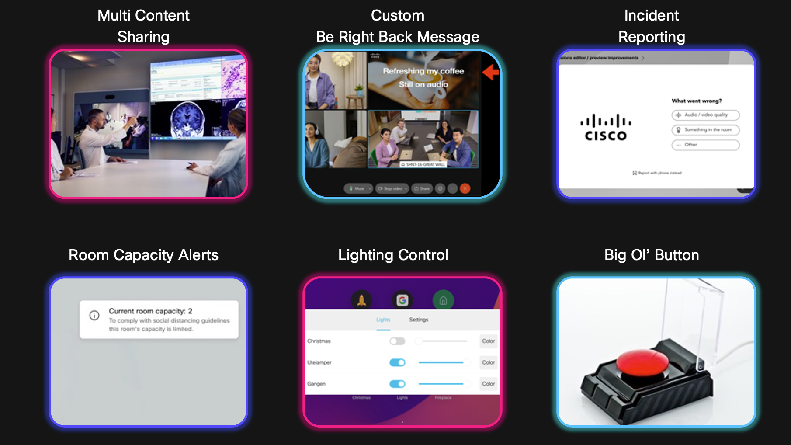
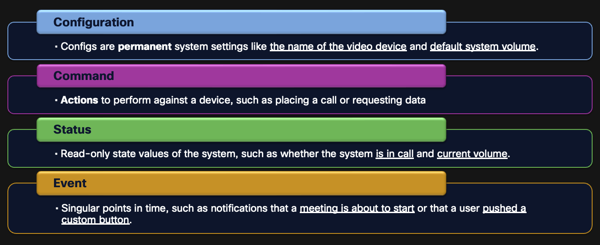
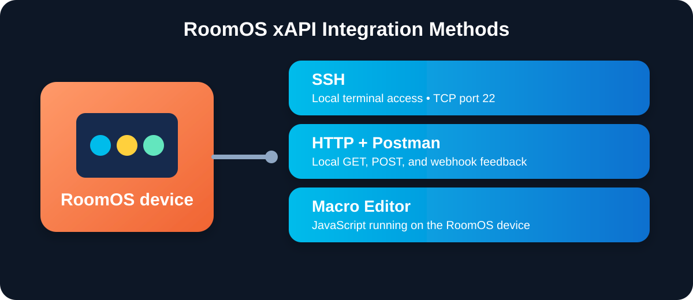

{{ config.cProps.devNotice }}
{{ config.cProps.acronyms }}

# What Is the RoomOS xAPI?

## Why Implement an API on RoomOS Devices?

APIs are fundamental to many services we use today.

They enable access to your device or application in ways that enable you to build new solutions and integrate with a greater world of solutions.

<figure markdown="span">
    { width="1000" }
    <figcaption>Solution Examples</figcaption>
</figure>

## The Four Branches of the RoomOS xAPI

RoomOS separates the xAPI into four major branches.

<figure markdown="span">
    { width="1000" }
    <figcaption>The four RoomOS xAPI branches used throughout the lab</figcaption>
</figure>

## Points of Integration

The Published Learner Path teaches the same RoomOS xAPI model through three active Integration Methods: SSH, HTTP with Postman, and the on-device Macro Editor. Other Integration Methods exist, but they are outside this section's active path.

<figure markdown="span">
    { width="1000" }
    <figcaption>Integration Methods taught in the Published Learner Path</figcaption>
</figure>
