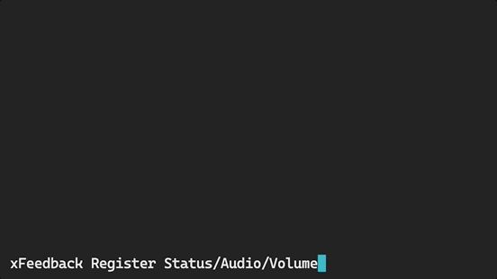

{{ config.cProps.devNotice }}
{{ config.cProps.acronyms }}
# Access RoomOS xAPI via SSH ~(section\ {{config.cProps.rxp.sectionIds.ssh}})~
!!! abstract

    In this section, we'll dive into the various pieces of the RoomOS Device xAPI stack and how to make use of them in various ways over a Secure Shell (SSH) Session to a Cisco RoomOS Device.

    Understanding how to navigate a terminal session with the a Cisco RoomOS Device will be instrumental in your device management and customization journey, but it's also a key integration pillar for many services on the market, such as a room control processors (Crestron, Extron, Etc) and

## Section {{config.cProps.rxp.sectionIds.ssh}} Requirements

!!! important ""

    !!! note inline end

        This lab assumes you have access to a Cisco RoomOS Device that is already setup and ready for use. If your device is not registered and online, please do so before beginning

    **Hardware**

    - A Laptop
    - A Cisco Desk, Board or Room Series Device running the most recent On Premise or Cloud Stable software
        - A Touch Controller is required when working on a Room Series Device. Either Room navigator or 3rd part touch display
        - Preferred Device: Cisco Desk Pro
    - A minimum of 1 camera (Either Integrated or External)

    **Software**

    - Laptop
        - Recommended Browser: Chrome or Firefox
        - Recommended Terminal Software:
            - Command Prompt (Windows)
            - Terminal (MAC)
            - [Putty](https://apps.microsoft.com/detail/xpfnzksklbp7rj?hl=en-US&gl=US) (Windows)
            - [Termius](https://termius.com/) (Windows, MAC, Linux)
    - RoomOS Device
        - Either the current On Premise or Cloud Stable release

    **Network**

    - Local Access to the RoomOS Device over port 22
    - General access to the Internet

## **Establish SSH Connection to Device** ~({{config.cProps.rxp.sectionIds.ssh}}.1)~

- Open the Terminal application on your device
- Connect to the Device via SSH using the built in OpenSSH platform in your terminal window

!!! note inline end

    Replace ``` [USERNAME]``` with your Codec's Username and ``` [IP_ADDRESS]``` with your Codec's IPv4 address that you set in section[X.X.X]

!!! blank "Type into terminal and press Enter"
    <pre><code>ssh {{config.cProps.auth.roomosUser}}@{{config.cProps.auth.roomosIp}}</code></pre> 
    

??? warning "If you encountered an warning running the command above, click here"
    
    If you encounter the following warning

    ``` {.shell, .no-copy}
    ssh [USERNAME]@[IP_ADDRESS]   
    @@@@@@@@@@@@@@@@@@@@@@@@@@@@@@@@@@@@@@@@@@@@@@@@@@@@@@@@@@@
    @    WARNING: REMOTE HOST IDENTIFICATION HAS CHANGED!     @
    @@@@@@@@@@@@@@@@@@@@@@@@@@@@@@@@@@@@@@@@@@@@@@@@@@@@@@@@@@@
    IT IS POSSIBLE THAT SOMEONE IS DOING SOMETHING NASTY!
    Someone could be eavesdropping on you right now (man-in-the-middle attack)!
    It is also possible that a host key has just been changed.
    The fingerprint for the RSA key sent by the remote host is
    SHA256:############################################
    Please contact your system administrator.
    Add correct host key in [PATH]/.ssh/known_hosts to get rid of this message.
    Offending RSA key in [PATH]/.ssh/known_hosts:##
    Host key for [IP_ADDRESS] has changed and you have requested strict checking.
    Host key verification failed.
    ``` 

    Double Check your device information and try again, if the information you entered is correct, try the following

    Then run the following command to clear an old SSH Sha Key
    Be sure to replace ``` [IP_ADDRESS]``` with your Codec's IPv4

    ``` shell title="Type into terminal and press Enter"
    ssh-keygen -R [IP_Address]
    ``` 

    - - -

<br>

- The OpenSSH platform will ask for you to confirm the device before connecting
    - Type `yes` when prompted into the terminal, then hit enter
    - Type the ``` [USERNAME]``` account password into the terminal when prompted, then hit enter

!!! success "Successfully connecting to the Codec should prompt the following information and is now awaiting your input"

    ``` {.shell, .no-copy}
    Welcome to  
    Cisco Codec Release RoomOS [Codec_Software_Version]
    SW Release Date: [Codec_Software_ReleaseDate]
    *r Login successful
    OK
    ``` 

## **Navigating the Terminal** ~({{config.cProps.rxp.sectionIds.ssh}}.2)~

!!! abstract

    In a terminal session with a Cisco Codec, you can execute commands, get, set or subscribe to configs, get or subscribe to status information as well as subscribe to events.

    These are especially useful when developing a customization or troubleshooting a system.

    Click to expand each lesson below, execute the contents as directed in your terminal session and observe the responses in the terminal window.
    

???+ lesson "Lesson: Lists All User Command Nodes ~({{config.cProps.rxp.sectionIds.ssh}}.2.1)~"

    ``` shell title="Type into terminal and press Enter"
    ?
    ``` 

    ???+ info "Compare your Terminal Output"
        <pre><code>- User Commands -
        help            <hl_1>xcommand</hl_1>        <hl_2>xconfiguration</hl_2>  xdocument       <hl_3>xevent</hl_3>
        <hl_4>xfeedback</hl_4>       xgetxml         <hl_7>xpreferences</hl_7>    <hl_5>xstatus</hl_5>         xtransaction
        bye             echo            log             systemtools
        OK
        </code></pre>

        We won't cover every shell command above, we'll only focus on <hl_2>xConfigurations</hl_2>, <hl_1>xCommands</hl_1>, <hl_5>xStatuses</hl_5>, <hl_3>xEvents</hl_3> and <hl_4>xFeedback</hl_4> as those contain all the Device xAPI references we need to develop a custom solution. But we'll also take a brief stop at <hl_7>xPreferences</hl_7> as it's important for SSH and Serial based integrations.

        For more information on the rest of those paths, check out the [Offical xAPI Guide](https://www.cisco.com/c/dam/en/us/td/docs/telepresence/endpoint/roomos-1114/api-reference-guide-roomos-1114.pdf).Page 33 defines all nodes


??? lesson "Lesson: Lists Terminal Preference Option ~({{config.cProps.rxp.sectionIds.ssh}}.2.2)~"

    - Lists Terminal Preference Options
      - The xPreferences command is used to set preferences for the RS-232 and SSH sessions. 

    ``` shell title="Type into terminal and press Enter"
    xpref ?
    ``` 

    
    ???+ info "Compare your Terminal Output"
        ``` {.shell, .no-copy}
        xpreferences usage:
          xpreferences outputmode <terminal/xml/json>
        OK
        ```

        Setting ``` xpreferences outputmode``` to JSON will change the terminal response output into a JSON format and likewise with XML

        Why might you consider JSON or XML? 
        
        - Your customization environment may be able to handle responses from the xAPI more efficiently if it's in an output format that easier for your environment to ingest
        - For testing, we'd recommend the terminal format, but when interfacing via a Room Control Processor or another service, you may have tools available to you to parse either JSON or XML to optimize you solution

        ??? example "Click Here to review different Output Mode responses"

            === "Terminal"

                ``` {.shell, .no-copy}
                xpref outputmode terminal

                OK
                xStatus Audio Volume            
                *s Audio Volume: 50
                ** end

                OK
                ``` 

            === "XML"

                ``` {.shell, .no-copy}
                xpref outputmode xml 
                xStatus Audio Volume
                <XmlDoc resultId="">
                <Status>
                  <Audio>
                    <Volume>50</Volume>
                  </Audio>
                </Status>
                </XmlDoc>
                ``` 

            === "JSON"

                ``` {.shell, .no-copy}
                xpref outputmode json    
                xStatus Audio Volume
                {
                  "Status": {
                    "Audio": {
                      "Volume": {
                        "Value": "50"
                      }
                    }
                  }
                }
                ```

??? lesson "Lesson: List Device Command Node References ~({{config.cProps.rxp.sectionIds.ssh}}.2.3)~"

    ``` shell title="Type into terminal and press Enter"
    xCommand ?
    ``` 

    ??? info "Click to Compare your Terminal Output"
        ``` {.shell, .no-copy}
        - User Commands -

        AirPlay          HttpClient       Provisioning     UserInterface    
        Audio            HttpFeedback     Proximity        UserManagement   
        Bookings         Logging          RemoteAccess     UserPresence     
        Call             Macros           RoomCleanup      Video            
        CallHistory      Message          RoomPreset       WebEngine        
        Camera           MicrosoftTeams   Security         Webex            
        Cameras          Network          SerialPort       WebRTC           
        Conference       Peripherals      Standby          Whiteboard       
        Diagnostics      Phonebook        SystemUnit       Zoom             
        Dial             Presentation     Time             

        OK
        ``` 


??? lesson "Lesson: List Device Status Node References ~({{config.cProps.rxp.sectionIds.ssh}}.2.4)~"
    ``` shell title="Type into terminal and press Enter"
    xStatus ?
    ``` 

    ??? info "Click to Compare your Terminal Output"
        ``` {.shell, .no-copy}
        - Status -

        Audio             ICE               Proximity         Time              
        Bookings          Logging           RemoteAccess      UserInterface     
        Call              MediaChannels     RoomAnalytics     Video             
        Cameras           MicrosoftTeams    RoomPreset        WebEngine         
        Capabilities      Network           SIP               Webex             
        Conference        NetworkServices   Standby           WebRTC            
        Diagnostics       Peripherals       SystemUnit        
        HttpFeedback      Provisioning      ThousandEyes      

        OK
        ```

??? lesson "Lesson: List Device Config Node References ~({{config.cProps.rxp.sectionIds.ssh}}.2.5)~"
    ``` shell title="Type into terminal and press Enter"
    xConfiguration ?
    ```

    ??? info Click to Compare your Terminal Output
        ``` {.shell, .no-copy}
        - User Configurations -

        Apps              Logging           RoomAnalytics     ThousandEyes      
        Audio             Macros            RoomCleanup       Time              
        Bookings          MicrosoftTeams    RoomScheduler     UserInterface     
        CallHistory       Network           RTP               UserManagement    
        Cameras           NetworkServices   Security          Video             
        Conference        Peripherals       Sensors           VoiceControl      
        FacilityService   Phonebook         SerialPort        WebEngine         
        Files             Provisioning      SIP               Webex             
        HttpClient        Proximity         Standby           WebRTC            
        HttpFeedback      RemoteAccess      SystemUnit        Zoom              

        OK
        ``` 


??? lesson "Lesson: List Device Event Node References ~({{config.cProps.rxp.sectionIds.ssh}}.2.6)~"
    ``` shell title="Type into terminal and press Enter"
    xEvent ?
    ``` 

    ??? info "Click to Compare your Terminal Output"
        ``` {.shell, .no-copy}
        xEvent ?
        ** end

        OK
        ``` 

    ??? curious ":thinking: The output of `xEvent ?` was not what you expected?"

          Try Removing the `?` from `xEvent` and re-run the command

          ``` shell title="Type into terminal and press Enter"
          xEvent
          ``` 

        ???+ info "Compare your Terminal Output"
            ``` {.shell, .no-copy}
            xEvent  
            *es Event Audio Input Connectors Ethernet SubId LoudspeakerActivity
            *es Event Audio Input Connectors Ethernet SubId NoiseLevel
            *es Event Audio Input Connectors Ethernet SubId PPMeter
            *es Event Audio Input Connectors Ethernet SubId VuMeter
            *es Event Audio Input Connectors HDMI Left PPMeter
            *es Event Audio Input Connectors HDMI Left VuMeter
            *es Event Audio Input Connectors HDMI Right PPMeter
            *es Event Audio Input Connectors HDMI Right VuMeter
            *es Event Audio Input Connectors Line PPMeter
            *es Event Audio Input Connectors Line VuMeter
            [... And the list goes on]
            OK
            ```
        
        All parent branches of the xAPI (TC, CE, and now RoomOS) have been in production for many years. The xEvent branch serves as a reminder that, as developers, we sometimes make decisions early on that have lasting effects. While there are differences in this branch that were introduced during earlier development, we have chosen to preserve them to ensure backwards compatibility with existing integrations. This approach helps avoid major disruptive changes for our community and supports solutions that are still in use today :smiley:

??? lesson "Lesson: Search for an xAPI using a Wildcard `//` ~({{config.cProps.rxp.sectionIds.ssh}}.2.7)~"
    ``` shell title="Type into terminal and press Enter"
    xConfiguration // Name ?
    ``` 

    ??? info "Click to Compare your Terminal Output"
        !!! note inline end
            You can also place a wildcard in multiple places within a path

            ``` {.shell, .no-copy}
            xConfiguration // Video // Name ?
            ``` 

        ``` {.shell, .no-copy}
        xConfiguration // Name ?
        *? xConfiguration FacilityService Service[1] Name: <S: 0, 1024>
        *? xConfiguration FacilityService Service[2] Name: <S: 0, 1024>
        *? xConfiguration FacilityService Service[3] Name: <S: 0, 1024>
        *? xConfiguration FacilityService Service[4] Name: <S: 0, 1024>
        *? xConfiguration FacilityService Service[5] Name: <S: 0, 1024>
        *? xConfiguration Network[1] DNS Domain Name: <S: 0, 64>
        *? xConfiguration SystemUnit Name: <S: 0, 50>
        *? xConfiguration UserInterface NameAndSiteLabels Mode: <Auto, Hidden>
        *? xConfiguration UserInterface Theme Name: <Auto, Light, Night>
        *? xConfiguration Video Input Connector[1] Name: <S: 0, 50>
        *? xConfiguration Video Input Connector[2] Name: <S: 0, 50>
        *? xConfiguration Video Input Connector[3] Name: <S: 0, 50>
        *? xConfiguration Video Input Connector[4] Name: <S: 0, 50>

        OK
        ``` 

## **Executing Commands** ~({{config.cProps.rxp.sectionIds.ssh}}.3)~

!!! abstract "xCommands"

    Commands instruct the device to execute actions, such as to dial a number or to search the phone book. All commands start with the prefix xCommand followed by a command path

    Click to expand each xCommand Lesson below, execute each Task in your terminal session as instructed and observe the responses in your terminal window as well as observe what happens to your Cisco RoomOS Device after each command is run


???+ lesson "Lesson: Execute an xCommand ~({{config.cProps.rxp.sectionIds.ssh}}.3.1)~"

    - **xAPI**: xCommand Video SelfView Set

    - **Task**:

        ``` shell title="Type into terminal and press Enter"
        xCommand Video SelfView Set Mode: On FullscreenMode: On OnMonitorRole: First
        ```

        - Observe the change to your Codec's Display, you should see your camera's SelfView Video in Full Screen on the OSD of your device.
            
            - If your video is blank, make sure your device's camera cover(if available) is not closed

        ``` shell title="Type into terminal and press Enter"
        xCommand Video SelfView Set Mode: On FullscreenMode: Off
        ```

        - Observe the change to your Codec's Display, you should see your camera feed in a Picture in Picture(PIP) Window

        ``` shell title="Type into terminal and press Enter"
        xCommand Video SelfView Set Mode: Off
        ```

        - Now your camera video should be closed

    ??? tip "Additional Info"

        Notice when we set the Mode parameter to <hl_1>On</hl_1> we included the FullScreenMode and OnMonitorRole parameters, but when we decided to set FullScreenMode <hl_7>Off</hl_7>, we left out OnMonitorRole.
        
        These are what's known as <hl_3>Optional Parameters</hl_3>, which are parameter's that are not required to be added in order to execute a command. These optional parameters have a default value that may or may not be applied and this is largely determined by the independent xAPI itself. You may also have <hl_5>Required Parameters</hl_5>. Required parameters must be run or else the xCommand will error out in the console and these required parameters are specifically called out in the documentation for the API.

    As you explore the API, feel free to click on the <hl_0>xAPI</hl_0> link at the bottom of each lesson to Learn more about the xAPI you're working with.

    <roomosdoc>xCommand Video SelfView Set</roomosdoc>

??? lesson "Lesson: Execute an xCommand with multiple arguments with the same name ~({{config.cProps.rxp.sectionIds.ssh}}.3.2)~"

    - **xAPI(s)**:
        - xCommand Video SelfView Set
        - xCommand Video Input SetMainVideoSource
    
    - **Task**:

        ``` shell title="Type into terminal and press Enter"
        xCommand Video SelfView Set Mode: On FullscreenMode: On
        ```

        ``` shell title="Type into terminal and press Enter"
        xCommand Video Input SetMainVideoSource ConnectorId: 1 ConnectorId: 1
        ```

        - Observe the change to your Codec's Display, you should see 2 instances of your camera feed spread equally in FullScreen

        ??? tip "Additional Info"

            - xCommand Video Input SetMainVideoSource, and other xAPIs like it offer some parameters that allow you to enter them in multiple times. Notice how we used <hl_6>ConnectorId: 1</hl_6> twice. This will create a 2x1 composition of your first video input connector and set this as your MainSource by default. This will effect SelfView and what you output on the far end of the Video Call.

            - Even though it's <hl_7>NOT</hl_7> practical to send a duplicate camera source into a call as we are now, it allows us a chance to interact with this xAPI and understand how it operates. This xAPI in particular was built to handle multiple video source inputs. For instance, if you had a Room Kit EQ with 4 cameras connected, you can compose all 4 cameras as apart of your MainSource, giving you an opportunity to visually communicate to the Far End in new ways

        ??? success "View Successful OSD Output"

            <figure markdown>
              { width="400" }
            </figure>

        ``` shell title="Type into terminal and press Enter"
        xCommand Video Input SetMainVideoSource ConnectorId: 1 ConnectorId: 1 Layout: PIP
        ```

        - Observe the change to your Codec's Display, you should see 2 instances of your camera feed, 1 FullScreen and another in a PIP window

        ??? tip "Additional Info"

            xCommand Video Input SetMainVideoSource has more than one parameter we can use to alter the composition in our MainSource. By default, the <hl_1>Layout</hl_1> parameter is set to a value of <hl_1>Equal</hl_1>, but we could opt for <hl_2>PIP</hl_2> or <hl_3>Prominent</hl_3> as <hl_1>Layout</hl_1> values as well.

        ??? success "View Successful OSD Output"

            Successful execution of this command, with <hl_2>PIP</hl_2> set as the <hl_1>Layout</hl_1>, will look similar to image below

            <figure markdown>
              { width="400" }
            </figure>

        - Lets wrap this lesson up by setting your MainSource back to a single connector and disabling SelfView

        ``` shell title="Type into terminal and press Enter"
        xCommand Video Input SetMainVideoSource ConnectorId: 1
        xCommand Video SelfView Set Mode: Off
        ```

        - Observe the change to your Codec's Display, your SelfView should be gone now

    <roomosdoc>xCommand Video SelfView Set</roomosdoc>
    <roomosdoc>xCommand Video Input SetMainVideoSource</roomosdoc>

??? lesson "Lesson: Execute an xCommand with a multiline argument  ~({{config.cProps.rxp.sectionIds.ssh}}.3.3)~"

    !!! info
        Some commands require a larger body of data. This data is written as a large string; some written in a variety of formats and this format is outlined by the individual xAPI's documentation

        When working in a terminal window, multiline commands are formatted as follows:

        !!! example ""

            === "Base Structure"

                ``` {.shell, .no-copy}
                [Command Path]          # Your xCommand Path to run
                [Multi Line Content]    # Your Multi Line content (Body)
                .                       # Terminate your Multi Line content with a dot .
                ```
            
            === "Full xAPI Example"

                ``` {.shell, .no-copy}
                xCommand Macros Macro Save Name: Test   # Your xCommand Path to run
                import xapi from 'xapi';                # Your Multi Line content (Body)

                console.log('Hello World');
                .                                       # Terminate your Multi Line content with a dot .
                ```

            !!! Note

                The command should be terminated with a dot <hl_0>.</hl_0> on the third line to indicate the command is complete

    - **xAPI**: xCommand UserInterface Extensions Panel Save

    - **Task**:

        ```shell title="Type into terminal and press Enter"
        xCommand UserInterface Extensions Panel Save PanelId: wx1_lab_multilineCommand
        <Extensions><Panel><Order>1</Order><PanelId>wx1_lab_multilineCommand</PanelId><Location>HomeScreen</Location><Icon>Info</Icon><Color>#1170CF</Color><Name>MultiLine Command [Section ({{config.cProps.rxp.sectionIds.ssh}}.3)]</Name><ActivityType>Custom</ActivityType></Panel></Extensions>
        .
        ```
    
    - Observe the change to your Codec's Display, you should see a new Panel Button labeled `MultiLine Command [Section ({{config.cProps.rxp.sectionIds.ssh}}.3)]` on your Touch Control interface

    ??? success "View Successful OSD output"
        <figure markdown>
          { width="600" }
        </figure>
    
    <roomosdoc>xCommand UserInterface Extensions Panel Save</roomosdoc>

??? lesson "Lesson: Execute an xCommand which generates data and responds  ~({{config.cProps.rxp.sectionIds.ssh}}.3.4)~"

    !!! info
        Some commands will generate data and output a response of that data. All commands will respond with either "OK" or "Error" but other commands can provide additional information.


    - **xAPI**: xCommand Extensions List

    - **Task**:

        ``` shell title="Type into terminal and press Enter"
        xCommand UserInterface Extensions List ActivityType: Custom
        ```
      
      - Observe your Terminal Window's output, you should see details of both the `MultiLine Command [Section ({{config.cProps.rxp.sectionIds.ssh}}.3)]` panel you loaded in previously as well as the `Subscription Assistant` panel details

    ??? success "Click to Compare your Terminal Output"
        ``` {.shell, .no-copy}
        OK
        *r ExtensionsListResult (status=OK): 
        *r ExtensionsListResult Extensions Version: "1.11"
        *r ExtensionsListResult Extensions Panel 1 Icon: Custom
        *r ExtensionsListResult Extensions Panel 1 Location: HomeScreenAndCallControls
        *r ExtensionsListResult Extensions Panel 1 ActivityType: Custom
        *r ExtensionsListResult Extensions Panel 1 Name: "Subscription Assistant [Lab 1451]"
        *r ExtensionsListResult Extensions Panel 1 PanelId: "wx1_1451_pt2_labBuddy"
        *r ExtensionsListResult Extensions Panel 1 Origin: local
        *r ExtensionsListResult Extensions Panel 1 Order: 99
        [...]
        *r ExtensionsListResult Extensions Panel 2 Icon: Info
        *r ExtensionsListResult Extensions Panel 2 Location: HomeScreen
        *r ExtensionsListResult Extensions Panel 2 ActivityType: Custom
        *r ExtensionsListResult Extensions Panel 2 Name: "MultiLine Command [Section ({{config.cProps.rxp.sectionIds.ssh}}.3)]"
        *r ExtensionsListResult Extensions Panel 2 PanelId: "wx1_lab_multilineCommand"
        *r ExtensionsListResult Extensions Panel 2 Origin: local
        *r ExtensionsListResult Extensions Panel 2 Order: 1
        *r ExtensionsListResult Extensions Panel 2 Color: "#1170CF"
        *r ExtensionsListResult Extensions Panel 2 Visibility: Auto
        ```
    <roomosdoc>xCommand UserInterface Extensions List</roomosdoc>

## **Getting, Setting and Subscribing to xConfigurations** ~({{config.cProps.rxp.sectionIds.ssh}}.4)~

!!! abstract "xConfigurations"
    Configurations are device settings that are persistent across device boots. Like commands, configurations are also structured in a hierarchy

    Click to expand each xConfiguration Lesson below, execute them in your terminal session and observe the responses in the terminal window

???+ lesson "Lesson: Getting an xConfiguration Value ~({{config.cProps.rxp.sectionIds.ssh}}.4.1)~"

    - **xAPI**: xConfiguration Audio DefaultVolume

    - **Task**: 

        ```shell title="Type into terminal and press Enter"
        xConfiguration Audio DefaultVolume
        ```
        
        - Observe your Terminal Window's output, you should see the value for your Audio DefaultVolume

        ???+ info "Compare your Terminal Output"
            ``` {.shell, .no-copy}
            *c xConfiguration Audio DefaultVolume: 50
            ** end

            OK
            ```

    <roomosdoc>xConfiguration Audio DefaultVolume</roomosdoc>

??? lesson "Lesson: Set a new xConfiguration Value ~({{config.cProps.rxp.sectionIds.ssh}}.4.2)~"

    - **xAPI**: xConfiguration Audio DefaultVolume

    - **Task**: 

        ```shell title="Type into terminal and press Enter"
        xConfiguration Audio DefaultVolume: 75
        ```

        - Observe your terminal output and review the response

        ??? info "Click to Compare your Terminal Output"
            ``` {.shell, .no-copy}
            ** end

            OK
            ```

        - Now that we've set the default volume to 75, let's double check our work by getting that value one more time

        ```shell title="Type into terminal and press Enter"
        xConfiguration Audio DefaultVolume
        ```
        
        ??? info "Click to Compare your Terminal Output"
            ``` {.shell, .no-copy}
            *c xConfiguration Audio DefaultVolume: 75
            ** end

            OK
            ```
    
    !!! note

        The <hl_0>getting</hl_0> and <hl_0>setting</hl_0> of an xConfiguration only differs slightly when accessing via a terminal.

        Click on the tabs below to see the differences side by side

        !!! blank ""

            === "Get xConfiguration"

                xConfiguration Audio DefaultVolume

            === "Set xConfiguration"

                xConfiguration Audio DefaultVolume<hl_3>: 75</hl_3>
        
        ??? curious ":thinking: Do xConfigurations offer Multiple Parameters or have Multiline execution?"

            No, that's solely related to commands. When setting an xConfiguration, they only ever contain 1 value and though some of those values can be quite long as a string, the syntax to enter them into the console is all written in the same line of the terminal shell

    <roomosdoc>xConfiguration Audio DefaultVolume</roomosdoc>

??? lesson "Lesson: Get multiple xConfiguration Values under a Common Node ~({{config.cProps.rxp.sectionIds.ssh}}.4.3)~"

    !!! info

        In many cases, you may want to pull information in bulk. We can do this easily by moving running an xConfiguration get request on ==Higher Common Node== in the xAPI path

        !!! curious "What do we mean by `Higher Common Node`"

            Click on the tabs below, to see how we'll change our requests by accessing a `Higher Common Node` on each level of an xAPI Path

            === "Full xAPI Path"

                {++xConfiguration Bluetooth Allowed++}

            === "Next Higher Common Node"

                {++xConfiguration Bluetooth++} {--Allowed--}

            === "Highest Common Node"

                {++xConfiguration++} {--Bluetooth Allowed--}

            === "View Visual Diagram"

                !!! Note

                    This Diagram only show a very small subset of our xAPI. We have hundreds of xAPI to explore :smiley:


                ``` mermaid
                flowchart TD
                  xAPI --> |Highest Common Node| A
                  A[xConfiguration] -->|Next Node| B(Audio)
                  B --> bb(Default Volume)
                  B --> bc(Input)
                  B --> ba(...)
                  bc --> bd(...)
                  A --> |Next Node| C(Network)
                  C --> CC(IPv4)
                  CC --> CCC(Address)
                  CC --> CCD(Gateway)
                  CC --> CCE(...)
                  A --> |Next Node| D(UserInterface)
                  D --> DD(Message)
                  D --> DF(Extensions)
                  D --> DG(...)
                  DD --> DDE(...)
                  DF --> DDF(...)
                  C --> CD(...) 
                  A --> |Next Node| E(Video)
                  E --> EE(Input)
                  EE --> EEE(...)
                  E --> EF(Output)
                  EF --> EEF(...)
                  E --> EG(...)
                  A --> |Nodes Continued| F(...)
                ```
    
    - **xAPI**: xConfiguration Audio

    - **Task**: 
    
        ```shell title="Type into terminal and press Enter"
        xConfiguration Audio
        ```

        - Observe your terminal output and review the response

    ??? info "Click to Compare your Terminal Output"
        ``` {.shell, .no-copy}
        *c xConfiguration Audio Input Value: 75
        *c xConfiguration Audio Input HDMI 1 Level: -5
        *c xConfiguration Audio Input HDMI 1 Mode: On
        *c xConfiguration Audio Input HDMI 1 VideoAssociation MuteOnInactiveVideo: On
        *c xConfiguration Audio Input Microphone 1 Mode: On
        *c xConfiguration Audio Input MicrophoneMode: Focused
        *c xConfiguration Audio Input USBC 1 Level: -5
        *c xConfiguration Audio Input USBC 1 Mode: On
        *c xConfiguration Audio Input USBC 1 VideoAssociation MuteOnInactiveVideo: On
        *c xConfiguration Audio Input USBMicrophone 1 EchoControl Mode: On
        *c xConfiguration Audio Input USBMicrophone 1 Level: 5
        *c xConfiguration Audio Input USBMicrophone 1 Zone: 1
        *c xConfiguration Audio Microphones Mute Enabled: True
        *c xConfiguration Audio Microphones NoiseRemoval Mode: Enabled
        *c xConfiguration Audio Microphones UsbPassthrough MuteButton: Inactive
        *c xConfiguration Audio Microphones VoiceActivityDetector Mode: Off
        *c xConfiguration Audio Output InternalSpeaker Mode: On
        *c xConfiguration Audio Panning HeadsetAnalog BinauralProcessing: True
        *c xConfiguration Audio Panning HeadsetAnalog Mode: Auto
        *c xConfiguration Audio Panning HeadsetUSB BinauralProcessing: False
        *c xConfiguration Audio Panning HeadsetUSB Mode: Auto
        *c xConfiguration Audio Panning Mode: Auto
        *c xConfiguration Audio SoundsAndAlerts RingTone: "Sunrise"
        *c xConfiguration Audio SoundsAndAlerts RingVolume: 0
        *c xConfiguration Audio USB Mode: SpeakerAndMicrophone
        *c xConfiguration Audio USB VolumeControl Capture Mode: Bypass
        *c xConfiguration Audio USB VolumeControl Capture Value: 0
        *c xConfiguration Audio USB VolumeControl Playback Mode: Bypass
        *c xConfiguration Audio USB VolumeControl Playback Value: 0
        *c xConfiguration Audio Ultrasound MaxVolume: 70
        ** end
        ```

        By simply removing <hl_7>`DefaultVolume`</hl_7> from <hl_1>xConfiguration Audio</hl_1>, we get all of the Configurations listed under the Audio Node of the Codec
    
    <roomosfind>xConfiguration Audio</roomosfind>

??? lesson "Lesson: Subscribing to an xConfiguration  ~({{config.cProps.rxp.sectionIds.ssh}}.4.4)~"
    
    ??? curious ":thinking: What do we mean by Subscribe?"

        A <hl_6>subscription</hl_6>, also called a <hl_4>feedback registration</hl_4> in an SSH terminal session, is a way to monitor changes to any xConfigurations, xStatuses, or xEvents using xAPI.

        - This lets you automatically watch for changes as they happen, and react to them—for example, to automate a process—without needing to keep checking the value yourself.

        - When you start a subscription, you won’t see any results right away. You’ll only see something printed to the console *after* a change happens in that xAPI branch.

        - If you need to know the current value as soon as your script starts, you should perform a Get request against the same branch to retrieve it, then subscribe to monitor for any future changes.

    - **xAPI:** xConfiguration Audio DefaultVolume

    - **Task**: 

        ```shell title="Type into terminal and press Enter"
            xFeedback Register Configuration/Audio/DefaultVolume
        ```

        - Press the <hl_5>Subscription Assistant Button</hl_5> on your Touch Interface
            - Under the xConfigurations Page, move the Slider labeled <hl_0>Audio DefaultVolume</hl_0> to a new position and release
            - Observe your <hl_6>Terminal Window's</hl_6> output, you should see events for your Subscription fill the <hl_6>Terminal Window</hl_6> as that value changes
                - <hl_3>Optional</hl_3>: Move the slider a few more times to see more changes come in


        ??? gif "Click to Compare your Terminal Output"

            <figure markdown>
              { width="600" }
            </figure>

        ??? gif "View Subscription Assistant Operation"
            
            <figure markdown>
              { width="600" }
            </figure>
    
    <roomosdoc>xConfiguration Audio DefaultVolume</roomosdoc>

??? lesson "Lesson: Unsubscribing from an xConfiguration  ~({{config.cProps.rxp.sectionIds.ssh}}.4.5)~"

    Just as we can subscribe to information, we can unsubscribe from that same information

    ??? curious ":thinking: Why bother with Unsubscribing?"

        Today, we have a limit of 50 unique subscriptions (or feedback registrations) that can be enabled on a device at any given time.

        Documented on page 40 of the <a href="https://www.cisco.com/c/dam/en/us/td/docs/telepresence/endpoint/roomos-1114/api-reference-guide-roomos-1114.pdf" target="_blank">Official xAPI Guide</a>

        So as your solutions grow, managing your subscriptions can become increasingly more important.

    - **xAPI**: xConfiguration Audio DefaultVolume

    - **Task**: 

        ```shell title="Type into terminal and press Enter"
        xFeedback Deregister Configuration/Audio/DefaultVolume
        ```

        - Press the <hl_5>Subscription Assistant Button</hl_5> on your Touch Interface
            - Under the xConfigurations Page, move the Slider labeled ==Audio DefaultVolume== to a new position and release
            - Observe your <hl_6>Terminal Window's</hl_6> output, those responses you saw in the previous lesson should have stopped outputting in your <hl_6>Terminal Window</hl_6>
                - <hl_3>Optional</hl_3>: Move the slider a few more times to verify

    <roomosdoc>xConfiguration Audio DefaultVolume</roomosdoc>

??? lesson "Lesson: Subscribe to Multiple xConfigurations under a Common Node  ~({{config.cProps.rxp.sectionIds.ssh}}.4.6)~"

    !!! info

        Just as we can Get multiple xConfiguration values, we can also subscribe to multiple xConfiguration values under a Higher Common Node

        Subscribing to a Higher Common Node doesn't consume multiple subscriptions, in fact it only consumes 1 of the 50 alloted to you. This can allow you to subscribe to a larger dataset while consuming less subscriptions in your automation.

        !!! example ""

            Click on the tabs below, to see how we'll change our requests by accessing a `Higher Common Node` on each level of an xAPI Path

            === "Full xAPI Path"

                xFeedback Register <hl_1>Configuration/Bluetooth/Allowed</hl_1>

            === "Next Higher Common Node"

                xFeedback Register <hl_1>Configuration/Bluetooth</hl_1>{--/Allowed--}

            === "Highest Common Node"

                xFeedback Register <hl_1>Configuration</hl_1>{--/Bluetooth/Allowed--}

    - **xAPI**: xConfiguration Video Input Airplay

    - **Task**: 

        ```shell title="Type into terminal and press Enter"
        xFeedback Register Configuration/Video/Input/AirPlay
        ```

        - Press the <hl_5>Subscription Assistant Button</hl_5> on your Touch Interface
            - Under the xConfigurations Page, press the toggles and buttons in the <hl_0>Airplay<hl_0> row
            - Observe your <hl_6>Terminal Window's</hl_6> output, you should see events for your Subscription fill the <hl_6>Terminal Window</hl_6>
                - <hl_3>Optional</hl_3>: Press those buttons and switches a few times to see more changes come in

        ??? gif "Click to Compare your Terminal Output"

            <figure markdown>
              { width="600" }
            </figure>

        ??? gif "View Subscription Assistant Operation"
            
            <figure markdown>
              { width="600" }
            </figure>

    <roomosfind>xConfiguration Video Input Airplay</roomosfind>

??? lesson "Lesson: Unsubscribe to Multiple xConfigurations under a Higher Common Node  ~({{config.cProps.rxp.sectionIds.ssh}}.4.7)~"

    - **xAPI**: xConfiguration Video Input Airplay

    - **Task**: 

        ```shell title="Type into terminal and press Enter"
        xFeedback Deregister Configuration/Video/Input/AirPlay
        ```

        - Press the <hl_5>Subscription Assistant Button</hl_5> on your Touch Interface
            - Under the xConfigurations Page, press the toggles and buttons in the <hl_0>Airplay<hl_0> row
            - Observe your <hl_6>Terminal Window's</hl_6> output, those responses you saw in the previous lesson should have stopped outputting in your <hl_6>Terminal Window</hl_6>
                - <hl_3>Optional</hl_3>: Press those buttons and switches a few times to see more changes come in

    !!! Tip

        In cases where you have multiple subscriptions, you can unsubscribe from all by running

        ```shell title="Type into terminal and press Enter"
        xFeedback DeregisterAll
        ```

## **Getting and Subscribing to Status** ~({{config.cProps.rxp.sectionIds.ssh}}.5)~

!!! abstract "xStatuses"
    xStatuses contain information about the current state of the device, such as connected calls, the status of the gatekeeper registration, connected inputs and output sources. This status information will fire a callback when that particular status occurs and their last known state is stored and can be retrieved.

    Many of the same techniques we reviewed under section **Getting, Setting and Subscribing to xConfigurations** ~({{config.cProps.rxp.sectionIds.ssh}}.4)~ will apply to xStatuses

    Be sure to complete **Getting, Setting and Subscribing to xConfigurations** ~({{config.cProps.rxp.sectionIds.ssh}}.4)~ prior to continuing in this section, as many pieces of additional context were covered there, and won't be repeated moving forward

    Click to expand each xStatus Lesson below, execute them in your terminal session and observe the responses in the terminal window

???+ lesson "Lesson: Getting an xStatus Value ~({{config.cProps.rxp.sectionIds.ssh}}.5.1)~"

    - **xAPI**: xStatus Audio Volume

    - **Task**: 

        ```shell title="Type into terminal and press Enter"
        xStatus Audio Volume
        ```

        - Observe your terminal output and review the response

        ??? info "Click to Compare your Terminal Output"
            ``` {.shell, .no-copy}
            *s Audio Volume: 65
            ** end
            ```
            
    <roomosdoc>xStatus Audio Volume</roomosdoc>

??? lesson "Lesson: Get multiple xStatus Values under a Common Node ~({{config.cProps.rxp.sectionIds.ssh}}.5.2)~"

    - **xAPI**: xStatus Audio Input

    - **Task**: 

        ```shell title="Type into terminal and press Enter"
        xStatus Audio Input
        ```

        - Observe your terminal output and review the response

    ??? info "Click to Compare your Terminal Output"
        ``` {.shell, .no-copy}
        [PLACEHOLDER - LUIS OUTPUT]
        ```

    <roomosfind>xStatus Audio Input</roomosfind>

??? lesson "Lesson: Subscribing to an xStatus ~({{config.cProps.rxp.sectionIds.ssh}}.5.3)~"

    - **xAPI**: xStatus Audio Volume

    - **Task**:

        ```shell title="Type into terminal and press Enter"
        xFeedback Register Status/Audio/Volume
        ```

        - Press the <hl_5>Subscription Assistant Button</hl_5> on your Touch Interface
            - Under the xStatuses Page, move the Slider labeled <hl_0>Adjust Volume</hl_0> to a new position and release
                - Alternatively, you can adjust the volume with the Codec's native volume control buttons
            - Observe your <hl_6>Terminal Window's</hl_6> output, you should see events for your Subscription fill the <hl_6>Terminal Window</hl_6>
                - <hl_3>Optional</hl_3>: Move the slider a few more times to see more changes come in

        ??? gif "Click to Compare your Terminal Output"

            <figure markdown>
              { width="600" }
            </figure>
      
        ??? gif "View Subscription Assistant Operation"
            
            <figure markdown>
              { width="600" }
            </figure>

    <roomosdoc>xStatus Audio Volume<roomosdoc>

??? lesson "Lesson: Unsubscribing to an xStatus  ~({{config.cProps.rxp.sectionIds.ssh}}.5.4)~"

    - **xAPI**: xStatus Audio Input

    - **Task**:

        ```shell title="Type into terminal and press Enter"
        xFeedback Deregister Status/Audio/Volume
        ```

        - Press the <hl_5>Subscription Assistant Button</hl_5> on your Touch Interface
            - Under the xStatuses Page, move the Slider labeled <hl_0>Adjust Volume</hl_0> to a new position and release
                - Alternatively, you can adjust the volume with the Codec's native volume control buttons
            - Observe your <hl_6>Terminal Window's</hl_6> output, those responses you saw in the previous lesson should have stopped outputting in your <hl_6>Terminal Window</hl_6>
                - <hl_3>Optional</hl_3>: Move the slider a few more times to see more changes come in

??? lesson "Lesson: Subscribe to Multiple xStatuses under a Common Node ~({{config.cProps.rxp.sectionIds.ssh}}.5.5)~"

    - **xAPI**: xStatus Cameras Camera[n] Position

    - **Task**:

        ``` title="Type into terminal and press Enter"
        xFeedback Register Status/Cameras/Camera/Position
        ```

        ??? curious "What happened to the <hl_6>[n]</hl_6> in the xAPI Path?"

            You may have noticed we never declared <hl_6>[n]</hl_6> in the xAPI Path for the command we ran. This was left out on purpose. <hl_6>[n]</hl_6> corresponds to the <hl_1>CameraId</hl_1> you want to target. Some Codecs can control up 7 cameras, so these xAPI paths branch per connected Camera

            Whereas you could be running this lab on a variety of RoomOS Devices, it's better to leave [n] out of the path for Lab Purposes. Not declaring [n] adds new value to us as developers in a multi-camera system; it allows us to subscribe to ALL camera's positions as they change rather than having to specify 1 camera of interest :smiley:

        - Press the <hl_5>Subscription Assistant Button</hl_5> on your Touch Interface
            - Under the xStatuses Page, click the button in the <hl_1>Camera Control Wheel</hl_1> row
                - Alternatively, you can adjust your cameras position through the native camera control interface
            - Observe your <hl_6>Terminal Window's</hl_6> output, you should see events for your Subscription fill the <hl_6>Terminal Window</hl_6>
                - <hl_3>Optional</hl_3>: Continue pressing buttons to see more changes come in

        ???+ gif "Click on the tabs below to"

            === "Compare Terminal"

                <figure markdown>
                  ![xStatus Cameras Camera[n] Position Output Gif](./images/2-2-4_xStatus-Subscribe-CameraPosition.gif){ width="600" }
                </figure>

            === "View Subscription Assistant"
                
                <figure markdown>
                  { width="600" }
                </figure>

            === "View Native Camera Control Interface"

                <figure markdown>
                  { width="600" }
                </figure>

    <roomosfind>xStatus Cameras Camera[n] Position</roomosfind>

??? lesson "Lesson: Unsubscribe from all xStatuses ~({{config.cProps.rxp.sectionIds.ssh}}.5.6)~"

    - **xAPI**: N/A

    - **Task**: 

        ```shell title="Type into terminal and press Enter"
            xFeedback DeregisterAll
        ```

        - Press the <hl_5>Subscription Assistant Button</hl_5> on your Touch Interface
            - Under the xStatuses Page, click the button in the <hl_1>Camera Control Wheel</hl_1> row
                - Alternatively, you can adjust your cameras position through the native camera control interface
            - Observe your <hl_6>Terminal Window's</hl_6> output, those responses you saw in the previous lesson should have stopped outputting in your <hl_6>Terminal Window</hl_6>
                - <hl_3>Optional</hl_3>: Continue pressing buttons to see more changes come in

## **Subscribing to Events** ~({{config.cProps.rxp.sectionIds.ssh}}.6)~

!!! Abstract "xEvents"

    Similar to xStatuses, xEvents will fire a callback when that particular event occurs; however, xEvents contain simpler information that's not necessary to store on the device, so you will not be able to get the value of the event after it fires.

    ??? curios "Why not store xEvent Data?"

        As noted above, xEvents are much simpler callbacks. 
        
        For example, <hl_0>xStatus Call</hl_0> contains information about the call such as the Display Name, CallBack Number, CallId and so on. This information is very useful for building something like a Favorites List or Troubleshooting that call. 
        
        When compared to <hl_0>xEvent UserInterface Extensions Widget Action</hl_0>, this event fires whenever a widget is interacted with by a user. We simply want to know when the button is pressed in order for use to run an automation, but storing this event has little to no value outside the general log collection on the device.

    Click to expand each xEvent Lesson below, execute them in your terminal session and observe the responses in the terminal window.

???+ lesson "Lesson: Subscribing to an xEvent ~({{config.cProps.rxp.sectionIds.ssh}}.6.1)~"

    - **xAPI**: xEvent UserInterface Message Prompt Response

    - **Task**: 

        ```shell title="Type into terminal and press Enter"
        xFeedback Register Event/UserInterface/Message/Prompt/Response
        ```

        - Press the <hl_5>Subscription Assistant Button</hl_5> on your Touch Interface
            - Under the xEvents Page, click the <hl_1>Prompt Button</hl_1> in the <hl_0>UserInterface Message</hl_0> row
                - This will create a Pop Up with 5 options
                - Click on any one of these 5 Options
            - Observe your <hl_6>Terminal Window's</hl_6> output, you should see events for your Subscription fill the <hl_6>Terminal Window</hl_6>
                - <hl_3>Optional</hl_3>: Feel free to try each of the options under that `Prompt` and continue to observe your <hl_6>Terminal Window's</hl_6> to understand how each one of them differs
            - Now click either the `TextInput`, the `Rating` or the `Alert` button and follow any instructions those interfaces offer
            - Observe your <hl_6>Terminal Window's</hl_6> output, you should see events for your Subscription fill the <hl_6>Terminal Window</hl_6>
                - Responses for `TextInput`, `Rating` or `Alert` shouldn't show since you're currently only subscribed to the `Prompt` branch
    
        ??? gif "Click to Compare your Terminal Output"

            <figure markdown>
              { width="600" }
            </figure>
        
        ??? gif "View Subscription Assistant Operation"
                
            <figure markdown>
              { width="600" }
            </figure>

    <roomosdoc>xEvent UserInterface Message Prompt Response</roomosdoc>

??? lesson "Lesson: Unsubscribing to an xEvent ~({{config.cProps.rxp.sectionIds.ssh}}.6.2)~"

    - **xAPI**: xEvent UserInterface Message Prompt Response

    - **Task**: 

        ```shell title="Type into terminal and press Enter"
        xFeedback Deregister Event/UserInterface/ScreenShotRequest/RequestId
        ```

        - Press the <hl_5>Subscription Assistant Button</hl_5> on your Touch Interface
            - Under the xEvents Page, click either the `Prompt`, the `TextInput`, the `Rating` or the `Alert` button in the <hl_0>UserInterface Message</hl_0> row and submit any accompanying actions in that interface
            - Observe your <hl_6>Terminal Window's</hl_6> output, those responses you saw in the previous lesson should have stopped outputting in your <hl_6>Terminal Window</hl_6>

    <roomosdoc>xEvent UserInterface Message Prompt Response</roomosdoc>

??? lesson "Lesson: Subscribe to Multiple xEvents under a Common Node ~({{config.cProps.rxp.sectionIds.ssh}}.6.3)~"

    - **xAPI**: xEvent UserInterface

    !!! note inline end

        By Subscribing to a Higher Common Node, such as xEvent UserInterface, we can see all UI related Events available in that xAPI Node

    - **Task**: 

        ```shell title="Type into terminal and press Enter"
        xFeedback Register Event/UserInterface
        ```

        - Press the <hl_5>Subscription Assistant Button</hl_5> on your Touch Interface
            - Under the xEvents Page, try any of the `Widgets` on this page, and submit any accompanying actions in that interface if any
            - Observe your <hl_6>Terminal Window's</hl_6> output, you should see events for your Subscription fill the <hl_6>Terminal Window</hl_6>
                - <hl_3>Optional</hl_3>: Try all of the `Widgets` on that page :smiley:
    
        ??? gif "Click to Compare your Terminal Output"

            <figure markdown>
              { width="600" }
            </figure>

        ??? gif "View Subscription Assistant Operation"
            
            <figure markdown>
              { width="600" }
            </figure>

    <roomosfind>xEvent UserInterface</roomosfind>

??? lesson "Lesson: Unsubscribe from all xEvents ~({{config.cProps.rxp.sectionIds.ssh}}.6.4)~"

    - **xAPI**: N/A

    - **Task**: 

        ```shell title="Type into terminal and press Enter"
            xFeedback DeregisterAll
        ```

        - Press the <hl_5>Subscription Assistant Button</hl_5> on your Touch Interface
            - Under the xEvents Page, try any of the `Widgets` on this page, and submit any accompanying actions in that interface if any
            - Observe your <hl_6>Terminal Window's</hl_6> output, those responses you saw in the previous lesson should have stopped outputting in your <hl_6>Terminal Window</hl_6>
                - <hl_3>Optional</hl_3>: Continue pressing buttons to see more changes come in

## **Tagging your xAPI Calls** ~({{config.cProps.rxp.sectionIds.ssh}}.7)~

As you work to build your automation in a SSH terminal session, you may find yourself making multiple calls against the same path and the timing of that output may be critical for your solution.

To help simplify which data belongs where, you can tag your xAPI paths with a custom value to better track your work.

By appending <hl_6>|resultId="`myValue`"</hl_6> to the end of any xAPI Call, the response from that xAPI will include that resultId you assign

!!! example "Review Tagging examples below"

    === "xStatus Audio Volume"

        ``` shell
        xStatus Audio Volume |resultId="Custom Value 1"
        *s Audio Volume: 50
        ** resultId: "Custom Value 1"
        ** end
        ```
    
    === "xCommand Video SelfView Set"

        ``` shell
        xCommand Video SelfView Set Mode: On |resultId="Custom Value 2"

        OK
        *r SelfViewSetResult (status=OK): 
        ** resultId: "Custom Value 2"
        ** end
        ```
    
    === "xConfiguration SystemUnit Name"

        ``` shell
        xConfiguration SystemUnit Name |resultId="Custom Value 3"
        *c xConfiguration SystemUnit Name: " "
        ** resultId: "Custom Value 3"
        ** end

        OK
        ```

    === "xFeedback Register Event/CallSuccessful"

        !!! note

            When declaring xFeedback, or subscribing to any xAPI, the resultId will only print when you execute the command, but will not print with the subsequent data coming in from the subscription

        ``` shell
        xFeedback Register Event/CallSuccessful |resultId="Custom Value 4"
        ** resultId: "Custom Value 4"
        ** end

        OK
        *e CallSuccessful Protocol: "Spark"
        *e CallSuccessful Direction: "outgoing"
        *e CallSuccessful RemoteURI: "spark:XXXXXXXX-XXXX-XXXX-XXXX-XXXXXXXXXXXX"
        *e CallSuccessful EncryptionIn: "On"
        *e CallSuccessful EncryptionOut: "On"
        *e CallSuccessful CallRate: 20000
        *e CallSuccessful CallId: 3
        ** end
        *e CallSuccessful Protocol: "Spark"
        *e CallSuccessful Direction: "outgoing"
        *e CallSuccessful RemoteURI: "spark:XXXXXXXX-XXXX-XXXX-XXXX-XXXXXXXXXXXX"
        *e CallSuccessful EncryptionIn: "On"
        *e CallSuccessful EncryptionOut: "On"
        *e CallSuccessful CallRate: 20000
        *e CallSuccessful CallId: 4
        ** end  
        ```

## **Section {{config.cProps.rxp.sectionIds.ssh}} Cleanup** ~({{config.cProps.rxp.sectionIds.ssh}}.8)~

{{config.cProps.rxp.sectionCleanup}}