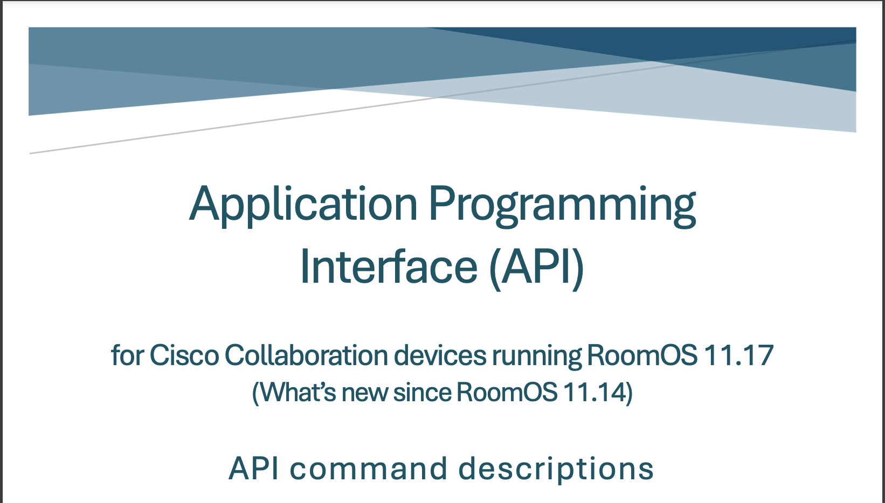
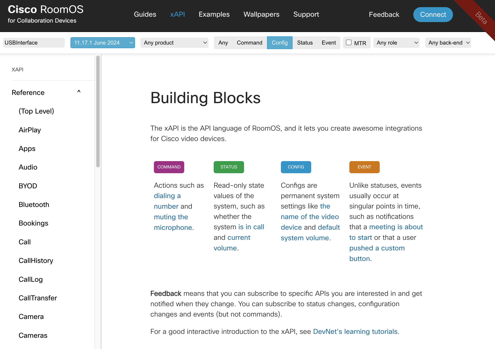
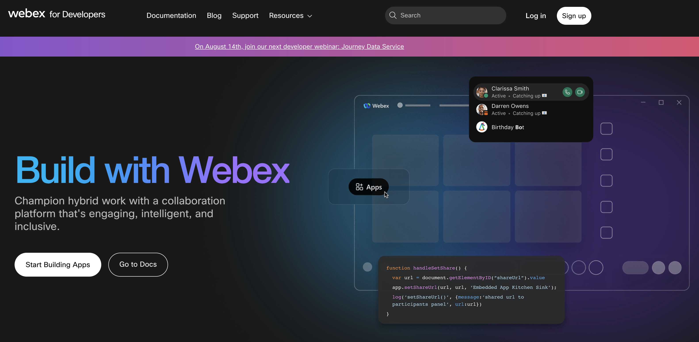

# Part 2: Accessing the Video Device xAPI

## 2.1: xAPI Documentation
xAPI Documentation can be found in several locations.

The Official API Reference Guide can be found <a target="blank" href="https://www.cisco.com/c/dam/en/us/td/docs/telepresence/endpoint/roomos-1117/api-descriptions-roomos-1117.pdf"> here</a>

- The Official API Doc release with every new On Premise release of RoomOS
- This guide contains the most accurate information our API as well as a detailed information of our integration protocols

<figure markdown>
  { width="400" }
</figure>

!!! success "Recommended Resource for this Lab"

    The <a target="blank" href="https://roomos.cisco.com/xapi"> RoomOS Site</a> contains the same information as the official PDF Doc, but contains the most recent Cloud API Releases

    - This site comes outfitted with a search engine and examples on how to execute the API
    - It will include all cloud versions of the API and will update automatically on a new cloud release
    - Though not the Official Guide, it's the proffered starting point for Development for it's additional content, code examples, tools and simplicity
    - The RoomOS site is the resource we'll use for the remainder of this lab

    <figure markdown>
      { width="400" }
    </figure>

The <a target="blank" href="https://developer.webex.com/docs/api/v1/xapi"> Webex for Developers</a> portal provides context on how to execute xAPI calls via the cloud

- This site does not contain a list of xAPI references, but does contain information on how to execute cloud xAPIs against your Cloud or Webex Edge registered endpoints as well as information about the scopes required for use
- This developer site will allow you to test cloud API directly from the site to help enable development with Devices and the rest of the Webex Portfolio


<figure markdown>
  { width="400" }
</figure>

- - -
- - -

## 2.2 Accessing the xAPI via SSH
!!! abstract

    In this section, we'll dive into the various pieces of the xAPI stack and how to make use of them in various ways over an SSH Session to the codec.

    Topics covered for SSH nearly 1:1 match a use case driven via a Serial Connection, whereas Serial requires additional hardware, it will not be covered in depth in this Lab.

### 2.2.1 - Establish SSH Connection to Device

- Open Terminal
- Connect to the Device via SSH
  - Type `ssh [USERNAME]@[IP_ADDRESS]`, then hit enter
    - Example: `ssh admin@10.0.0.X`
  - Type `Y` or `Yes` when prompted, then hit enter
  - Type the admin account password when prompted, then hit enter

### 2.2.2 - Navigating the Terminal

In a terminal session with a Cisco Codec, there are several tools for API discovery available.

Though not required for building a customization, these are especially useful when developing, especially on early access software like the Beta or Preview channel

- Lists All User Command Nodes
```shell title="Type into terminal and press Enter"
?
```

<details><summary>Click to Compare Log Output</summary>
  ```shell title="Type into terminal and press Enter"
         - User Commands -

  help            xcommand        xconfiguration  xdocument       xevent          
  xfeedback       xgetxml         xpreferences    xstatus         xtransaction    
  bye             echo            log             systemtools     
  OK
  ```

  We won't cover every command under the ? tree, we'll only focus on xConfiguration, xCommand, xStatus and xEvent as those contain all the xAPI reference we need to focus on

  For more information on the rest of those paths, check out the [Offical xAPI Guide](https://www.cisco.com/c/dam/en/us/td/docs/telepresence/endpoint/roomos-1114/api-reference-guide-roomos-1114.pdf).Page 33 defines all nodes
</details>

- Lists Terminal Preference Options
  - The xPreferences command is used to set preferences for the RS-232 and SSH sessions. 
```shell title="Type into terminal and press Enter"
xpref ?
```

<details><summary>Click to Compare Log Output (optional)</summary>
  ```shell
  xpreferences usage:
    xpreferences outputmode <terminal/xml/json>
  OK
  ```
</details> 

- List Device Command Node References
```shell title="Type into terminal and press Enter"
xCommand ?
```

<details><summary>Click to Compare Log Output (optional)</summary>
  ```shell
  - User Commands -

  AirPlay          HttpClient       Provisioning     UserInterface    
  Audio            HttpFeedback     Proximity        UserManagement   
  Bookings         Logging          RemoteAccess     UserPresence     
  Call             Macros           RoomCleanup      Video            
  CallHistory      Message          RoomPreset       WebEngine        
  Camera           MicrosoftTeams   Security         Webex            
  Cameras          Network          SerialPort       WebRTC           
  Conference       Peripherals      Standby          Whiteboard       
  Diagnostics      Phonebook        SystemUnit       Zoom             
  Dial             Presentation     Time             

  OK
  ```
</details> 

- List Device Status Node References
```shell title="Type into terminal and press Enter"
xStatus ?
```

<details><summary>Click to Compare Log Output (optional)</summary>
  ```shell
  - Status -

  Audio             ICE               Proximity         Time              
  Bookings          Logging           RemoteAccess      UserInterface     
  Call              MediaChannels     RoomAnalytics     Video             
  Cameras           MicrosoftTeams    RoomPreset        WebEngine         
  Capabilities      Network           SIP               Webex             
  Conference        NetworkServices   Standby           WebRTC            
  Diagnostics       Peripherals       SystemUnit        
  HttpFeedback      Provisioning      ThousandEyes      

  OK
  ```
</details> 

- List Device Config Node References
```shell title="Type into terminal and press Enter"
xConfiguration ?
```

<details><summary>Click to Compare Log Output (optional)</summary>
  ```shell
  - User Configurations -

  Apps              Logging           RoomAnalytics     ThousandEyes      
  Audio             Macros            RoomCleanup       Time              
  Bookings          MicrosoftTeams    RoomScheduler     UserInterface     
  CallHistory       Network           RTP               UserManagement    
  Cameras           NetworkServices   Security          Video             
  Conference        Peripherals       Sensors           VoiceControl      
  FacilityService   Phonebook         SerialPort        WebEngine         
  Files             Provisioning      SIP               Webex             
  HttpClient        Proximity         Standby           WebRTC            
  HttpFeedback      RemoteAccess      SystemUnit        Zoom              

  OK
  ```
</details> 

- List Device Event Node References
```shell title="Type into terminal and press Enter"
xEvent ?
```

<details><summary>Click to Compare Log Output (optional)</summary>
```shell
xEvent ?
** end

OK
``` 
</details> 

??? question ":thinking: The output of ```xEvent ?``` was not what you expected?"

      Try Removing the ```?``` from ```xEvent``` and re-run the command

      ```shell title="Type into terminal and press Enter"
      xEvent
      ```

      <details><summary>Click to Compare Log Output (optional)</summary>
      ```shell
      xEvent  
      *es Event Audio Input Connectors Ethernet SubId LoudspeakerActivity
      *es Event Audio Input Connectors Ethernet SubId NoiseLevel
      *es Event Audio Input Connectors Ethernet SubId PPMeter
      *es Event Audio Input Connectors Ethernet SubId VuMeter
      *es Event Audio Input Connectors HDMI Left PPMeter
      *es Event Audio Input Connectors HDMI Left VuMeter
      *es Event Audio Input Connectors HDMI Right PPMeter
      *es Event Audio Input Connectors HDMI Right VuMeter
      *es Event Audio Input Connectors Line PPMeter
      *es Event Audio Input Connectors Line VuMeter
      [... And the list goes on]
      OK
      ```
      </details> 

- Search for an xAPI using a Wildcard ```//```
```shell title="Type into terminal and press Enter"
xConfig // Name ?
```

<details><summary>Click to Compare Log Output (optional)</summary>
```shell
xConfig // Name ?
*? xConfiguration FacilityService Service[1] Name: <S: 0, 1024>
*? xConfiguration FacilityService Service[2] Name: <S: 0, 1024>
*? xConfiguration FacilityService Service[3] Name: <S: 0, 1024>
*? xConfiguration FacilityService Service[4] Name: <S: 0, 1024>
*? xConfiguration FacilityService Service[5] Name: <S: 0, 1024>
*? xConfiguration Network[1] DNS Domain Name: <S: 0, 64>
*? xConfiguration SystemUnit Name: <S: 0, 50>
*? xConfiguration UserInterface NameAndSiteLabels Mode: <Auto, Hidden>
*? xConfiguration UserInterface Theme Name: <Auto, Light, Night>
*? xConfiguration Video Input Connector[1] Name: <S: 0, 50>
*? xConfiguration Video Input Connector[2] Name: <S: 0, 50>
*? xConfiguration Video Input Connector[3] Name: <S: 0, 50>
*? xConfiguration Video Input Connector[4] Name: <S: 0, 50>

OK
``` 
</details> 

- Search for an xAPI using a Wildcard
  - `xConfig // Name ?`

| Key              | Description      |
| :-------         | :-------         |
| `?`              | List all commands under a given node Path         |
| `??`             | List all commands `and value spaces` under a given node Path         |
| `//`             | Path wild, use to search for key words in any given path. You can use multiple wildcards in a xAPI path         |

### 2.2.3 - Executing Commands

- Execute a command
  - `xCommand Video Selfview Set Mode: On FullscreenMode: On OnMonitorRole: First`
- Execute a command with multiple duplicate parameters
  - `xCommand Video Input SetMainVideoSource ConnectorId: 1 Layout: Equal`
  - `xCommand Video Input SetMainVideoSource ConnectorId: 1 ConnectorId: 1 Layout: Equal`
  - `xCommand Video Input SetMainVideoSource ConnectorId: 1 Layout: Equal`
  - `xCommand Video Selfview Set Mode: Off`
- Execute a command with a multiline argument
  - `xCommand UserInterface Extensions Panel Save PanelId: wx1_lab_multilineCommand`
    ```xml
    <Extensions>
      <Panel>
        <Order>1</Order>
        <PanelId>wx1_lab_multilineCommand</PanelId>
        <Location>HomeScreen</Location>
        <Icon>Info</Icon>
        <Color>#1170CF</Color>
        <Name>MultiLine Command</Name>
        <ActivityType>Custom</ActivityType>
      </Panel>
    </Extensions>
    ```
  - `xCommand UserInterface Extensions Panel Remove PanelId: wx1_lab_multilineCommand`

- Put a booking, then list extensions
  - `xCommand Booking List`

### 2.2.4 - Getting, Setting and Subscribing to Configurations

- Get a Config Value
  - `xConfig Audio DefaultVolume`
- Set a new Config Value
  - `xConfiguration Audio DefaultVolume: 40`
- Get Multiple Config Values under a common Node
  - `xConfig Audio`
- Subscribe to a Config
  - `xFeedback Register Configuration/Audio/DefaultVolume`
- Unsubscribe from a Config
  - `xFeedback Deregister Configuration/Audio/DefaultVolume`
- Subscribe to multiple Config under a common node
  - `xFeedback Register Configuration/Video/Input/AirPlay`
- Unsubscribe from all
  - `xFeedback DeregisterAll`

### 2.2.5 - Setting and Subscribing to Status

- Get a status value
  - `xStatus Audio Volume`
- Get multiple status values under a common node
  - `xStatus Audio Input`
- Subscribe to a status
  - `xFeedback Register Status/Audio/Volume`
- Unsubscribe from a status
  - `xFeedback Deregister Status/Audio/Volume`
- Subscribe to multiple statuses under a common node
  - `xFeedback Register Status/RoomAnalytics`
- Unsubscribe from all
  - `xFeedback DeregisterAll`

### 2.2.6 - Subscribing to Events

- Subscribe to an Event
  - `xFeedback Register Event/UserInterface/ScreenShotRequest/RequestId`
- Unsubscribe from an Event
  - `xFeedback Deregister Event/UserInterface/ScreenShotRequest/RequestId`
- Subscribe to multiple statuses under a common node
  - `xFeedback Register Event/UserInterface/ScreenShotRequest`
- Unsubscribe from all
  - `xFeedback DeregisterAll`